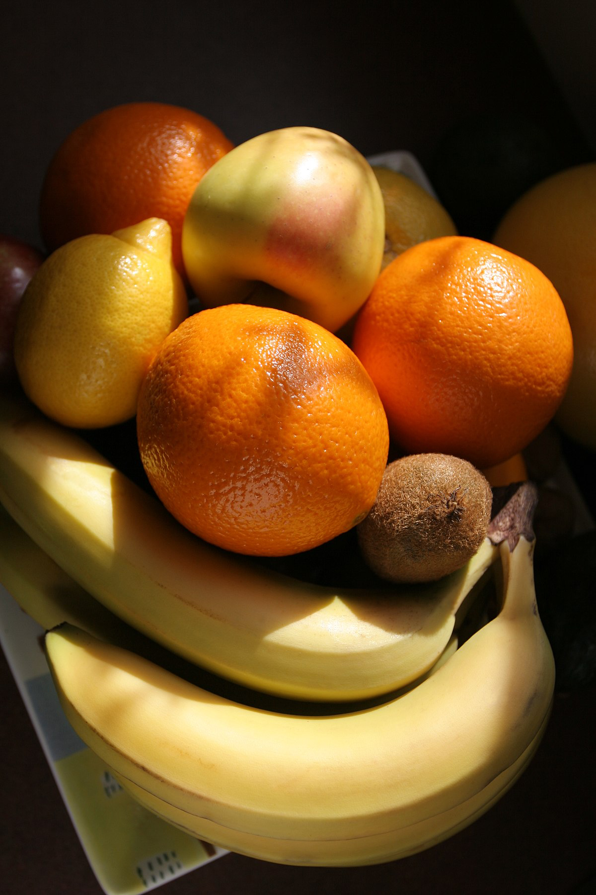
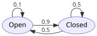
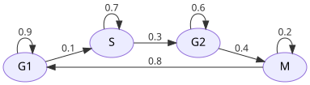

## Exercises in probability

### Q1.1
The probability of the weather being sunny is 75%. What is the probability that it rains, if these are the only two types of weathers?

::: {.callout-tip collapse="true" title="Step-by-step solution"}
The two outcomes are mutually exclusive and exhaustive, so their probabilities sum to 1:
$$P(\text{rain}) = 1 - P(\text{sunny}) = 1 - 0.75 = 0.25$$

**Answer:** 25%.
:::

### Q1.2
A guest picks a fruit at random from this plate (equal probabilities). What is the probability of them picking an orange?

{width=50%}

The plate has **7 fruits**, of which **2 are oranges**.

::: {.callout-tip collapse="true" title="Step-by-step solution"}
For equally-likely outcomes:
$$P(\text{orange}) = \frac{\#\text{oranges}}{\#\text{fruits}} = \frac{2}{7} \approx 0.286$$

**Answer:** $2/7 \approx 28.6\%$.
:::

### Q1.3
A coin is tossed 4 times. What is the probability that all of them show heads up?

::: {.callout-tip collapse="true" title="Step-by-step solution"}
Independent flips multiply:
$$P(\text{4 heads}) = \left(\tfrac{1}{2}\right)^4 = \tfrac{1}{16} = 0.0625$$

**Answer:** $1/16 = 6.25\%$.
:::

### Q1.4
In a game, you toss a coin. If it turns up head, you roll a dice deciding how many pieces of candy you will receive. What is the likelihood that you will receive 2 pieces of candy?

::: {.callout-tip collapse="true" title="Step-by-step solution"}
You only get candy if the coin is heads **and** the dice shows 2:
$$P(\text{2 candies}) = P(\text{head}) \cdot P(\text{dice} = 2) = \tfrac{1}{2} \cdot \tfrac{1}{6} = \tfrac{1}{12}$$

**Answer:** $1/12 \approx 8.3\%$.
:::

### Q1.5
A coin is thrown 3 times. What is the probability that at least one head is obtained?

::: {.callout-tip collapse="true" title="Step-by-step solution"}
The complement of "at least one head" is "no heads at all":
$$P(\geq 1 \text{ head}) = 1 - P(\text{0 heads}) = 1 - \left(\tfrac{1}{2}\right)^3 = 1 - \tfrac{1}{8} = \tfrac{7}{8}$$

**Answer:** $7/8 = 87.5\%$. The complement trick is often the easiest way to compute "at least one" probabilities.
:::

### Q1.6
What is the probability of getting a numbered card from a deck of cards?

::: {.callout-tip collapse="true" title="Step-by-step solution"}
A standard deck has 52 cards. Numbered cards are 2–10, i.e. 9 ranks × 4 suits = 36 cards.
$$P(\text{numbered}) = \frac{36}{52} = \frac{9}{13} \approx 0.692$$

**Answer:** $9/13 \approx 69.2\%$. (Aces, Jacks, Queens, Kings are the non-numbered ones.)
:::

### Q1.7
If throwing two dice, what is the likelihood that their sum is 3?

> *Hint:* draw all possibilities as a 6×6 table, count the entries with sum 3.

::: {.callout-tip collapse="true" title="Step-by-step solution"}
Total outcomes: $6 \times 6 = 36$, all equally likely.

Outcomes summing to 3: $(1,2)$ and $(2,1)$ — that's 2 outcomes.

$$P(\text{sum} = 3) = \tfrac{2}{36} = \tfrac{1}{18} \approx 5.6\%$$
:::

### Q1.8
Using R, what is the likelihood that the sum of 4 dice sums up to 10?

> *Hints:* nested for-loops, see [example of nested loops](https://bookdown.org/yundai09/rbootcamp/loops.html#nested-loops).

::: {.callout-tip collapse="true" title="Step-by-step solution"}
```r
count <- 0
total <- 0
for (a in 1:6) {
  for (b in 1:6) {
    for (c in 1:6) {
      for (d in 1:6) {
        total <- total + 1
        if (a + b + c + d == 10) count <- count + 1
      }
    }
  }
}
count / total      # 80 / 1296 = 0.0617...
```

**Answer:** $80/1296 = 5/81 \approx 6.17\%$.

(Sanity check by hand: count compositions of 10 into 4 parts, each in $[1,6]$ — by inclusion–exclusion this gives $\binom{9}{3} - 4\binom{3}{3} = 84 - 4 = 80$.)
:::

### Q1.9
You toss a dice twice. What is the probability that you get the same side twice?

> *Hint:* in how many ways is this possible?

::: {.callout-tip collapse="true" title="Step-by-step solution"}
There are 36 equally likely outcomes. The "same side twice" outcomes are $(1,1), (2,2), \ldots, (6,6)$ — exactly 6 of them.

$$P(\text{same}) = \tfrac{6}{36} = \tfrac{1}{6}$$

Equivalently: the first die can be anything; the second has to match → probability $1/6$.
:::

### Q1.10
You toss a dice twice. What is the probability that you get different sides?

::: {.callout-tip collapse="true" title="Step-by-step solution"}
**Way (a) — count directly:** of the 36 outcomes, $36 - 6 = 30$ have different sides → $30/36 = 5/6$.

**Way (b) — use Q1.9 + the complement rule:**
$$P(\text{different}) = 1 - P(\text{same}) = 1 - \tfrac{1}{6} = \tfrac{5}{6}$$

Way (b) is usually the simpler one once you know the complement of the event you've already computed.
:::

### Q1.11
Two persons (A and B) are asked to solve a problem. $P(A \text{ solves}) = 0.1$ and $P(B \text{ solves}) = 0.2$. What is $P(A \text{ or } B \text{ solves})$?

> *Hint:* What is the probability that neither solves it?

::: {.callout-tip collapse="true" title="Step-by-step solution"}
Assume A and B are independent.

$$P(\text{neither}) = (1 - 0.1)(1 - 0.2) = 0.9 \cdot 0.8 = 0.72$$

$$P(A \text{ or } B) = 1 - P(\text{neither}) = 1 - 0.72 = 0.28$$

**Answer:** 28%.

(Equivalent direct computation: $P(A) + P(B) - P(A \text{ and } B) = 0.1 + 0.2 - 0.1\cdot 0.2 = 0.28$.)
:::

- Optional: counting-type probability questions: <https://thirdspacelearning.com/blog/probability-questions>.
- Optional: harder questions: <https://www.hitbullseye.com/Probability-Examples.php>.

### Q1.12
Two heterozygous parents ($Aa \times Aa$) each pass one of their two alleles to the offspring with equal probability, independently. There are four equally likely allele combinations: $AA, Aa, aA, aa$.

a. What is $P(\text{homozygous recessive } aa)$?
b. What is $P(\text{at least one dominant allele } A)$?
c. For two unlinked genes inherited independently, what is $P(aabb)$ from the cross $AaBb \times AaBb$?

> *Hint:* (b) is the same complement-of-"at least one" trick as Q1.5; (c) uses independence of events as in Q1.4 and Q1.11.

::: {.callout-tip collapse="true" title="Step-by-step solution"}
a. $P(aa) = \tfrac{1}{2} \cdot \tfrac{1}{2} = \tfrac{1}{4}$.
b. $P(\text{at least one } A) = 1 - P(aa) = \tfrac{3}{4}$.
c. Independent loci multiply: $P(aabb) = P(aa) \cdot P(bb) = \tfrac{1}{4} \cdot \tfrac{1}{4} = \tfrac{1}{16}$.

The four genotype categories from $AaBb \times AaBb$ — dominant-dominant, dominant-recessive, recessive-dominant, recessive-recessive — appear in proportions 9:3:3:1, the classic dihybrid cross result.
:::

### Q1.13
Each base in a genome mutates per generation with some small probability $\mu$ (for humans, $\mu \approx 10^{-8}$). Treat bases as independent.

a. What is $P(\text{no mutation in } n \text{ bases})$?
b. What is $P(\text{at least one mutation in } n \text{ bases})$?
c. For $\mu = 10^{-8}$ and $n = 3 \times 10^9$ (a human genome), is the chance of *some* new mutation small or large?

> *Hint:* (a) is independence as in Q1.3 (four heads in a row); (b) is the complement trick from Q1.5 — at genome scale.

::: {.callout-tip collapse="true" title="Step-by-step solution"}
a. Each base is independent, so $P(\text{no mutation}) = (1-\mu)^n$.
b. By complement: $P(\geq 1) = 1 - (1-\mu)^n$.
c. For $\mu = 10^{-8}$, $n = 3 \times 10^9$: $(1-\mu)^n \approx e^{-\mu n} = e^{-30} \approx 10^{-13}$, so $P(\geq 1) \approx 1$ — every offspring carries new mutations. Family trio sequencing studies in fact see $\sim 60$ *de novo* mutations per child (counting both parental contributions).
:::

### Q1.14
Pick a random DNA sequence of length $k$ (a "k-mer") and ask whether it matches a fixed target sequence. Assume each base is equally likely (A/C/G/T) and bases are independent.

a. What is $P(\text{match})$?
b. Compute the numerical value for $k = 4$ and $k = 20$.
c. Roughly how often would you expect a random 20-mer to occur, by chance, in a $3 \times 10^9$-base human genome?

> *Hint:* (a) is the same independence-multiplication as Q1.3, but with four equally likely bases instead of two coin sides.

::: {.callout-tip collapse="true" title="Step-by-step solution"}
a. $P(\text{match}) = \left(\tfrac{1}{4}\right)^k$.
b. $k = 4 \Rightarrow 1/256 \approx 4 \times 10^{-3}$; $k = 20 \Rightarrow 1/4^{20} \approx 9.1 \times 10^{-13}$.
c. Expected number of random matches in a genome of size $L$ is $L \cdot 4^{-k}$. For $L = 3 \times 10^9$, $k = 20$: $\approx 3 \times 10^9 \cdot 9.1 \times 10^{-13} \approx 0.003$ — almost surely zero. That's why PCR primers (typically 18–25 bp) are usually unique in a genome.
:::

## Exercises on Expected value / Expectation

### Q2.1
Assume you win 100\$ if the coin turns heads up, but have to pay 50\$ otherwise. What do you win on average per coin flip?

::: {.callout-tip collapse="true" title="Step-by-step solution"}
$$E[X] = \tfrac{1}{2}\cdot 100 + \tfrac{1}{2}\cdot(-50) = 50 - 25 = 25$$

**Answer:** \$25 per flip on average.
:::

### Q2.2
Assume you roll a dice and win 100\$ if you get a 6; but you have to pay 20\$ if you get an odd number. What do you win on average per dice toss?

::: {.callout-tip collapse="true" title="Step-by-step solution"}
Three cases: a 6 (prob $1/6$, payoff +100), an odd number 1/3/5 (prob $3/6$, payoff −20), an even number 2/4 (prob $2/6$, payoff 0).

$$E[X] = \tfrac{1}{6}\cdot 100 + \tfrac{3}{6}\cdot(-20) + \tfrac{2}{6}\cdot 0 = \tfrac{100 - 60}{6} = \tfrac{40}{6} \approx 6.67$$

**Answer:** \$6.67 per toss on average.
:::

### Q2.3
You offer people to win 10\$ times the number of dots on a dice they throw. What is the least they should pay to play, for you to break even on average?

::: {.callout-tip collapse="true" title="Step-by-step solution"}
$$E[10 \cdot \text{dice}] = 10 \cdot \frac{1+2+3+4+5+6}{6} = 10 \cdot \frac{21}{6} = 35$$

**Answer:** they must pay at least \$35 per play for you to break even on average.
:::

### Q2.4
You flip a coin and you either gain 50\$ or lose 100\$. However, instead of gaining 50\$, you get the option to flip again, and either gain 200\$, or lose 150\$.

a. Assuming you already won 50\$, would you flip the coin again?
b. If you are offered to play, and you pick the optimal strategy, what would you win or lose on average?

::: {.callout-tip collapse="true" title="Step-by-step solution"}
**a.** Compare the certain 50\$ to the expected value of re-flipping:
$$E[\text{reflip}] = \tfrac{1}{2}\cdot 200 + \tfrac{1}{2}\cdot(-150) = 100 - 75 = 25$$

50 > 25, so **don't reflip** — keep the 50\$.

**b.** With the optimal strategy (never reflip), the game is just the original coin flip:
$$E[\text{game}] = \tfrac{1}{2}\cdot 50 + \tfrac{1}{2}\cdot(-100) = 25 - 50 = -25$$

**Answer:** you lose \$25 on average per game. (You should refuse to play.)
:::

### Q2.5
Each base in a genome mutates per generation with small probability $\mu$. What is the expected number of new mutations across a whole genome of length $L$?

For humans ($\mu \approx 10^{-8}$, $L \approx 3 \times 10^9$ bp), what does this give?

> *Hint:* this is just linearity of expectation — each base is a tiny "lottery ticket" with payoff 1 if it mutates, 0 otherwise, the same structure as Q2.3's $E[10 \cdot \text{dice}]$.

::: {.callout-tip collapse="true" title="Step-by-step solution"}
By linearity of expectation, summing one Bernoulli per base:
$$E[\#\text{mutations}] = \mu \cdot L$$

For humans: $E \approx 10^{-8} \cdot 3 \times 10^9 = 30$ new mutations per offspring per generation. Family trio sequencing studies in fact estimate $\sim 60$ *de novo* mutations per child (counting both parental contributions).
:::

### Q2.6
A short-read sequencer produces $N$ reads of length $\ell$ each, scattered roughly uniformly over a genome of size $L$. What is the expected number of reads covering any given base ("expected coverage")?

For $N = 3 \times 10^8$ reads of $\ell = 100$ bp on a human genome ($L = 3 \times 10^9$ bp), how much coverage do you get?

> *Hint:* the same linearity-of-expectation logic as Q2.5 — each read contributes a tiny expected count to each base.

::: {.callout-tip collapse="true" title="Step-by-step solution"}
A given base is covered by a given read with probability $\ell / L$ (the read's start position is roughly uniform over $L$ choices, and $\ell$ of those would cover the base). Summing over all $N$ reads:
$$E[\text{coverage}] = N \cdot \tfrac{\ell}{L} = \frac{N \ell}{L}$$

For the example: $E[\text{coverage}] = (3 \times 10^8 \cdot 100) / (3 \times 10^9) = 10\times$. You will use this exact formula in module 3 when planning sequencing depth.
:::

## Exercises in Markov chains

A single ion channel in a cell membrane flickers between an **Open** state (lets ions through) and a **Closed** state (blocks them). Suppose a model of one such channel has the following per-step transition probabilities:



### Q3.1
Intuitively, do you expect the channel to be open or closed most of the time?

::: {.callout-tip collapse="true" title="Step-by-step solution"}
Compare the self-loops: Open stays open with only **0.1**, while Closed stays closed with **0.5**. So once the channel closes it tends to stay closed, but an open channel flips to closed with 0.9 probability.

**Answer:** mostly closed — we expect the chain to spend much more time in the Closed state. (The stationary-distribution machinery in Q3.9 makes this rigorous: it puts ≈ 64% on Closed and ≈ 36% on Open.)
:::

### Q3.2
Write the transition matrix.

::: {.callout-tip collapse="true" title="Step-by-step solution"}
With the state order (Open, Closed), read each arrow off the diagram:

$$P = \begin{bmatrix} 0.1 & 0.9 \\ 0.5 & 0.5 \end{bmatrix}$$

Row 1 (from Open): stay open 0.1, switch to closed 0.9. Row 2 (from Closed): switch to open 0.5, stay closed 0.5. Each row sums to 1, as it must.
:::

### Q3.3
Draw the Markov chain of continuously flipping a coin (how many and which states are there? probabilities of going between them?).

::: {.callout-tip collapse="true" title="Step-by-step solution"}
Two states: **H** (heads) and **T** (tails). Each flip is independent of the previous one, so from either state you go to H with probability $1/2$ and to T with probability $1/2$.

```
        0.5
   ┌───────────┐
   ▼           │
  ┌───┐  0.5  ┌───┐
  │ H │ ────▶ │ T │
  │   │ ◀──── │   │
  └───┘  0.5  └───┘
   │           ▲
   └───────────┘
        0.5
```

(Each state has a self-loop of 0.5 and a cross-edge of 0.5 to the other state.)
:::

### Q3.4
Write the transition matrix (for the coin chain in Q3.3).

::: {.callout-tip collapse="true" title="Step-by-step solution"}
With the order (H, T):

$$P = \begin{bmatrix} 0.5 & 0.5 \\ 0.5 & 0.5 \end{bmatrix}$$

Each row sums to 1, as it must.
:::

Consider the following Markov chain:



### Q3.5
What is the probability of going from state 2 to state 3 in one step?

::: {.callout-tip collapse="true" title="Step-by-step solution"}
Read $P_{2,3}$ directly off the diagram — the probability on the arrow $S_2 \to S_3$:

$$P_{2,3} = 0.9$$
:::

### Q3.6
Write the transition matrix.

::: {.callout-tip collapse="true" title="Step-by-step solution"}
With state order $(S_1, S_2, S_3)$ and reading each arrow off the diagram:

$$P = \begin{bmatrix} 0 & 0.5 & 0.5 \\ 0.1 & 0 & 0.9 \\ 0.2 & 0.8 & 0 \end{bmatrix}$$

Each row sums to 1. The zeros on the diagonal reflect that no state has a self-loop in this chain.
:::

### Q3.7
What is the probability of going from state 2 to state 3 in two steps?

> *Hints:* this can be read out of $P^2$; you can also derive it from conditional probability from scratch.
> To verify the answer, use `%*%` in R to multiply matrices.
> There is an intuitive answer: what possible ways are there to go from 2 to 3 in two steps?

::: {.callout-tip collapse="true" title="Step-by-step solution"}
**Method 1 — by hand (enumerate paths):** in 2 steps from $S_2$ to $S_3$, the only intermediate states are $S_1$, $S_2$, or $S_3$. But $P_{2,2} = 0$ and $P_{3,3} = 0$, so only the path $S_2 \to S_1 \to S_3$ contributes:

$$P(2 \to 3 \text{ in 2 steps}) = P_{2,1}\cdot P_{1,3} = 0.1 \cdot 0.5 = 0.05$$

**Method 2 — matrix:** the same number is entry $(2,3)$ of $P^2$:

$$P^2 = \begin{bmatrix} 0.15 & 0.40 & 0.45 \\ 0.18 & 0.77 & 0.05 \\ 0.08 & 0.10 & 0.82 \end{bmatrix}$$

In R:
```r
P <- matrix(c(0, 0.5, 0.5,
              0.1, 0,   0.9,
              0.2, 0.8, 0), 3, 3, byrow = TRUE)
(P %*% P)[2, 3]      # 0.05
```

**Answer:** $0.05$.
:::

### Q3.8
What is the probability of going from state 1 to state 3 in 3 steps?

::: {.callout-tip collapse="true" title="Step-by-step solution"}
It is entry $(1,3)$ of $P^3$:
$$(P^3)_{1,3} = \sum_k (P^2)_{1,k} \cdot P_{k,3} = 0.15 \cdot 0.5 + 0.40 \cdot 0.9 + 0.45 \cdot 0 = 0.435$$

In R:
```r
P3 <- P %*% P %*% P
P3[1, 3]      # 0.435
```

**Answer:** $0.435$.
:::

### Q3.9
What is the *stationary distribution* for the Markov chain?

The video introduced the *stationary state/distribution*, which is when the probability of being in a certain state does not change after taking one more step. In other words, it is a stable point. Markov chains that furthermore always converge to a stable state are called *ergodic*.

Remember that stationary state is when $\pi P = \pi$ and $\sum_i \pi_i = 1$ (by definition — what is the intuitive interpretation of this equation?).

You can get the first matrix equation into a more familiar form by rewriting as $\pi(P - \mathbb{I}) = 0$ and simplifying it.

You note that the vector is in an inconvenient place for Gaussian elimination. Sweat not, as you can swap the order: $0 = 0^T = (AB)^T = B^T A^T$, where $T$ denotes the [transpose](https://en.wikipedia.org/wiki/Transpose).

*Hint #2:* To get full rank (i.e. be able to get a unique answer), you need to make use of the normalizing condition (that all probabilities sum to 100%). It can be rewritten as
$$\begin{bmatrix} 1 & 1 & \cdots \end{bmatrix} \begin{bmatrix} \pi_1 \\ \pi_2 \\ \vdots \end{bmatrix} = \begin{bmatrix} 1 \end{bmatrix}$$
and added to the first system of equations. Note that the balance equations $\pi(P - \mathbb{I}) = 0$ are *redundant* — each row of $P - \mathbb{I}$ sums to $0$, so one of them is implied by the others. To keep the matrix square (so you can use a standard solver), drop one of the balance equations and put the normalization row in its place.

If the above is confusing, simply solve it without using matrices. They are not needed for such a small problem.

::: {.callout-tip collapse="true" title="Step-by-step solution"}
For the 3-state chain $P = \begin{bmatrix} 0 & 0.5 & 0.5 \\ 0.1 & 0 & 0.9 \\ 0.2 & 0.8 & 0 \end{bmatrix}$, write $\pi P = \pi$ with $\pi = (\pi_1, \pi_2, \pi_3)$. This gives three equations:

$$\begin{aligned}
0.1\,\pi_2 + 0.2\,\pi_3 &= \pi_1 \\
0.5\,\pi_1 + 0.8\,\pi_3 &= \pi_2 \\
0.5\,\pi_1 + 0.9\,\pi_2 &= \pi_3
\end{aligned}$$

Substitute (1) into (2): $0.05\,\pi_2 + 0.9\,\pi_3 = \pi_2 \Longrightarrow \pi_3 = \tfrac{19}{18}\pi_2$.

Plug back into (1): $\pi_1 = 0.1\,\pi_2 + 0.2 \cdot \tfrac{19}{18}\pi_2 = \tfrac{14}{45}\pi_2$.

Normalize with $\pi_1 + \pi_2 + \pi_3 = 1$:
$$\left(\tfrac{14}{45} + 1 + \tfrac{19}{18}\right)\pi_2 = \tfrac{213}{90}\,\pi_2 = 1 \;\Longrightarrow\; \pi_2 = \tfrac{90}{213} = \tfrac{30}{71}$$

So:
$$\pi = \left(\tfrac{28}{213},\; \tfrac{90}{213},\; \tfrac{95}{213}\right) \approx (0.131,\; 0.423,\; 0.446)$$

**Answer:** in the long run the chain spends ≈ 13% of the time in $S_1$, 42% in $S_2$, 45% in $S_3$.

**Matrix solver in R.** Following the hint, $\pi P = \pi$ becomes $(P^T - I)\,\pi^T = 0$. The three balance equations are redundant (each row of $P^T - I$ sums to $0$), so we throw one of them out and replace it with the normalization $\pi_1 + \pi_2 + \pi_3 = 1$. That gives a square system we can hand to `solve()`:
```r
P <- matrix(c(0,   0.5, 0.5,
              0.1, 0,   0.9,
              0.2, 0.8, 0), 3, 3, byrow = TRUE)

A <- t(P) - diag(3)
A[3, ] <- 1                # replace the last balance eq. with sum-to-one
b <- c(0, 0, 1)
pi <- solve(A, b)
pi          # 0.1314554 0.4225352 0.4460094
```

Sanity check by iterating $P$ instead:
```r
P100 <- P
for (i in 1:99) P100 <- P100 %*% P
P100        # every row should be ≈ (0.131, 0.423, 0.446)
```
(For ergodic chains, $\pi(t=k)$ converges to the stationary distribution regardless of starting state.)
:::

### Q3.10
Optional: solve problem 1 here: <https://www.probabilitycourse.com/chapter11/11_2_7_solved_probs.php> (the other problems are beyond this course).

### Q3.11
Eukaryotic cells progress through a cycle of four phases: $G_1 \to S \to G_2 \to M \to G_1$. The phases differ in length — $G_1$ is typically the longest and $M$ (mitosis) the shortest. Suppose that, in arbitrary time units, the per-step transition probabilities are as below:



What is the stationary distribution? Equivalently, what fraction of time does a population of cells spend in each phase?

::: {.callout-tip collapse="true" title="Step-by-step solution"}
Read the matrix off the diagram (state order $G_1, S, G_2, M$):

$$P = \begin{bmatrix} 0.9 & 0.1 & 0 & 0 \\ 0 & 0.7 & 0.3 & 0 \\ 0 & 0 & 0.6 & 0.4 \\ 0.8 & 0 & 0 & 0.2 \end{bmatrix}$$

Use the same matrix-solver trick as Q3.9: $\pi P = \pi$ becomes $(P^T - I)\,\pi^T = 0$, drop one (redundant) balance row, and replace it with the normalization $\sum_i \pi_i = 1$.
```r
P <- matrix(c(0.9, 0.1, 0,   0,
              0,   0.7, 0.3, 0,
              0,   0,   0.6, 0.4,
              0.8, 0,   0,   0.2), 4, 4, byrow = TRUE)

A <- t(P) - diag(4)
A[4, ] <- 1                   # replace last balance eq. with sum-to-one
b <- c(0, 0, 0, 1)
pi <- solve(A, b)
pi          # 0.5854 0.1951 0.1463 0.0732
```

Exact answer: $\pi = (24/41,\ 8/41,\ 6/41,\ 3/41) \approx (58.5\%,\ 19.5\%,\ 14.6\%,\ 7.3\%)$.

So a typical cycling cell spends ≈ 59% of its time in $G_1$, 20% in $S$, 15% in $G_2$, and 7% in $M$ — matching the textbook biology that $G_1$ dominates the cycle and mitosis is comparatively brief.
:::

**Optional deeper reading:** You can see how to model, for example, the continuous coin flip game here: <https://physiology.med.cornell.edu/people/banfelder/qbio/resources_2016/S.1_markov.pdf>.

## Extra exercise material

A second pass at the same material, for extra practice.

### Basic probability (extra)

- **QE1.1** A diagnostic PCR test for a viral infection has sensitivity $P(+ \mid \text{infected}) = 0.95$ and specificity $P(- \mid \text{healthy}) = 0.98$. In a screening population, the prevalence is $P(\text{infected}) = 0.01$. A randomly tested person comes back positive. What is the probability that they are actually infected (the positive predictive value, PPV)?

::: {.callout-tip collapse="true" appearance="minimal"}
## Hint
This is a conditional-probability problem. Write down the four joint probabilities (infected/healthy × test+/test−) and pick out the right ratio.
:::

::: {.callout-tip collapse="true" appearance="minimal"}
## Hint
$\text{PPV} = P(\text{infected} \mid +) = \dfrac{P(+ \mid \text{infected})\,P(\text{infected})}{P(+)}$, where $P(+) = P(+ \mid \text{inf})P(\text{inf}) + P(+ \mid \text{healthy})P(\text{healthy})$.
:::

::: {.callout-note collapse="true" appearance="minimal"}
## Solution
$P(+) = 0.95\cdot 0.01 + 0.02 \cdot 0.99 = 0.0095 + 0.0198 = 0.0293$.

$$\text{PPV} = \frac{0.95 \cdot 0.01}{0.0293} \approx 0.324$$

**Answer:** about **32%**. Even with a very specific test, a rare disease produces many false positives — this is the same intuition as Q1.14: rare events at scale are still dominated by the background. This is why screening tests are usually followed up by a confirmatory test.
:::

- **QE1.2** An Illumina sequencer makes per-base errors with probability $p_e = 0.001$ (Phred Q30). At a particular position, the true base is **A**. When the sequencer makes an error, it produces one of the three other bases uniformly at random.

  a. What is $P(\text{read base} = \text{C} \mid \text{true base} = \text{A})$?
  b. What is $P(\text{read base} = \text{A} \mid \text{true base} = \text{A})$?
  c. If you observe a **C** at this position, and your prior is $P(\text{true} = \text{A}) = 0.999$, $P(\text{true} = \text{C}) = 0.001$ (the rest negligible), what is $P(\text{true} = \text{C} \mid \text{read} = \text{C})$? Assume that when the true base is C, the sequencer reads C with probability $1 - p_e$.

::: {.callout-tip collapse="true" appearance="minimal"}
## Hint
(a) and (b) are direct. (c) is Bayes' theorem again, like QE1.1.
:::

::: {.callout-note collapse="true" appearance="minimal"}
## Solution
a. $P(\text{C} \mid \text{A}) = p_e / 3 = 0.001/3 \approx 3.33 \times 10^{-4}$.
b. $P(\text{A} \mid \text{A}) = 1 - p_e = 0.999$.
c. $P(\text{read = C}) = P(\text{C}\mid\text{A})\cdot 0.999 + P(\text{C}\mid\text{C}) \cdot 0.001 = 3.33\times 10^{-4} \cdot 0.999 + 0.999 \cdot 0.001 \approx 3.33\times 10^{-4} + 9.99\times 10^{-4} = 1.33\times 10^{-3}$.

$$P(\text{true = C} \mid \text{read = C}) = \frac{0.999 \cdot 0.001}{1.33 \times 10^{-3}} \approx 0.75$$

**Answer:** about **75%**. So a single read showing a variant is informative but not conclusive — this is why variant callers require multiple supporting reads.
:::

- **QE1.3** A read is mapped to the genome. From past calibration, you know:
  - $P(\text{maps to correct location} \mid \text{read is high-quality}) = 0.99$
  - $P(\text{maps to correct location} \mid \text{read is low-quality}) = 0.6$
  - 80% of your reads are high-quality.

  A randomly picked read mapped to the correct location. What is the probability that it was a high-quality read?

::: {.callout-tip collapse="true" appearance="minimal"}
## Hint
Bayes' theorem on quality given outcome. Same structure as QE1.1.
:::

::: {.callout-note collapse="true" appearance="minimal"}
## Solution
$P(\text{correct}) = 0.99 \cdot 0.8 + 0.6 \cdot 0.2 = 0.792 + 0.12 = 0.912$.

$$P(\text{HQ} \mid \text{correct}) = \frac{0.99 \cdot 0.8}{0.912} \approx 0.868$$

**Answer:** about **87%**. Correctly-mapped reads are slightly enriched for HQ compared to the 80% baseline, as expected.
:::

### Markov chains (extra)

- **QE2.1** A gene can be in one of two states: **ON** (transcribing) or **OFF** (silent). Per time step:
  - if ON, it stays ON with probability 0.7 and switches to OFF with probability 0.3;
  - if OFF, it stays OFF with probability 0.8 and switches to ON with probability 0.2.

  a. Write the transition matrix $P$ with state order (ON, OFF).
  b. If the gene starts ON, what is the probability it is ON after **3 time steps**?
  c. Compute the **stationary distribution** $\pi$. What fraction of time is the gene ON?

::: {.callout-tip collapse="true" appearance="minimal"}
## Hint
(b) is entry $(1,1)$ of $P^3$ — use `%*%` in R. (c) follows the same recipe as Q3.9: $(P^T - I)\pi^T = 0$ plus normalization.
:::

::: {.callout-note collapse="true" appearance="minimal"}
## Solution
```{r, eval=TRUE}
P <- matrix(c(0.7, 0.3,
              0.2, 0.8), 2, 2, byrow = TRUE)

# (b) Start ON = (1, 0). After 3 steps, want P(ON) = (P^3)[1,1].
P3 <- P %*% P %*% P
P3
P3[1, 1]              # probability still ON after 3 steps

# (c) Stationary distribution: (P^T - I) pi^T = 0, plus sum-to-one.
A <- t(P) - diag(2)
A[2, ] <- 1            # replace last balance eq. with normalization
b <- c(0, 1)
pi <- solve(A, b)
pi                     # (P(ON), P(OFF))
```

By hand: $\pi_{\text{ON}} \cdot 0.3 = \pi_{\text{OFF}} \cdot 0.2$, so $\pi_{\text{ON}} / \pi_{\text{OFF}} = 2/3$. With normalization: $\pi = (2/5, 3/5) = (0.4, 0.6)$. The gene is ON about **40%** of the time in the long run.
:::

- **QE2.2** A bacterium is in one of three growth phases: **Lag**, **Exp** (exponential), **Stat** (stationary). Per time step the transition probabilities are:

  - From Lag: stay 0.6, to Exp 0.4, to Stat 0.
  - From Exp: stay 0.7, to Stat 0.3, to Lag 0.
  - From Stat: stay 0.9, to Lag 0.1, to Exp 0.

  a. Write the transition matrix with state order (Lag, Exp, Stat).
  b. Compute the stationary distribution.
  c. Which phase dominates in the long run?

::: {.callout-tip collapse="true" appearance="minimal"}
## Hint
Re-use the matrix recipe from Q3.9 / Q3.11.
:::

::: {.callout-note collapse="true" appearance="minimal"}
## Solution
```{r, eval=TRUE}
P <- matrix(c(0.6, 0.4, 0.0,
              0.0, 0.7, 0.3,
              0.1, 0.0, 0.9), 3, 3, byrow = TRUE)

# Check rows sum to 1
rowSums(P)

# Stationary distribution
A <- t(P) - diag(3)
A[3, ] <- 1
b <- c(0, 0, 1)
pi <- solve(A, b)
pi              # (Lag, Exp, Stat)
```

The Stat self-loop of 0.9 is the stickiest state, so the chain spends most of its time there — biologically, a closed batch culture spends most of its time in stationary phase, matching the standard textbook growth curve.
:::

- **QE2.3** Consider the cell-cycle chain from Q3.11. Suppose a cell starts in $G_1$. What is the expected number of steps until it first enters mitosis ($M$)? This is the **mean first-passage time** from $G_1$ to $M$.

  Use the standard trick: let $h_i$ be the expected number of steps to reach $M$ starting from state $i$. Then $h_M = 0$ and for the other states
  $$h_i = 1 + \sum_{j} P_{i,j}\, h_j$$
  Solve this linear system for $h_{G_1}, h_S, h_{G_2}$.

::: {.callout-tip collapse="true" appearance="minimal"}
## Hint
Treat $M$ as an absorbing state ($h_M = 0$). Then you have three unknowns ($h_{G_1}, h_S, h_{G_2}$) and three linear equations.
:::

::: {.callout-tip collapse="true" appearance="minimal"}
## Hint
In matrix form: let $Q$ be the 3×3 submatrix of $P$ on non-absorbing states. Then $h = (I - Q)^{-1}\mathbf{1}$.
:::

::: {.callout-note collapse="true" appearance="minimal"}
## Solution
```{r, eval=TRUE}
# Full cell-cycle chain from Q3.11, order (G1, S, G2, M)
P <- matrix(c(0.9, 0.1, 0,   0,
              0,   0.7, 0.3, 0,
              0,   0,   0.6, 0.4,
              0.8, 0,   0,   0.2), 4, 4, byrow = TRUE)

# Make M absorbing for the first-passage computation:
# strip row/col 4 to get Q on transient states {G1, S, G2}
Q <- P[1:3, 1:3]
Q

# Mean first-passage times to M from each transient state:
h <- solve(diag(3) - Q, rep(1, 3))
names(h) <- c("G1", "S", "G2")
h
```

The expected number of steps from $G_1$ to $M$ is the first entry. Solving by hand:
$h_{G_2} = 1 + 0.6\,h_{G_2} \Rightarrow h_{G_2} = 2.5$;
$h_S = 1 + 0.7\,h_S + 0.3\,h_{G_2} \Rightarrow h_S = (1 + 0.75)/0.3 = 35/6 \approx 5.83$;
$h_{G_1} = 1 + 0.9\,h_{G_1} + 0.1\,h_S \Rightarrow h_{G_1} = (1 + 0.583)/0.1 \approx 15.83$.

**Answer:** about **15.8 steps** from $G_1$ to first reach $M$. This makes sense given the long $G_1$ self-loop of 0.9.
:::

- **QE2.4** Take the simple ON/OFF gene from QE2.1. Starting in the **OFF** state, what is the probability that the gene is ON for the **first time** at exactly step 3 (i.e. OFF, OFF, ON)?

::: {.callout-tip collapse="true" appearance="minimal"}
## Hint
"First time ON at step 3" means: OFF at step 1, OFF at step 2, ON at step 3. Multiply conditional probabilities along this single path.
:::

::: {.callout-note collapse="true" appearance="minimal"}
## Solution
Starting at OFF (step 0). The required path is OFF $\to$ OFF $\to$ OFF $\to$ ON, with probabilities $0.8, 0.8, 0.2$:

```{r, eval=TRUE}
P <- matrix(c(0.7, 0.3,
              0.2, 0.8), 2, 2, byrow = TRUE)
# Path OFF -> OFF -> OFF -> ON has probability P[2,2] * P[2,2] * P[2,1]
prob <- P[2, 2] * P[2, 2] * P[2, 1]
prob
```

**Answer:** $0.8 \cdot 0.8 \cdot 0.2 = 0.128$, i.e. **12.8%**. Geometric-like waiting time: the probability of first switching to ON at step $k$ is $0.8^{k-1} \cdot 0.2$ (a geometric distribution with success probability 0.2), and the mean waiting time is $1/0.2 = 5$ steps.
:::
