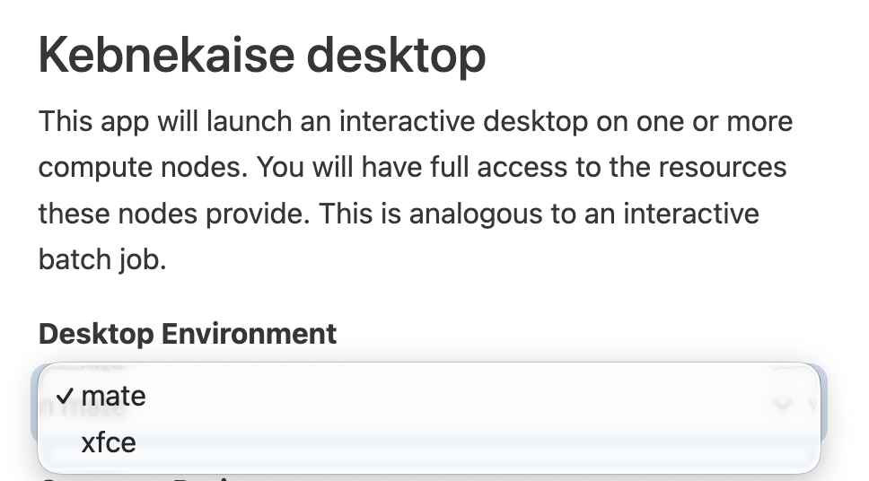
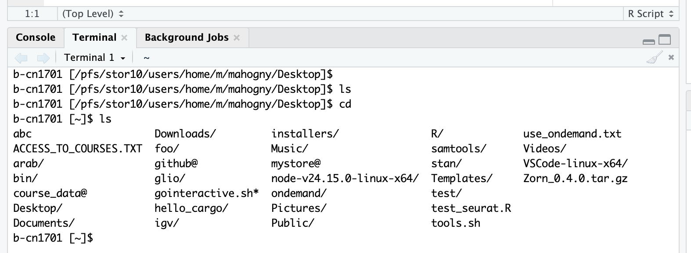
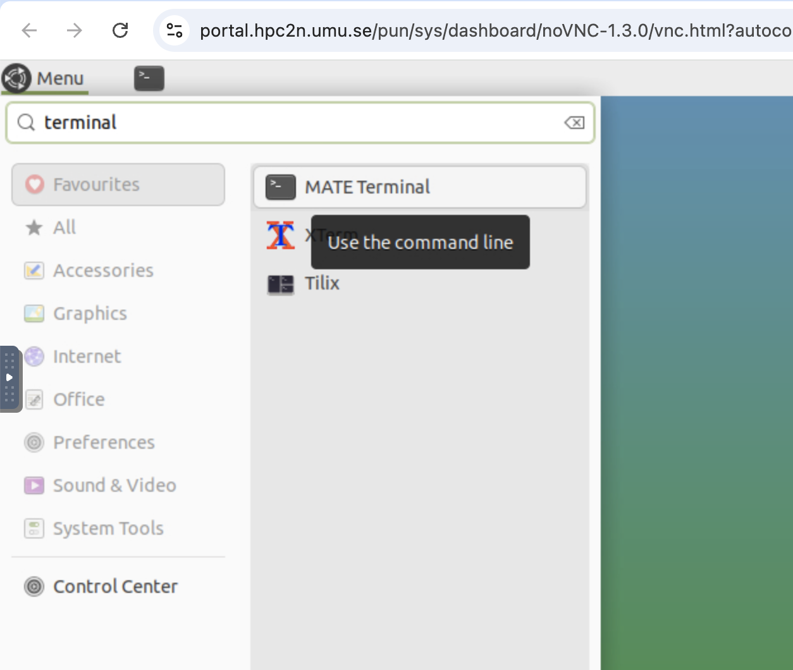
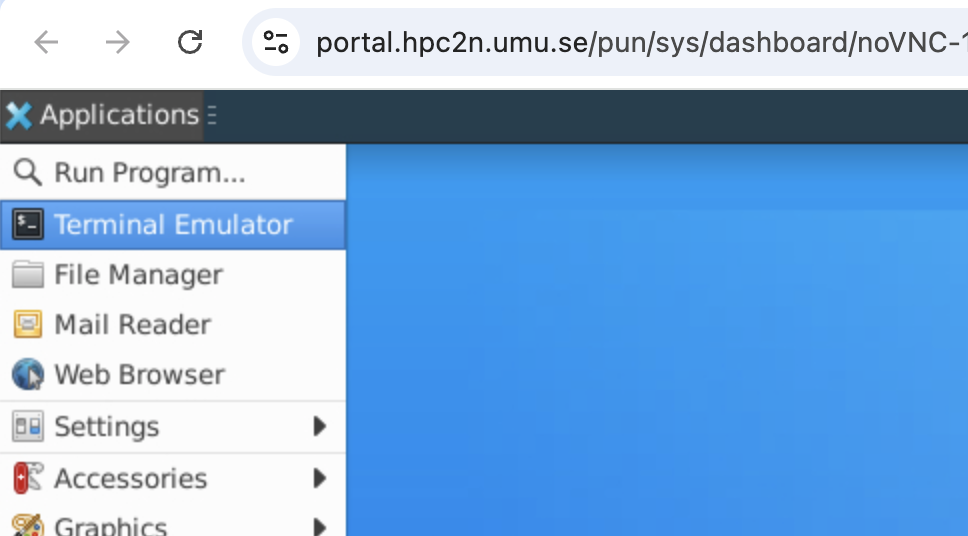
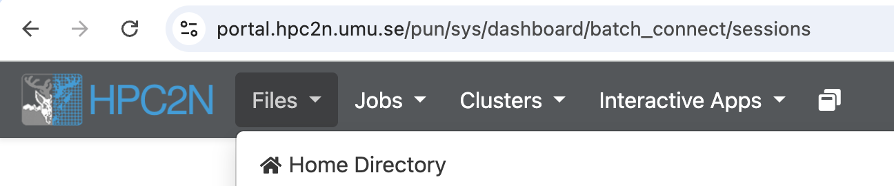

HPC2N (High Performance Computing Center North) provides the computing resources we will use for parts of this course.
Here are some pointers how to use their resources!

## Starting a desktop session (MATE / XFCE)

HPC2N is still developing a user friendly remote graphical desktop session. For random reasons we yet don't understand,
the standard settings might not work for you. If so, try to swap from MATE to XFCE (or vice versa). The settings appear
when you request to start a desktop:

{width=700}

## Opening a terminal

You will run most analysis commands from a terminal. Depending on the desktop environment you started, the way to open a terminal differs slightly.

### Terminal inside RStudio

You can also open a terminal directly from within RStudio, which is useful when you want to run shell commands alongside your R code.
⚠️ This is the easiest way to access the terminal and ml commands work here! But don't confuse it with the R Console (where you run R commands).

{width=700}

### Terminal in MATE and XFCE

You will need the graphical desktop later in the course. Once you get in, open the terminal from the "start menu".
⚠️ The desktop has issues with ml commands! So RStudio is the simpler option, when applicable
{width=700}

{width=700}

## Downloading files

To transfer your results back to your local computer, use the file manager to download files from HPC2N.
* Ideally use wget to download files to HPC2N directly instead of uploading from your computer. This is what serious users do
* If you are serious about bioinformatics, teach yourself how to use the "scp" command to download/upload files from your computer. This is beyond this course but compulsory knowledge in, e.g., the bioinformatics masters program

{width=700}

