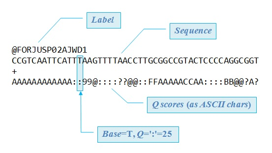

# Hands-on exercise 3.1a: Quality control and pre-processing of Illumina whole-genome sequencing data

#### Laura M. Carroll

#### 4/13/2025


# <span class="header-section-number">1</span> Introduction

**Goal:** Assess the quality of Illumina paired-end reads associated with a bacterial pathogen, before and after trimming

**Input:** Raw Illumina paired-end reads in gzipped fastq format (\*.fastq.gz)

**Output:** Trimmed Illumina paired-end reads in gzipped fastq format (\*.fastq.gz)

**Programs Used:**

  - [FastQC](https://www.bioinformatics.babraham.ac.uk/projects/fastqc/): quality control for high throughput sequence data
  - [fastp](https://github.com/OpenGene/fastp): ultrafast all-in-one preprocessing and quality control for short (e.g., Illumina) reads
  - [MultiQC](https://github.com/MultiQC/MultiQC): aggregate bioinformatics results across many samples into a single report


## <span class="header-section-number">1.1</span> Learning Outcomes

  - Navigate in a Linux/Unix environment from the command line
  - Learn and practice using commands to accomplish simple tasks
  - Run software from the command line
  - Retrieve files from a remote workstation
  - Assess the quality of Illumina sequencing reads using FastQC
  - Remove Illumina adapter sequences and low-quality bases using fastp
  - Aggregate FastQC results using MultiQC


## <span class="header-section-number">1.2</span> Assessing the quality of raw Illumina reads with FastQC

1.  Create a directory named `activity1` in your home directory, and then move to `activity1`:


```bash
cd ~
mkdir activity1
cd activity1
```

2.  For this activity, we will use raw reads associated with a clinical *Salmonella enterica* isolate, which are stored on a remote server. This particular *Salmonella enterica* strain was isolated in 2017 from the blood of a 77-year old man in Switzerland with no known travel history. The isolate underwent whole-genome sequencing (WGS) using an Illumina MiSeq platform and a Nextera XT library preparation kit.

The isolate’s genome was sequenced using paired-end reads: forward reads are stored in a file called `mystery_salmonella_A_1.fastq.gz`, and reverse reads are stored in a file called `mystery_salmonella_A_2.fastq.gz`. Both of these files are in fastq format (`.fastq`), compressed using gzip (`.gz`; a common method for compressing genomic data).

Let’s download the forward reads from the remote server to our local computer using the `wget` command:

```bash
wget http://beagle.henlab.org/public/course_introtobioinfo/mystery_salmonella_A_1.fastq.gz
```

If we type `ls`, we should see our forward reads in our current directory:

```bash
ls
```

Now, let’s download the reverse reads:

```bash
wget http://beagle.henlab.org/public/course_introtobioinfo/mystery_salmonella_A_2.fastq.gz
```

If we type `ls`, we’ll see that we now have forward and reverse reads in our current directory:

```bash
ls
```





Figure 1: fastq format (USEARCH)


3.  Now let’s run [FastQC](https://www.bioinformatics.babraham.ac.uk/projects/fastqc/), a popular program that is used to assess the quality of sequencing reads. It will provide us with a lot of interesting and valuable metrics which can help guide our downstream analyses (e.g., read length, number of reads, per-base quality, adapter content). Here, we will use FastQC to assess the quality of the raw reads of our mystery isolate.


Figure 2: Output of FastQC (Babraham Bioinformatics)


To use FastQC, load the `FastQC` module (using `ml`, as below, or the long form, `module load`):

```bash
module purge > /dev/null 2>&1
ml FastQC/0.12.1-Java-11
```

Once that finishes, we can check if FastQC is loaded by running

```bash
fastqc --version
```

This will print the version of FastQC that is installed.

We can also run the following to print the FastQC help message (explains how to run FastQC, the different options and what they do, etc.):

```bash
fastqc -h
```

4.  Now let’s run FastQC on our raw Illumina reads\!

The general format for running FastQC from the command line is as follows (note: don’t execute this command; it is just an example):

```bash
fastqc </path/to/first_reads.fastq.gz> </path/to/second_reads.fastq.gz> </path/to/third_reads.fastq.gz> </path/to/nth_reads.fastq.gz>
```

Let’s try running FastQC with our forward and reverse reads. Because they are already in our current directory, we can just supply the names of the files:

```bash
fastqc mystery_salmonella_A_1.fastq.gz mystery_salmonella_A_2.fastq.gz
```

Once FastQC is finished, we can type `ls` and see that we now have four additional files: a `.zip` and a `.html` file for our two `.fastq.gz` files with our forward and reverse Illumina raw reads:

```bash
ls
```

5.  Open the FastQC html file for your forward and reverse reads (it should open in your browser); what sort of information can we gather about our sample?


## <span class="header-section-number">1.3</span> Trimming raw Illumina reads with fastp

1.  Now that we have a general idea of what the quality of our raw reads is like, let’s see if we can do better by cleaning up our raw reads. To that end, we’ll use [fastp](https://github.com/OpenGene/fastp) to trim our Illumina reads (i.e., remove Illumina adapter sequences and low-quality bases from our Illumina reads). Trimming can often improve read quality and, later, assembly. There are numerous trimming programs available (e.g., [Trim Galore/cutadapt](https://www.bioinformatics.babraham.ac.uk/projects/trim_galore/), [Trimmomatic](http://www.usadellab.org/cms/?page=trimmomatic), [bbduk](https://jgi.doe.gov/data-and-tools/software-tools/bbtools/bb-tools-user-guide/bbduk-guide/), just to name a few), but here we will use fastp; it is a popular, ULTRAfast, and easy-to-use trimming program that, importantly, takes into account read pairing information for paired-end reads (most modern trimming software, including the fastp alternatives listed, should do this, but it’s always good to double-check beforehand if you try out something new).

Let’s get trimming\! Back in your terminal, make sure you are in your `activity1` directory with the forward and reverse reads from our Mystery Salmonella A isolate (`mystery_salmonella_A_1.fastq.gz` and `mystery_salmonella_A_2.fastq.gz`):

```bash
pwd
```

should show that we are in our `activity1` directory

```bash
ls
```

should show `mystery_salmonella_A_1.fastq.gz` and `mystery_salmonella_A_2.fastq.gz`

(If not: `cd ~/activity1`)

2.  Let’s load `fastp`; note that there are some other modules we need to load before loading `fastp` (we can see this by running `module spider fastp`):


```bash
module purge > /dev/null 2>&1
ml GCC/13.2.0
ml fastp/0.23.4
```

We can check that fastp has been installed properly by running the following:

```bash
fastp --version
```

This command will print the version of fastp that has been installed.

3.  Let’s use fastp to trim our raw reads\!

The command to run fastp for paired-end Illumina reads takes the following form (note: don’t execute this command; it is just an example):

```bash
fastp -i </path/to/raw_forward_reads.fastq.gz> -I </path/to/raw_reverse_reads.fastq.gz> -o </path/to/trimmed_forward_reads.fastq.gz> -O </path/to/trimmed_reverse_reads.fastq.gz> --detect_adapter_for_pe --thread [number of threads] -j </path/to/report.json> -h </path/to/report.html>
```

With this command, we:

  - Call `fastp`
  - Provide the path to an isolate’s forward reads (`-i`)
  - Provide the path to an isolate’s reverse reads (`-I`)
  - Specify where to output the isolate’s trimmed forward reads (`-o`)
  - Specify where to output the isolate’s trimmed reverse reads (`-O`)
  - Enable adapter sequence auto-detection (`--detect_adapter_for_pe`)
  - Specify the number of threads to use (`--thread`)
  - Specify where to output the JSON report produced by `fastp` (`-j`)
  - Specify where to output the HTML report produced by `fastp` (`-h`)


4.  Now let’s run `fastp` as described above, using one thread:


```bash
fastp -i mystery_salmonella_A_1.fastq.gz -I mystery_salmonella_A_2.fastq.gz -o mystery_salmonella_A_trimmedP_1.fastq.gz -O mystery_salmonella_A_trimmedP_2.fastq.gz --detect_adapter_for_pe --thread 1 -j fastp.json -h fastp.html
```

What are we doing when we run this?

  - We call `fastp`
  - We provide `fastp` with the path to our raw forward reads (`-i mystery_salmonella_A_1.fastq.gz`)
  - We provide `fastp` with the path to our raw reverse reads (`-I mystery_salmonella_A_2.fastq.gz`)
  - We tell `fastp` where to output our isolate’s trimmed forward reads (`-o mystery_salmonella_A_trimmedP_1.fastq.gz`)
  - We tell `fastp` where to output our isolate’s trimmed reverse reads (`-O mystery_salmonella_A_trimmedP_2.fastq.gz`)
  - We tell `fastp` to enable adapter sequence auto-detection (`--detect_adapter_for_pe`)
  - We tell `fastp` to use 1 thread (`--thread 1`)
  - We tell `fastp` where to output a JSON report (`-j fastp.json`)
  - We tell `fastp` where to output an HTML report (`-h fastp.html`)


5.  Wait\! Once fastp is finished, let’s take a look at the sizes of our fastq.gz files to get a rough idea of the effect trimming had on our genome. To do this, we can use `ls` with the `-l` and `-h` options to list our files and their respective sizes in human-readable format; we can additionally supply `*.fastq.gz` after the command, which allows us to only list files ending in .fastq.gz:


```bash
ls -lh *.fastq.gz
```


## <span class="header-section-number">1.4</span> Assessing the quality of trimmed Illumina reads with FastQC

1.  Using the FastQC instructions above, run FastQC on your forward and reverse trimmed paired reads (`mystery_salmonella_A_trimmedP_1.fastq.gz` and `mystery_salmonella_A_trimmedP_2.fastq.gz`)

2.  Once FastQC finishes, open the html files for your trimmed forward and reverse reads in your browser (i.e., `mystery_salmonella_A_trimmedP_1_fastqc.html` and `mystery_salmonella_A_trimmedP_2_fastqc.html`, respectively). Has the quality of your reads improved?


## <span class="header-section-number">1.5</span> Aggregate multiple FastQC reports with MultiQC

1.  As you may have already noticed, opening and scrolling through multiple FastQC reports can be extremely tedious\! Luckily for us…there’s a better way\! [MultiQC](https://github.com/MultiQC/MultiQC) is a fast, easy-to-use tool, which can aggregate results produced by a variety of bioinformatics tools–FastQC included–into a single HTML report\!

Let’s start by loading the MultiQC module; note that there are some other modules we need to load before loading `MultiQC` (we can see this by running `module spider MultiQC`):

```bash
module purge > /dev/null 2>&1
ml GCC/13.2.0  OpenMPI/4.1.6
ml MultiQC/1.22.3
```

Once that finishes, we can check if MultiQC is loaded by running

```bash
multiqc --version
```

This will print the version of MultiQC that is installed.

We can also run the following to print the MultiQC help message:

```bash
multiqc -h
```

2.  Assuming we are already in our `activity1` directory, we can run MultiQC by simply running the following command:


```bash
multiqc .
```

That’s it\!

3.  Once MultiQC finishes, open the MultiQC HTML file, `multiqc_report.html`, in your favorite browser. So much easier than looking at individual reports\!


# <span class="header-section-number">2</span> References

Babraham Bioinformatics. [FastQC: a quality control tool for high throughput sequence data.](https://www.bioinformatics.babraham.ac.uk/projects/fastqc/) Accessed April 14, 2019. URL: <https://www.bioinformatics.babraham.ac.uk/projects/fastqc/>

Bolger, A.M., M. Lohse, and B. Usadel. 2014. [Trimmomatic: a flexible trimmer for Illumina sequence data.](https://www.ncbi.nlm.nih.gov/pmc/articles/PMC4103590/) *Bioinformatics* 30(15): 2114-2120. DOI: 10.1093/bioinformatics/btu170.

Ewels, P., et al. 2016. [MultiQC: summarize analysis results for multiple tools and samples in a single report.](https://pmc.ncbi.nlm.nih.gov/articles/PMC5039924/) *Bioinformatics* 32(19):3047–3048. doi: 10.1093/bioinformatics/btw354.

JGI. [BBDuk: Decontamination Using Kmers.](https://jgi.doe.gov/data-and-tools/bbtools/bb-tools-user-guide/bbduk-guide/) Accessed April 15, 2019. URL: <https://jgi.doe.gov/data-and-tools/bbtools/bb-tools-user-guide/bbduk-guide/>

Krueger, F. and Babraham Bioinformatics. [Trim Galore: a wrapper tool around Cutadapt and FastQC to consistently apply quality and adapter trimming to FastQ files, with some extra functionality for MspI-digested RRBS-type (Reduced Representation Bisufite-Seq) libraries.](http://www.bioinformatics.babraham.ac.uk/projects/trim_galore/) Accessed April 15, 2019. URL: <http://www.bioinformatics.babraham.ac.uk/projects/trim_galore/>.

Martin, M. 2011. [Cutadapt removes adapter sequences from high-throughput sequencing reads.](https://journal.embnet.org/index.php/embnetjournal/article/view/200/479) *EMBnet.journal* 17(1): 10-12. DOI: <https://doi.org/10.14806/ej.17.1.200>.

Ritchie, D.M. 1984. [The UNIX system: The evolution of the UNIX time-sharing system.](https://onlinelibrary.wiley.com/doi/abs/10.1002/j.1538-7305.1984.tb00054.x) *AT\&T Bell Laboratories Technical Journal* 63(8): 1577-1593. DOI: 10.1002/j.1538-7305.1984.tb00054.x.

Schubert, M., S. Lindgreen, and L. Orlando. 2016. [AdapterRemoval v2: rapid adapter trimming, identification, and read merging.](https://www.ncbi.nlm.nih.gov/pmc/articles/PMC4751634/) *BMC Research Notes* 9: 88. DOI: 10.1186/s13104-016-1900-2.


## Extra exercise material

Theoretical questions on FASTQ, Phred scores, FastQC interpretation, and trimming trade-offs. Each is pen-and-paper unless a code chunk is shown; try first, then peek.

- **QE1.1** Given Phred scores Q = 10, 20, 30, 40, compute P(base wrong) for each. What is the *expected* number of base-call errors in a 150 bp read with uniform Q30 quality?

::: {.callout-tip collapse="true" appearance="minimal"}
## Hint
The Phred definition: $Q = -10 \log_{10} P$, so $P = 10^{-Q/10}$.
:::

::: {.callout-tip collapse="true" appearance="minimal"}
## Hint
Expected number of errors = (read length) × P(error per base), by linearity of expectation.
:::

::: {.callout-note collapse="true" appearance="minimal"}
## Solution
```{r, eval=TRUE}
Q <- c(10, 20, 30, 40)
P <- 10^(-Q/10)
data.frame(Q = Q, P_error = P)

# Expected errors in a 150 bp Q30 read:
150 * 10^(-30/10)
```
So Q10 → 10 %, Q20 → 1 %, Q30 → 0.1 %, Q40 → 0.01 %. A 150 bp Q30 read has an expected 0.15 errors — most reads are error-free, but ~14 % carry at least one error (Poisson tail).
:::

- **QE1.2** A FASTQ quality line begins `:::CCFFFFFHHGG`. Using Sanger / Illumina 1.8+ encoding (ASCII offset 33), what are the Phred scores at each position? Which positions would survive a Q20 cutoff?

::: {.callout-tip collapse="true" appearance="minimal"}
## Hint
For each character, Q = ASCII − 33. In R: `utf8ToInt(":") - 33` gives the score.
:::

::: {.callout-note collapse="true" appearance="minimal"}
## Solution
```{r, eval=TRUE}
qstr <- ":::CCFFFFFHHGG"
Q <- utf8ToInt(qstr) - 33
data.frame(char = strsplit(qstr, "")[[1]], Q = Q, keep = Q >= 20)
```
`:` = Q25, `C` = Q34, `F` = Q37, `H` = Q39, `G` = Q38. All 14 positions pass Q20 — typical for a high-quality Illumina 1.8+ read start. (Quality usually only drops at the 3′ end of the read.)
:::

- **QE1.3** A bacterial genome is 5 Mb. After fastp trimming you have 1.2 M paired-end reads of mean length 140 bp. Estimate fold-coverage. How does it change if a stricter Q30 trim loses 15 % of bases?

::: {.callout-tip collapse="true" appearance="minimal"}
## Hint
Coverage = (total bases sequenced) / (genome size). Paired-end means each *pair* contributes 2 × mean-length bases.
:::

::: {.callout-note collapse="true" appearance="minimal"}
## Solution
```{r, eval=TRUE}
n_pairs    <- 1.2e6
mean_len   <- 140
genome     <- 5e6

bases <- 2 * n_pairs * mean_len
cov   <- bases / genome
cov

# After losing 15% of bases:
cov_strict <- cov * 0.85
cov_strict
```
Roughly **67×** coverage, dropping to **57×** under the stricter Q30 trim. Both are comfortable for variant calling (≥30× is the usual rule of thumb for bacterial WGS); the trade-off is fewer errors at the cost of slightly thinner coverage.
:::

- **QE1.4** Why does base-call quality typically *drop* toward the 3′ end of an Illumina read? Predict where you would see this on a FastQC "per-base sequence quality" plot.

::: {.callout-tip collapse="true" appearance="minimal"}
## Hint
Think about how sequencing-by-synthesis works cycle-by-cycle on a cluster of identical templates.
:::

::: {.callout-note collapse="true" appearance="minimal"}
## Solution
Each cycle, one labelled nucleotide should be incorporated and read across every molecule in a cluster. In practice some molecules fail to extend (*phasing*) and others extend twice (*pre-phasing*); these "out-of-sync" molecules contribute mixed signal in subsequent cycles. The asynchrony accumulates with each cycle, so signal-to-noise (and Phred score) decays toward the 3′ end. On the FastQC per-base quality plot you see boxes that are tall and high (Q30+) at the start, dropping into the yellow/red zone over the final 20–40 cycles of the read.
:::

- **QE1.5** Why do sequencing adapters appear at the *3′* end of reads, not the 5′? Why are *short* DNA fragments more likely to be adapter-contaminated than long ones? What insert-size distribution maximises adapter contamination?

::: {.callout-tip collapse="true" appearance="minimal"}
## Hint
Sequencing starts inside the insert (after the sequencing primer anneals) and proceeds outward. What does the polymerase read once it crosses the end of the insert?
:::

::: {.callout-note collapse="true" appearance="minimal"}
## Solution
The sequencing primer binds at the 5′ end of the insert and the polymerase reads outward (5′→3′). If the read length exceeds the insert length, the read runs off the insert and into the *downstream* (3′) adapter — so adapter contamination is always on the 3′ end. For short fragments (insert < read length) every read reaches the adapter; for long fragments (insert ≫ read length) no read does. Adapter contamination peaks when the insert-size distribution is narrowly centred just *below* the read length (e.g. 130 bp inserts with 150 bp reads). This is also why size-selection during library prep matters.
:::

- **QE1.6** FastQC reports the GC-content distribution as a *single* Gaussian for a clean sample. Suppose you see a **second, sharp peak** at a different GC value. What might cause this, and what should you do about it before continuing?

::: {.callout-tip collapse="true" appearance="minimal"}
## Hint
A second peak means part of your DNA isn't from the organism you think you're sequencing.
:::

::: {.callout-note collapse="true" appearance="minimal"}
## Solution
A second sharp peak almost always means a second source of DNA — typically contamination from another organism (the GC content of bacteria varies widely, so a contaminant often shows up at a different GC). It can also be a technical artefact such as un-removed adapter sequences.

What to do: investigate before trimming. Re-run FastQC *after* fastp adapter trimming to see if the peak goes away (technical); if it persists, treat the sample as potentially contaminated and decide whether to re-prep or accept it with caveats.
:::

- **QE1.7** What is the difference between **PCR** duplicates and **optical** duplicates? How do they look different in a FastQC duplication plot, and when is a high duplication rate *expected* (not a sign of trouble)?

::: {.callout-tip collapse="true" appearance="minimal"}
## Hint
Both produce identical reads but they arise at different steps in library prep / sequencing.
:::

::: {.callout-note collapse="true" appearance="minimal"}
## Solution
- **PCR duplicates** are clonal copies created during library amplification: many physical molecules with the same sequence, distributed randomly across the flow-cell. Driven by low input DNA + too many PCR cycles.
- **Optical duplicates** are imaging artefacts: a single cluster mis-called as two adjacent clusters by the basecaller. They are *physically close* on the flow-cell — tools like `MarkDuplicates` flag them by coordinate proximity.

In FastQC the duplication-level plot can't distinguish them — both show as elevated bars for "≥10 duplicates" — so PCR and optical duplicates look the same. You'd need read coordinates (post-mapping) to separate them.

High duplication is **expected** in amplicon sequencing, 16S surveys, ChIP-seq, and any low-complexity library (single locus, single TF binding site) — there are only so many distinct fragments to begin with. It's worrying mainly in WGS / RNA-seq where you expect high library complexity.
:::

- **QE1.8** If you raise fastp's quality cutoff from `-q 15` to `-q 30`, what trade-off are you making? Express it as expected base loss vs expected residual error rate, using the Phred → P(error) relation from QE1.1.

::: {.callout-tip collapse="true" appearance="minimal"}
## Hint
A base at Q15 has 1/30 chance of being wrong; a base at Q30 has 1/1000 chance. Raising the cutoff to 30 discards everything in between.
:::

::: {.callout-note collapse="true" appearance="minimal"}
## Solution
```{r, eval=TRUE}
p_err <- function(q) 10^(-q/10)
p_err(15); p_err(30)
```
Raising `-q` from 15 to 30 cuts the residual per-base error rate from ~3 % to 0.1 % (a 30× reduction). The cost is throwing away every base whose quality is between Q15 and Q30 — typically the last 20–40 cycles of each read on a mature Illumina run. In practice this can mean losing 10–30 % of total bases on an older flow-cell. For variant calling this is usually a good trade (false positives drop sharply); for assembly it can be counter-productive (you may lose the only reads spanning a low-complexity repeat).
:::

- **QE1.9** A library is sequenced 2×150 bp. Under what condition do the forward and reverse reads of a pair **overlap** in the middle of the insert?

::: {.callout-tip collapse="true" appearance="minimal"}
## Hint
Each read is 150 bp. If they overlap, the two together cover an insert of less than what total length?
:::

::: {.callout-note collapse="true" appearance="minimal"}
## Solution
The forward and reverse reads together would span up to 2 × 150 = 300 bp of insert (if they don't overlap at all). They overlap whenever the **insert is shorter than 300 bp** — then the two reads cover some of the same bases in the middle.

This is useful: you can *merge* an overlapping pair into a single longer "consensus" read, with the overlapping region used to correct base errors. Tools like `fastp --merge` do this automatically. Whether you want to merge depends on the downstream analysis — for amplicon work and small-insert variant calling, yes; for many other uses, the aligner handles it fine without merging.
:::
