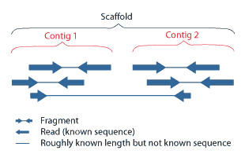
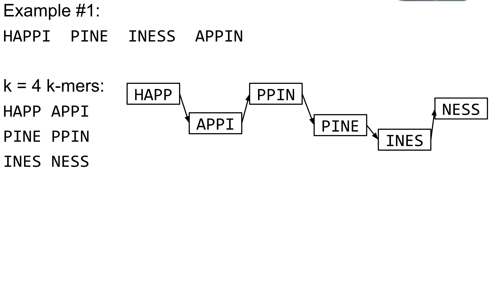
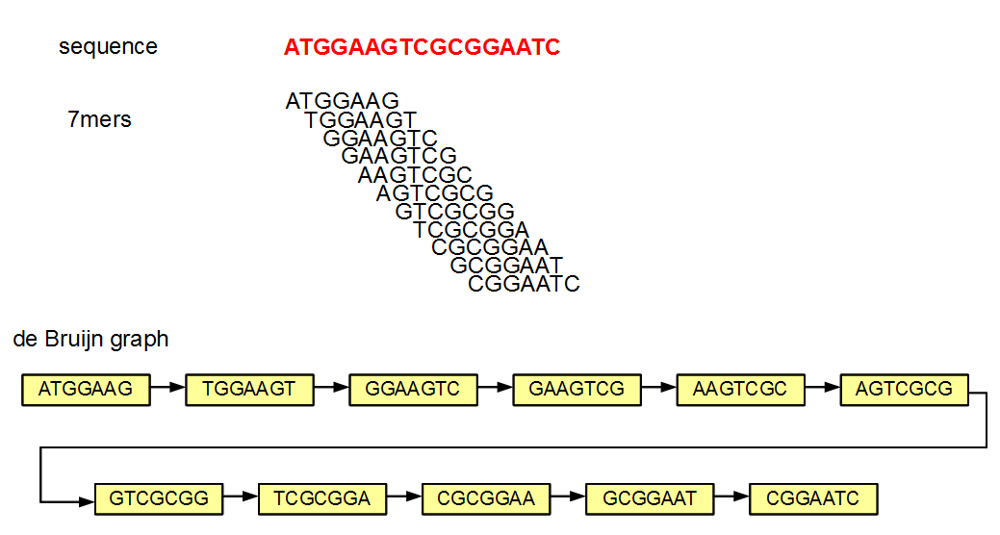
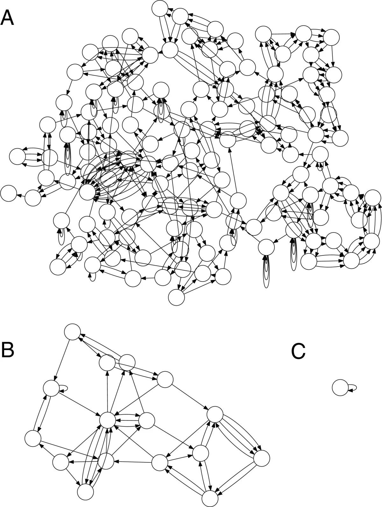

# Hands-on exercise 3.1b: De novo assembly of bacterial genomes

#### Laura M. Carroll

#### 4/13/2025


# <span class="header-section-number">1</span> Introduction

**Goal:** Assemble a bacterial genome *de novo* from Illumina short reads

**Input:** Trimmed Illumina paired-end reads in gzipped fastq format (\*\_trimmedP\_1.fastq.gz and \*\_trimmedP\_2.fastq.gz)

**Output:** Contigs and/or scaffolds in fasta format (\*.fasta)

**Programs Used:**

  - [SKESA](https://github.com/ncbi/SKESA): a *de novo* assembler for bacterial genomes
  - [QUAST](https://github.com/ablab/quast): quality assessment tool for genome assemblies


## <span class="header-section-number">1.1</span> Learning Outcomes

  - Assemble a bacterial genome *de novo* from Illumina short reads
  - Assess the quality of a bacterial genome assembly using various metrics


## <span class="header-section-number">1.2</span> Background


### <span class="header-section-number">1.2.1</span> Some terminology

  - **contig**: a contiguous length of genomic sequence in which the order of bases is known to a high confidence level

  - ***de novo* assembly**: a genome assembled without a reference

  - **read**: sequenced base pairs generated from a DNA fragment

  - **scaffold**: a construction in which multiple contigs are chained together using additional information about the relative position and orientation of the contigs in the genome; contigs in a scaffold are separated by gaps, which are designated by a variable number of ‘N’ characters





Figure 1: Reads versus contigs versus scaffolds (Wikipedia)


### <span class="header-section-number">1.2.2</span> From short reads to contigs: how do we assemble bacterial genomes?

The goal of genome assembly is to take thousands, millions, or even billions of short Illumina reads and obtain contigs, or continuous, closed stretches of DNA. Sounds easy, right?


Figure 2: Genome assembly is easy, right? (BioBeans)


We can tackle this problem by breaking it into pieces…literally, by using De Bruijn graphs. De Bruijn graphs are a type of directed graph. A directed graph is a structure made up of a set of vertices connected by edges, where the edges have direction.

A De Bruijn graph is a directed graph which represents overlaps between sequences of symbols. Sequences can be reconstructed by moving between nodes in the graph. In the context of reconstructing a genome from Illumina data, the nodes are k-mers, or all possible sub-sequences of length k that are contained in a sequence. For example, if we wanted to find all 3-mers in a sequence of characters, “Salmonella”, we would have the following:

“Sal”, “alm”, “lmo”, “mon”, “one”, “nel”, “ell”, “lla”

Our k-mers will have k-1 overlap (in our case, k-1 = 3-1 = 2). Starting with “Sal”, we need the next 3-mer to begin with “a”, followed by “l”. So our next 3-mer is “alm”:

Sal  
  alm  

The third 3-mer needs to begin with “lm”, so it must be “lmo”:

Sal  
  alm  
    lmo  

And the rest follow:

Sal  
  alm  
    lmo  
      mon  
        one  
          nel  
            ell  
              lla  

Another example:





Figure 3: Assembling “happiness” with 4-mers (Galaxy)


Another example, this time with a DNA sequence, k = 7, and overlap of 7-1 = 6 nucleotides:





Figure 4: Assembling a nucleotide sequence with 7-mers (homolog.us)


These are obviously some very simple examples. You can probably imagine how this can get complicated pretty quickly:





Figure 5: de Bruijn graphs for E. coli K12 where k = 50 (A), k = 1,000 (B), and k = 5,000 (C). (Koren, et al., 2013, Genome Biology)


Luckily, several assemblers that can be used to asseble bacterial genomes from multicell (i.e., not single-cell) data exist. [SPAdes](https://github.com/ablab/spades) has become one of the most popular bacterial genome assemblers in recent years due to the [improvments it made relative to its predecessors](https://www.ncbi.nlm.nih.gov/pmc/articles/PMC3342519/) (click [here](http://cab.spbu.ru/software/spades/) for some more benchmarking fun). Very recently, however, [SKESA](https://genomebiology.biomedcentral.com/articles/10.1186/s13059-018-1540-z), the assembler used to assemble hundreds of thousands of genomes in NCBI’s Sequence Read Archive (SRA) database, has been made available. There is [some debate](http://cab.spbu.ru/benchmarking-tools-for-de-novo-microbial-assembly/) as to which assembler is best for assembling the genomes of bacterial isolates; however, for this course, we will be using SKESA with our trimmed read pairs (trimmed using fastp), taking advantage of its speed.


### <span class="header-section-number">1.2.3</span> What makes a good genome assembly?

There are numerous metrics that can be used to assess genome quality, including:

Genome size

Number of contigs

Length of longest contig

N50 (the sequence length of the shortest contig at 50% of the total genome length)

L50 (the smallest number of contigs whose length sum makes up half of genome size)

Distribution of contigs with various lengths (e.g., how many contigs are longer than 1,000 bp? 5,000 bp?)

Number of ambiguous bases (Ns) present in the assembly

Average per-base-pair read coverage

Conveniently, [QUAST](https://github.com/ablab/quast) is able to report many of these metrics for us; as such, we’ll be using it to evaluate the assembled genome of our mystery *Salmonella* isolate.


# <span class="header-section-number">2</span> Activity 3.2


## <span class="header-section-number">2.1</span> Assemble a bacterial genome using SKESA

1.  Let’s make sure that we are starting from our home directory. To do so, `cd` (change directories) to your home directory:


```bash
cd ~
```

If we type `pwd` to print our current working directory, we should see we are in our home directory:

```bash
pwd
```

If we type `ls`, we should see that our `activity1` directory is still there:

```bash
ls
```

If, for some reason, you accidentally deleted your `activity1` directory, have no fear\! Just type `mkdir activity1` to create a new one.

2.  To assemble our genome, we are going to want to use our trimmed read pairs that we trimmed using fastp (the trimmedP.fastq.gz files from Activity 3.1). These should be in our `activity1` directory, so let’s move to our `activity1` directory:


```bash
cd activity1
```

If we type `ls`, we should see that the file containing our trimmed forward read pairs for our Mystery Salmonella A isolate, `mystery_salmonella_A_trimmedP_1.fastq.gz`, should be among the files in our current working directory (`activity1`), as well as the file containing its trimmed reverse read pairs, `mystery_salmonella_A_trimmedP_2.fastq.gz`:

```bash
ls
```

If, for some reason, you accidentally deleted your `activity1` directory, or if you deleted your `trimmedP.fastq.gz` files, you can just copy the backup trimmedP files to your `activity1` directory with the following commands\! To copy the trimmed forward reads to your computer:

```bash
wget http://beagle.henlab.org/public/course_introtobioinfo/mystery_salmonella_A_trimmedP_1.fastq.gz
```

To copy the trimmed reverse reads to your computer:

```bash
wget http://beagle.henlab.org/public/course_introtobioinfo/mystery_salmonella_A_trimmedP_2.fastq.gz
```

These results were obtained by running fastp using the exact same commands that you ran previously, with the exact same input files\!

3.  Now that we have our forward and reverse trimmed read pairs in gzipped fastq format (`.fastq.gz`), let’s use [SKESA](https://github.com/ncbi/SKESA) to assemble our genome *de novo* (i.e., without a reference genome).

Let’s start by loading the SKESA module; note that there are some other modules we need to load before loading `SKESA` (we can see this by running `module spider SKESA`):

```bash
module purge > /dev/null 2>&1
ml GCC/13.2.0  OpenMPI/4.1.6
ml SKESA/2.4.0_saute.1.3.0_2
```

To make sure SKESA is loaded, let’s check which version we’ve installed:

```bash
skesa --version
```

We can also print the help screen for SKESA:

```bash
skesa --help
```

4.  The general format for running SKESA using paired-end Illumina reads from a bacterial isolate is as follows (note: don’t execute this command; it is just an example):


```bash
skesa --reads </path/to/isolate_trimmedP_1.fastq.gz>,</path/to/isolate_trimmedP_2.fastq.gz> --cores <number of cores> --memory <memory available in Gb> --contigs_out <name of output fasta file>
```

Let’s go through this command, piece-by-piece:

  - **We call the command `skesa` (`skesa`)**

  - **We supply the paths to the fastq.gz files containing trimmed forward and reverse read pairs, separated by a comma: `--reads </path/to/isolate_trimmedP_1.fastq.gz>,</path/to/isolate_trimmedP_2.fastq.gz>`**

In our case, this will just be `--reads mystery_salmonella_A_trimmedP_1.fastq.gz,mystery_salmonella_A_trimmedP_2.fastq.gz`

  - **Number of cores to use: `--cores <number of cores>`**

This value is specific to the computer on which you’re running SKESA, as the number of cores you have available will determine this. By default, SKESA uses all available cores, but just to be safe and laptop-friendly, we’ll use 1 core: `--cores 1`

  - **Memory available in gigabytes: `--memory <memory available in Gb>`**

This value is also specific to the computer on which you are running SKESA. By default, SKESA uses `--memory 32`. To make this accessible for most laptops, let’s use `--memory 8` (but feel free to adjust this, based on your laptop).

  - **Name of the desired output fasta file: `--contigs_out <name of output fasta file>`**

You can hypothetically name your output file anything, but let’s name ours after the isolate we are querying (we’ll use the extension `.fna`, because SKESA produces a fasta file, which contains the assembled contigs): `--contigs_out mystery_salmonella_A.fna`

Now, let’s put it all together by running the following command:

```bash
skesa --reads mystery_salmonella_A_trimmedP_1.fastq.gz,mystery_salmonella_A_trimmedP_2.fastq.gz --cores 4 --memory 16 --contigs_out mystery_salmonella_A.fna
```

5.  Wait\! Assembling our genome can take a bit of time (10-15 minutes or so).


## <span class="header-section-number">2.2</span> Assess the quality of an assembled genome using QUAST

1.  Let’s start by making sure that we are starting from our `activity1` directory, which is in our home (`~`) directory. To move to our `activity1` directory, run the following command:


```bash
cd ~/activity1
```

If we type `pwd`, we should see that we are now in `activity1`:

```bash
pwd
```

If we type `ls`, we should see that the output file we created while running SKESA, `mystery_salmonella_A.fna` is present among the files in `activity1`:

```bash
ls
```

2.  Now that we have an assembled genome (`mystery_salmonella_A.fna`), let’s use [QUAST](https://github.com/ablab/quast) to assess the quality of our genome. QUAST provides various metrics which we can use to evaluate the quality of our assembled genome.

Let’s start by loading the QUAST module; note that there are some other modules we need to load before loading `QUAST` (we can see this by running `module spider QUAST`):

```bash
module purge > /dev/null 2>&1
ml GCC/13.2.0
ml QUAST/5.2.0
```

To check if QUAST is loaded, run the following command to check its version:

```bash
quast --version
```

3.  The general format for running QUAST to evaluate an assembled genome in fasta format is as follows (note: don’t execute this command; it is just an example):


```bash
quast -o </path/to/desired/output_directory> --min-contig 1 </path/to/input/contigs.fasta>
```

While QUAST has many options other than this (use `quast -h` to see them), we will just supply our input assembly (`mystery_salmonella_A.fna`), an output directory (we could name this anything, but let’s call it `mystery_salmonella_A_quast`), the number of threads (this depends on our computer, but here we will just use `--threads 1`), and we will change the `--min-contig` option to `--min-contig 1` (by default, QUAST sets this parameter to `--min-contig 500`, but we will lower it to 1 to consider all of our contigs in our assembly, not just those over 500 bp in length)

To that end, run QUAST using the following command:

```bash
quast -o mystery_salmonella_A_quast --threads 1 --min-contig 1 mystery_salmonella_A.fna
```

4.  When QUAST finishes, we can take a look at one of the text files with a summary of our results. If we type `ls` and supply the path to our directory with our QUAST results, `mystery_salmonella_A_quast`, we’ll see that QUAST has produced numerous reports:


```bash
ls mystery_salmonella_A_quast
```

If you want to look at the graphical reports that QUAST produced, you can open them in your browser. However, we can quickly view one of the short text-based reports, `report.txt`, using `cat`, which will print the text to our terminal in its entirety:

```bash
cat mystery_salmonella_A_quast/report.txt
```

We can see a lot of valuable statistics for our assembled genome, including its N50, L50, total length, longest contig, distribution of contig lengths, and GC content.


# <span class="header-section-number">3</span> References

Bankevich, Anton, et al. 2012. [SPAdes: A New Genome Assembly Algorithm and Its Applications to Single-Cell Sequencing.](https://www.ncbi.nlm.nih.gov/pmc/articles/PMC3342519/) *Journal of Computational Biology* 19(5): 455–477.

Gurevich, Alexey, et al. 2013. [QUAST: quality assessment tool for genome assemblies.](https://www.ncbi.nlm.nih.gov/pmc/articles/PMC3624806/) *Bioinformatics* 29(8): 1072–1075.

JGI. “What is a Scaffold?” Accessed April 15, 2019. URL: <https://genome.jgi.doe.gov/help/scaffolds.jsf>.

Koren, S., et al. 2013. [Reducing assembly complexity of microbial genomes with single-molecule sequencing.](https://www.ncbi.nlm.nih.gov/pmc/articles/PMC4053942/) *Genome Biology* 14(9):R101.

PacBio Blog. September 21, 2016. “Genomes vs. GenNNNes: The Difference between Contigs and Scaffolds in Genome Assemblies”. Accessed April 15, 2019. URL: <https://www.pacb.com/blog/genomes-vs-gennnnes-difference-contigs-scaffolds-genome-assemblies/>

Souvorov, Agarwala, and Lipman. 2018. [SKESA: strategic k-mer extension for scrupulous assemblies.](https://genomebiology.biomedcentral.com/articles/10.1186/s13059-018-1540-z) *Genome Biology* 19: 153.


