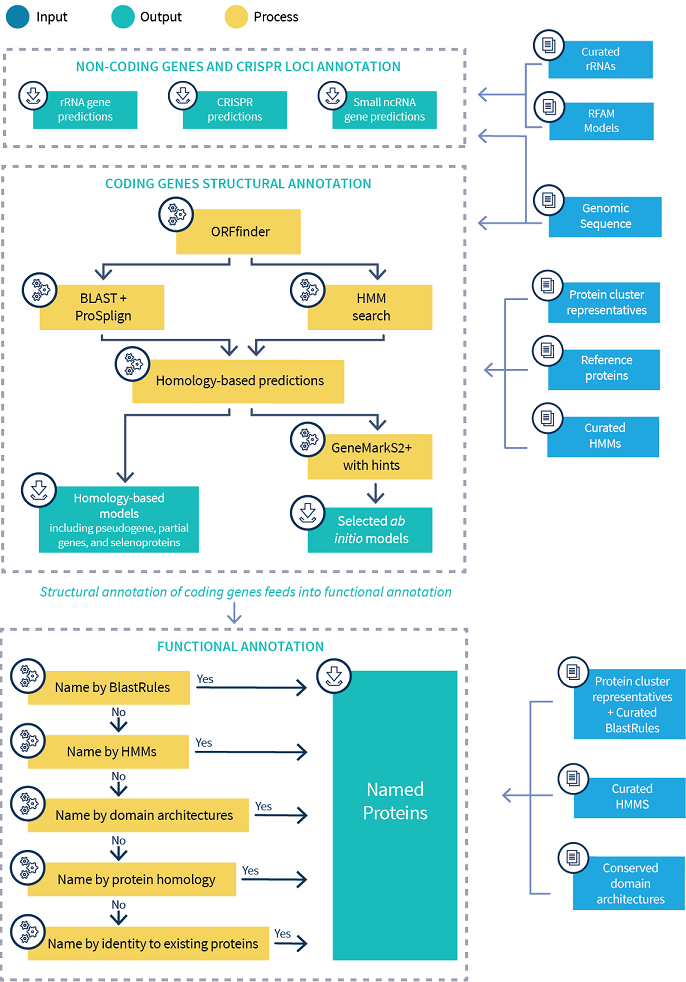
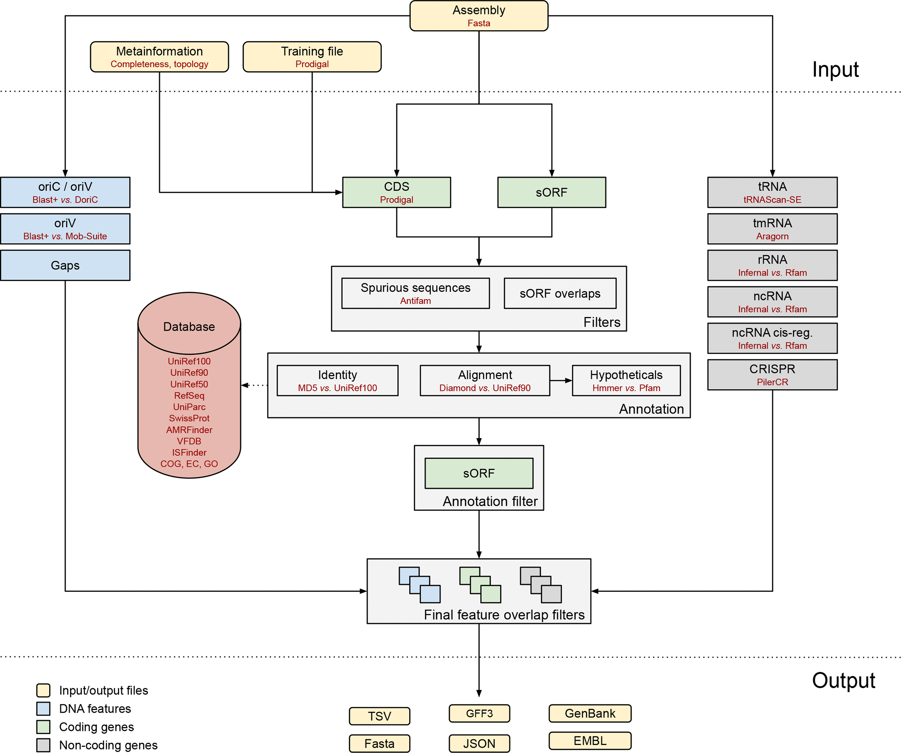
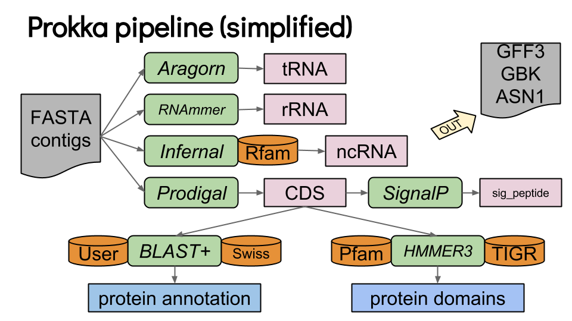

# Hands-on exercise 3.3: Genome annotation

#### Laura M. Carroll

#### 4/13/2025


# <span class="header-section-number">1</span> Introduction

**Goal:** Annotate whole genomes from the command line using Prokka; identify antimicrobial resistance genes, plasmid replicons, and virulence factors in bacterial genomes using the command line implementation of BLAST

**Input:** Assembled genomes in fasta format (\*.fasta)

**Output:** Genome annotation information in numerous formats (e.g., gff, faa, ffn); text files reporting the presence or absence of various sequences in a genome (\*.txt)

**Programs Used:**

  - [Prokka](https://github.com/tseemann/prokka): Rapid prokaryotic genome annotation
  - [BLAST+](https://www.ncbi.nlm.nih.gov/books/NBK279680/): command-line implementation of BLAST
  - [ABRicate](https://github.com/tseemann/abricate): BLAST-based screening of assembled genomes for antimicrobial resistance genes, virulence factors, etc.


## <span class="header-section-number">1.1</span> Learning Outcomes

  - Use Prokka to annotate whole bacterial genomes
  - Use the command line implementation of BLAST to construct custom databases which can be used to query genes present in bacterial genomes
  - Identify antimicrobial resistance (AMR) genes in bacterial genomes from the command line using ABRicate and the ResFinder AMR gene database
  - Identify plasmid replicons in bacterial genomes from the command line using ABRicate and the PlasmidFinder database
  - Identify virulence factors in bacterial genomes from the command line using ABRicate and the Virulence Factor Database (VFDB)


## <span class="header-section-number">1.2</span> Background


### <span class="header-section-number">1.2.1</span> Some terminology

  - **Genome annotation**: the process of describing the structure and function of the components of a genome (e.g., determining the locations and functions of genes and other features within a genome)

  - **BLAST**: the basic local alignment search tool; used to compare a query sequence to a database of subject sequences to identify database sequences that resemble the query sequence above a certain threshold

  - **HMMER**: used for searching sequence databases for sequence homologs, and for making sequence alignments; utilizes probabilistic models called profile hidden Markov models (profile HMMs)

  - **contig**: a contiguous length of genomic sequence in which the order of bases is known to a high confidence level


### <span class="header-section-number">1.2.2</span> How do we annotate whole genomes?

Genome annotation is the process of describing the structure and function of the components of a genome (e.g., determining the locations and functions of genes and other features within a genome). There are numerous genome annotation pipelines out there, and the methods they employ vary. Some common tasks genome annotation pipelines may perform include (i) identification of sequence features (e.g., protein-coding genes, non-coding RNAs, CRISPR loci), (ii) functional annotation of sequence features using BLAST and/or HMM-based approaches (e.g., HMMER). Within the bacterial space, popular annotation pipelines include [NCBI’s Prokaryotic Genome Annotation Pipeline (PGAP)](https://www.ncbi.nlm.nih.gov/genome/annotation_prok/process/), [Bakta](https://github.com/oschwengers/bakta), and [Prokka](https://github.com/tseemann/prokka) (click on the links if you’re interested in learning more about each specific tool/pipeline).





Figure 1: Overview of the NCBI PGAP pipeline (NCBI)





Figure 2: Overview of the Bakta pipeline (Schwengers, et al.)





Figure 3: Overview of the Prokka pipeline (Seemann)


For general, whole-genome annotation, the “best” pipeline depends on the type of data we’re working with and our experimental goals. Some things to consider:

  - Which organism are we working with? A eukaryote? Prokaryote?

  - Do we have experimental constraints? E.g., if we have thousands of genomes to annotate, we may want to prioritize speed.

  - Do we have computational constraints? E.g., some annotation tools have massive databases and need computers with adequate storage resources to use them.


### <span class="header-section-number">1.2.3</span> Specialized annotation tools

In the bacterial space, general genome annotation pipelines (e.g., [Prokka,](https://academic.oup.com/bioinformatics/article/30/14/2068/2390517) [Bakta](https://www.ncbi.nlm.nih.gov/pmc/articles/PMC8743544/), [PGAP](https://www.ncbi.nlm.nih.gov/pmc/articles/PMC5001611/)) work by identifying all genes in a genome, and then attempting…with varying success…to assign a predicted function to each gene. However, sometimes, we may want to search our genome for specific features of interest, perhaps using a specialized database constructed specifically for our task. In this situation, we may want to use a specialized annotation tool and/or database, which is designed specifically to search for our features of interest. Some examples of specialized annotation tools/databases for bacteria include tools for identifying antimicrobial resistance (AMR) genes ([AMRFinderPlus](https://www.nature.com/articles/s41598-021-91456-0), [ABRicate](https://github.com/tseemann/abricate), [ARIBA](https://www.ncbi.nlm.nih.gov/pmc/articles/PMC5695208/)), bacterial virulence factors ([VFDB](http://www.mgc.ac.cn/VFs/)), biosynthetic gene clusters (BGCs; [antiSMASH](https://antismash.secondarymetabolites.org/#!/start))…and much, much more\!

In this activity, we’ll start by using a general annotation pipeline (Prokka) to detect and annotate genomic features across our entire genome. Then, we’ll use the command-line implementation of BLAST to search our genome for antimicrobial resistance (AMR) genes specifically. Finally, we’ll use a specialized annotation tool, which relies on BLAST (ABRicate) to identify AMR genes, plasmid replicons, and virulence factors in our mystery genome\!


## <span class="header-section-number">1.3</span> Annotating bacterial genomes with Prokka

1.  Move to your `activity1` directory:

<!-- end list -->

    cd ~/activity1

If, for some reason, you accidentally deleted your `activity1` directory, have no fear\! Just (i) `cd ~` and (ii) type `mkdir activity1` to create a new one.

If we type `ls mystery_salmonella_A.fna`, we should see the mystery *Salmonella* genome we assembled in a previous activity:

    ls mystery_salmonella_A.fna

If you accidentally deleted your `mystery_salmonella_A.fna` file, you can just copy the genome to your `activity1` directory with the following command:

    wget http://beagle.henlab.org/public/course_introtobioinfo/mystery_salmonella_A.fna

2.  Now that we are in our `activity1` directory, let’s annotate `mystery_salmonella_A.fna`. To do this, we’ll use [Prokka](https://github.com/tseemann/prokka)\!

Let’s start by loading the Prokka module; note that there are some other modules we need to load before loading `prokka` (we can see this by running `module spider prokka`):

    module purge > /dev/null 2>&1
    ml GCC/13.2.0  OpenMPI/4.1.6
    ml prokka/1.14.5

Once `prokka` is loaded, try printing the help screen\!

    prokka --help

We can also print the version:

    prokka --version

3.  Now let’s annotate our genome by running Prokka as follows:

<!-- end list -->

    prokka --outdir mystery_salmonella_A_prokka_results --kingdom Bacteria --prefix  mystery_salmonella_A --cpus 1 --compliant mystery_salmonella_A.fna

With this command, we are:

  - Calling `prokka`
  - Supplying the name of a directory in which we want to output all of our files (it could be anything; in our case, we’ll name it `mystery_salmonella_A_prokka_results`)
  - Telling prokka that our organism belongs to the kindom Bacteria (`--kingdom Bacteria`)
  - Telling prokka to name all of the output files it creates after our isolate (`--prefix  mystery_salmonella_A`)
  - Telling prokka to use 1 CPU (`--cpus 1`)
  - Telling prokka to make our output Genbank/ENA/DDJB compliant (`--compliant`)
  - Supplying the path to our input genome (`mystery_salmonella_A.fna`)

<!-- end list -->

4.  Wait\! Prokka will take a few minutes to annotate our genome. After it finishes, if we type `ls` to print the contents of our working directory, `activity1`, we should see a new directory listed, `mystery_salmonella_A_prokka_results` :

<!-- end list -->

``` 
ls
```

If we type `ls` and supply the path to `mystery_salmonella_A_prokka_results`, we can see the files that prokka created:

    ls mystery_salmonella_A_prokka_results

Do you recognize any of the file extensions? You can read about each output file here: <https://github.com/tseemann/prokka>

How many protein coding genes did Prokka find? (Hint: use `grep` and check the file ending in `*.faa`)

How many transcript-associated genes (protein and RNAs) did Prokka find? (Hint: use `grep` and check the file ending in `*.ffn`)


## <span class="header-section-number">1.4</span> Creating and using custom BLAST gene databases to query bacterial genomes

We learned how to annotate a bacterial genome using a general annotation tool (Prokka). But what if we were interested in whether specific genes were present in our genome or not (e.g., AMR genes, virulence factors)? Finding this information in the output of general annotation tools is challenging, and sometimes, impossible. To overcome this, let’s construct our own specialized pipeline, which uses the [command-line implementation of nucleotide BLAST (blastn)](https://www.ncbi.nlm.nih.gov/books/NBK279680/) to detect antimicrobial resistance (AMR) genes in our mystery genome\!

1.  To do this, we will treat `mystery_salmonella_A.fna` as our query sequence. As our database, we will use the [ResFinder](http://genepi.food.dtu.dk/resfinder) AMR gene database.

Let’s copy the ResFinder database to our current directory, `activity1`:

    wget http://beagle.henlab.org/public/course_introtobioinfo/resfinder.fasta

If we type `ls` to print the contents of our working directory, `activity1`, we should see (among other files) two files listed: `mystery_salmonella_A.fna` (our query sequence), and `resfinder.fasta` (our AMR database sequences):

``` 
ls
```

If we type `head` and supply the path to `resfinder.fasta`, we can see the first few lines of `resfinder.fasta`:

    head resfinder.fasta

We should see a file in fasta format which contains nucleotide sequences.

2.  Let’s load the command-line implementation of BLAST (i.e., `BLAST+`); note that there are some other modules we need to load before loading `BLAST+` (we can see this by running `module spider BLAST+/2.16.0`):

<!-- end list -->

    module purge > /dev/null 2>&1
    ml GCC/13.2.0  OpenMPI/4.1.6
    ml BLAST+/2.16.0

To test if our BLAST installation is working, we can print the help screen for nucleotide BLAST (blastn):

    blastn -h

3.  To run BLAST, we first need to construct and format a BLAST database of our AMR gene sequences. To do this, we use the following command (note: don’t execute this command; it is just an example):

<!-- end list -->

    makeblastdb -in database.fasta -dbtype [nucl or prot]

With this command, we

  - Call `makeblastdb`, BLAST’s command for constructing and formatting BLAST databases
  - Supply `makeblastdb` with the path to the fasta file with which we want to create a BLAST database (`-in`)
  - Specify whether our database contains nucleotide sequences (`-dbtype nucl`) or amino acid sequences (`-dbtype prot`)

To run `makeblastdb` and construct a custom BLAST database using the AMR gene sequences available in ResFinder, let’s run the following command:

    makeblastdb -in resfinder.fasta -dbtype nucl

With this command, we

  - Call `makeblastdb`, BLAST’s command for constructing and formatting BLAST databases
  - Supply `makeblastdb` with the path to our ResFinder database (`-in resfinder.fasta`)
  - Tell `makeblastdb` that `resfinder.fasta` contains nucleotide sequences (`-dbtype nucl`)

If we type `ls`, we should see some new files (`resfinder.fasta.*`):

``` 
ls
```

4.  Now, we can use nucleotide BLAST (`blastn`) to identify possible AMR genes present in our genome. `blastn` has a lot of options available; to check them out, run `blastn` with the `-h` command (for help):

<!-- end list -->

    blastn -h

5.  For our analysis, let’s keep things simple by taking advantage of BLAST’s default settings. Let’s identify AMR genes in our genome, `mystery_salmonella_A.fna`, using the following command:

<!-- end list -->

    blastn -query mystery_salmonella_A.fna -db resfinder.fasta -out blast_resfinder.txt -outfmt 6

With this command, we

  - Call the command line implementation of nucleotide BLAST (`blastn`)
  - Tell `blastn` that we want to treat our mystery genome as a query (`-query mystery_salmonella_A.fna`)
  - Tell `blastn` that we want to treat `resfinder.fasta` as a BLAST database (`-db resfinder.fasta`)
  - Tell `blastn` what to name our output file; we can name it anything, but here, we’ll name it `blast_resfinder.txt` (`-out blast_resfinder.txt`)
  - Tell `blastn` which file format it should use for the output file; here, we are specifying output format `6`, which corresponds to a text file with [12 columns](http://www.metagenomics.wiki/tools/blast/blastn-output-format-6) (`-outfmt 6`)

<!-- end list -->

6.  After `blastn` finishes running, we should see a file named `blast_resfinder.txt` in our directory:

<!-- end list -->

``` 
ls
```

7.  Let’s look at the first few lines of `blast_resfinder.txt` with the `head` command:

<!-- end list -->

    head blast_resfinder.txt

We should see that our data is formatted into 12 columns. Although blastn doesn’t print this, [the 12 default columns for blast outfmt 6 correspond to the following](http://www.metagenomics.wiki/tools/blast/blastn-output-format-6):

| Column | Column Header | Definition                      |
| ------ | ------------- | ------------------------------- |
| 1      | qseqid        | query sequence ID               |
| 2      | sseqid        | subject sequence ID             |
| 3      | pident        | percentage of identical matches |
| 4      | length        | alignment length                |
| 5      | mismatch      | number of mismatches            |
| 6      | gapopen       | number of gap openings          |
| 7      | qstart        | start of alignment in query     |
| 8      | qend          | end of alignment in query       |
| 9      | sstart        | start of alignment in subject   |
| 10     | send          | end of alignment in subject     |
| 11     | evalue        | BLAST expect value              |
| 12     | bitscore      | BLAST bit score                 |

8.  If we use `cat` to print the output of `blast_resfinder.txt` in its entirety, we’ll see that there is a lot of information provided by BLAST:

<!-- end list -->

    cat blast_resfinder.txt

We’ll see the names of contigs in our assembly, `mystery_salmonella_A.fna`, (i.e., our query sequences) listed in the first column, with AMR alleles reported in the second (e.g., sul2\_5). The third column contains the percentage of identical matches between query and subject (i.e., contigs in our assembly and AMR genes in our databse), while the second to last column contains our BLAST e-value.

This is a lot of information, and it can seem pretty overwhelming\! Luckily, numerous BLAST wrappers, such as [ABRicate](https://github.com/tseemann/abricate), can be used to parse the output of BLAST and identify which genes in a database (if any) are present in a sequence, making it much easier to interpret BLAST results. Additionally, these tools can scale to hundreds, and even thousands, of genomes, making it possible to interpret BLAST results in aggregate (see the next section below\!)


## <span class="header-section-number">1.5</span> Detecting AMR genes in assembled bacterial genomes with ABRicate

1.  Let’s use ABRicate to identify AMR genes in our assembled genome, `mystery_salmonella_A.fna`, using the ResFinder database of AMR genes.

First, let’s load ABRicate; note that there are some other modules we need to load before loading `ABRicate` (we can see this by running `module spider ABRicate/1.0.0`):

    module purge > /dev/null 2>&1
    ml GCC/13.2.0  OpenMPI/4.1.6
    ml ABRicate/1.0.0

We can test if `abricate` loaded by printing the help screen:

    abricate --help

2.  To run ABRicate, our command takes the following structure (note: don’t execute this command; it is just an example):

<!-- end list -->

    abricate --mincov [integer between 0 and 100] --minid [integer between 0 and 100] --db [database_name] --threads [integer] assembly.fasta > output.txt

With this command, we

  - Call `abricate`
  - Specify the minimum percent coverage threshold for a gene to be considered present in a genome; by default, ABRicate sets this to 80 (`--mincov`)
  - Specify the minimum percent identity threshold for a gene to be considered present in a genome; by default, ABRicate sets this to 80 (`--minid`)
  - Specify which database ABRicate should use; by default, ABRicate uses `ncbi`, which corresponds to the NCBI AMR gene database (`--db`)
  - Specify the number of threads for ABRicate to use; this is set to 1 by default (`--threads`)
  - Specify the assembled genome in which you want to detect genes, in fasta format (`input.fasta`)
  - Specify the name of an output file where ABRicate will print the results (`> output.txt`)

Let’s try running it ourselves on our genome:

    abricate --mincov 80 --minid 80 --db resfinder --threads 1 mystery_salmonella_A.fna > mystery_salmonella_A_resfinder.txt

With this command, we

  - Call `abricate` (`abricate`)
  - Specify a minimum percent coverage threshold of 80 (`--mincov 80`)
  - Specify a minimum percent identity threshold of 80 (`--minid 80`)
  - Tell ABRicate to use `resfinder` as the database (`--db resfinder`)
  - Tell ABRicate to use 1 thread (`--threads 1`)
  - Tell ABRicate to use mystery\_salmonella\_A.fna as input (`mystery_salmonella_A.fna`)
  - Tell ABRicate to save the results of our query to a text file named mystery\_salmonella\_A\_resfinder.txt (`> mystery_salmonella_A_resfinder.txt`)

ABRicate will print the number of genes it detected before it finishes. How many AMR genes did it detect in the genome of `mystery_salmonella_A.fna`?

3.  If we type `ls`, we should see that ABRicate created a file named `mystery_salmonella_A_resfinder.txt`:

<!-- end list -->

``` 
ls
```

If we use `cat` to print the output of `mystery_salmonella_A_resfinder.txt`, we’ll see that this is much easier to interpret than our raw BLAST results:

    cat mystery_salmonella_A_resfinder.txt

For a detailed explanation of ABRicate’s output format, [check out the README file (under “Output”).](https://github.com/tseemann/abricate)


## <span class="header-section-number">1.6</span> Detecting plasmid replicons in assembled bacterial genomes with ABRicate

1.  Repeat Steps 2 and 3 of the section above (“Detecting AMR genes in assembled bacterial genomes with ABRicate”), but replace all instances of “resfinder” with “plasmidfinder”…now you can see plasmid replicons present in our mystery genome\!


## <span class="header-section-number">1.7</span> Detecting virulence factors in assembled bacterial genomes with ABRicate

1.  Repeat Steps 2 and 3 of the section above (“Detecting AMR genes in assembled bacterial genomes with ABRicate”), but replace all instances of “resfinder” with “vfdb”…now you can see virulence factors present in our mystery genome\!


# <span class="header-section-number">2</span> References

Camacho, et al. 2009. BLAST+: architecture and applications. BMC Bioinformatics 10:421. doi: 10.1186/1471-2105-10-421.

Carattoli, et al. 2014. In Silico Detection and Typing of Plasmids using PlasmidFinder and Plasmid Multilocus Sequence Typing. Antimicrobial Agents Chemotherapy 58(7): 3895–3903. doi: 10.1128/AAC.02412-14.

Eddy, Sean. 2011. Accelerated Profile HMM Searches. PLoS Computational Biology 7(10):e1002195. doi: 10.1371/journal.pcbi.1002195.

Florensa, et al. 2022. ResFinder – an open online resource for identification of antimicrobial resistance genes in next-generation sequencing data and prediction of phenotypes from genotypes. Microbial Genomics 8(1): 000748. doi: 10.1099/mgen.0.000748.

Liu, et al. 2022. VFDB 2022: a general classification scheme for bacterial virulence factors. Nucleic Acids Research 50(D1): D912–D917. doi: 10.1093/nar/gkab1107

Schwengers, et al. 2021. Bakta: rapid and standardized annotation of bacterial genomes via alignment-free sequence identification. Microbial Genomics 7(11): 000685. doi: 10.1099/mgen.0.000685.

Seemann, Torsten. 2014. Prokka: rapid prokaryotic genome annotation. Bioinformatics 30(14): 2068–2069. doi: <https://doi.org/10.1093/bioinformatics/btu153>.

Tatusova, et al. 2016. NCBI prokaryotic genome annotation pipeline. Nucleic Acids Research 44(14):6614-24. doi: 10.1093/nar/gkw569.


