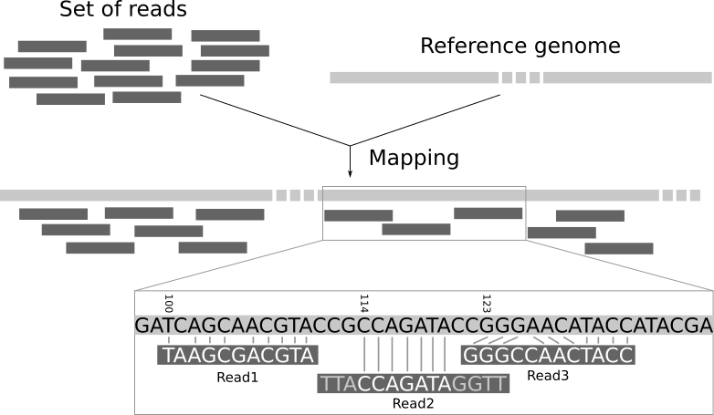
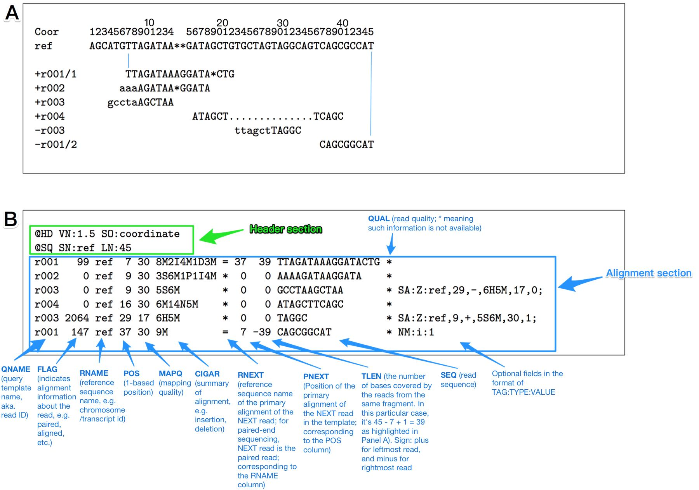

# Hands-on exercise 3.4: Read mapping and variant calling

#### Laura M. Carroll

#### 4/13/2025


# <span class="header-section-number">1</span> Introduction

**Goal:** Identify variants (i.e., single nucleotide polymorphisms \[SNPs\] and short indels) in bacterial genomes using read mapping-based approaches

**Input:** Trimmed Illumina paired-end reads in gzipped fastq format (\*\_trimmedP\_1.fastq.gz and \*\_trimmedP\_2.fastq.gz)

**Output:** Variants in vcf format (\*.vcf)

**Programs Used:**

  - [bwa](https://bio-bwa.sourceforge.net/): Burrow-Wheeler Aligner for short-read alignment
  - [samtools](https://www.htslib.org/): a suite of programs for interacting with high-throughput sequencing data
  - [bcftools](https://samtools.github.io/bcftools/bcftools.html): a set of utilities that manipulate variant calls in the variant call format (vcf) and its binary counterpart (bcf)
  - [vcftools](https://vcftools.github.io/index.html): a program package designed for working with vcf files


## <span class="header-section-number">1.1</span> Learning Outcomes

  - Map short reads to a reference genome
  - Identify variants in closely related bacterial genomes using a reference-based mapping approach
  - Manipulate vcf files using vcftools


## <span class="header-section-number">1.2</span> Background


### <span class="header-section-number">1.2.1</span> Some terminology

  - **single-nucleotide polymorphism (SNP)** : a substitution of a single nucleotide that occurs at a specific position in the genome

  - **core single-nucleotide polymorphism (core SNP)** : a SNP at a site that is present in all genomes queried in a set

  - **high-quality single-nucleotide polymorphism (hqSNP)** : a SNP present among a set of genomes with high support (e.g., high sequence quality, high sequence depth, high consensus)

  - **SNP calling**: also known as variant calling; identification of nucleotides which differ from a reference and/or other genomes

  - **reference-free SNP calling**: identification of SNPs within a set of genomes without the use of a reference genome

  - **reference-based SNP calling**: identification of SNPs relative to a closely related reference genome

  - **closed genome**: a genome assembly in which all chromosomes are fully sequenced, each consisting of a single, high-quality sequence

  - **draft genome**: a genome assembly consisting of contigs or scaffolds


### <span class="header-section-number">1.2.2</span> Why SNPs?

SNPs identified in bacterial genomes can be used in a number of comparative genomics applications. Often, they are used to infer the phylogenetic relatedness of bacterial isolates at the whole-genome level, with applications that include identifying bacterial strains responsible for outbreaks (as has been done for foodborne pathogens [*Listeria monocytogenes*](https://www.ncbi.nlm.nih.gov/pubmed/28643628), [*Salmonella enterica*](https://www.ncbi.nlm.nih.gov/pubmed/28930002), [*Escherichia coli*](https://www.ncbi.nlm.nih.gov/pubmed/27446025), [*Bacillus cereus*](https://www.frontiersin.org/articles/10.3389/fmicb.2019.00144/full), and others). Other applications of bacterial SNP data include [identifying transmission events between hosts](https://www.ncbi.nlm.nih.gov/pmc/articles/PMC4012302/), [querying the spatiogeographical spread of a pathogen](https://academic.oup.com/cid/advance-article-abstract/doi/10.1093/cid/ciy919/5146342?redirectedFrom=fulltext), and conducting [bacterial genome-wide association studies (GWAS)](https://www.nature.com/articles/nrg.2016.132), in which SNPs are associated with phenotypes of interest (e.g., [virulence](https://www.ncbi.nlm.nih.gov/pmc/articles/PMC4009613/), [resistance to antimicrobials](https://www.nature.com/articles/ng.2747)).


### <span class="header-section-number">1.2.3</span> How do we identify SNPs in bacterial genomes?

Numerous pipelines have been developed to identify SNPs in bacterial genomes, with the “best” approach often depending on the data that you’re working with, as well as the goals of your experiment or study.

SNP calling pipelines can be categorized based on several attributes, including:

  - Whether they rely on a reference genome (reference-based) or not (reference-free)
  - Whether they rely on read mapping, k-mer, or genome alignment based approaches to identify SNPs
  - Whether they can use reads, assembled genomes, or a combination of the two as input
  - The filtering steps they employ (e.g., removal of SNPs in phage regions, removal of clustered SNPs, removal of SNPs not meeting minimum read depth or quality score thresholds)


#### <span class="header-section-number">1.2.3.1</span> Reference-based versus reference-free SNP calling

**Reference-based SNP calling approaches** rely on aligning reads or genomic regions to a reference genome, which is an assembled genome that is closely related to the genomes of interest, and then identifying SNPs relative to that reference. Reference-based SNP calling approaches are the most commonly employed SNP calling approaches when querying bacterial genomes (particularly within the context of of outbreak detection), and they are useful when querying closely related strains. There are many reference-based SNP calling pipelines which can be used to identify SNPs in bacterial genomes; examples include [the CFSAN SNP Pipeline](https://snp-pipeline.readthedocs.io/en/latest/), [LYVE-SET](https://github.com/lskatz/lyve-SET), [Snippy](https://github.com/tseemann/snippy), and [Parsnp](https://genomebiology.biomedcentral.com/articles/10.1186/s13059-014-0524-x).

**Reference-free SNP calling approaches** detect SNPs between a set of genomes without the requirement of a user-supplied reference genome. A popular reference-free SNP calling approach within the context of bacterial genomics is that which is employed by [kSNP](https://www.ncbi.nlm.nih.gov/pubmed/25913206), a tool which uses a k-mer based approach to call SNPs. The kSNP reference-free approach is valuable in situations where bacterial genomes are distant enough that no reference genome is adequately “close” to all the the genomes in the set.


#### <span class="header-section-number">1.2.3.2</span> Read mapping versus k-mer versus genome alignment SNP calling approaches

**Read mapping** approaches involve aligning (“mapping”) sequencing reads to a reference genome; ergo, they are a subset of reference-based SNP calling. The majority of SNP calling pipelines used to identify SNPs in bacterial genomes rely on read mapping; however, different pipelines may employ different read mapping strategies or algorithms. Many SNP calling pipelines which employ a read mapping approach exist; examples include [the CFSAN SNP Pipeline](https://snp-pipeline.readthedocs.io/en/latest/), [LYVE-SET](https://github.com/lskatz/lyve-SET), and [Snippy](https://github.com/tseemann/snippy).





Figure 1: Mapping reads to a reference genome (<https://shiltemann.github.io/>)


**Genome alignment** approaches can be categorized as either core-genome alignment or whole-genome alignment based. Core-genome alignment based approaches involve identifying orthologous sequences present in all genomes in a set, while whole-genome alignment approaches extend alignment to regions not present in all genomes. [Parsnp](https://genomebiology.biomedcentral.com/articles/10.1186/s13059-014-0524-x) has become a popular tool for identifying SNPs in bacterial genomes using a core-genome alignment approach, due to its scalability (i.e., ability to query dozens, hundreds, and even thousands of closely related bacterial genomes) and speed (a major drawback that often plagues whole-genome alignment).

The **k-mer based** approach, as employed by reference-free SNP calling pipeline [kSNP](https://www.ncbi.nlm.nih.gov/pubmed/25913206), involves breaking up genomic data into odd-length k-mers, and then comparing the k-mers to each other, allowing the center nucleotide to vary.


#### <span class="header-section-number">1.2.3.3</span> Input data format

SNP calling pipelines can additionally differ in terms of the types of input data which they require/can accept; some pipelines or tools require data to be short reads in fastq or gzipped fastq (fastq.gz) format, while others only support assembled genomes in fasta format. Some approaches may be additionally capable of utilizing both short reads, as well as assemblies (e.g., by fragmenting the contigs into synthetic “reads”).


#### <span class="header-section-number">1.2.3.4</span> Filtering steps

SNP calling pipelines can differ in terms of the filtering steps which they employ. Examples of filtering steps include:

  - Removing SNPs which align to prophage regions (because mobile elements like phage can have different mutation rates)
  - Removing SNPs which cluster closely together (because SNPs which occur close together may have been acquired via horizontal gene transfer, not mutation)
  - Minimum read depth (for mapping based approaches, because we may be less confident in SNPs with few reads supporting them)
  - Minimum quality or consensus thresholds (for mapping based approaches, because SNPs with conflicting allele calls may not actually be SNPs)


### <span class="header-section-number">1.2.4</span> Selecting a SNP calling pipeline for your data

The “right” SNP calling pipeline depends on your data, as well as the goals of your experiment, and the [SNP calling pipeline you choose can greatly affect the quantity and identity of the SNPs you identify.](https://www.frontiersin.org/articles/10.3389/fmicb.2019.00144/full)

Some things to consider:

1.  **How “closely related” are my samples?** Do they belong to the same species? The same lineage within a species? A reference-based approach is not generally a good idea if you’re working with isolates which are not closely related (e.g., different species). However, if your isolates are known to be closely related, the identification of high-quality (hqSNPs) using a reference-based approach is usually a goal to keep in mind.

2.  **Do I have short reads available for my samples? Only assemblies? A combination?** Pipelines which rely on a read mapping approach (e.g., CFSAN) utilize reads in fastq.gz format as input, while others (e.g., Parsnp) can only use assembled genomes in fasta format as input. Other approaches may use a combination; for example, kSNP can use either assemblies or reads. Snippy and LYVE-SET are designed primarily for identifying SNPs using reads as input but are capable of using assemblies for genomes for which no reads are available.

3.  **How conservative do I want to be when identifying SNPs?** Some pipelines (e.g., CFSAN, LYVE-SET) employ strict filtering criteria to remove SNPs that do not meet specific conditions, meaning that they identify hqSNPs (i.e., the risk of a false positive \[a SNP is called that is not actually a SNP\] is low). As such, they remove “noisy” SNPs at the risk of removing true SNPs (i.e., they may remove a “true” SNP which does not meet the specified conditions). Pipelines like CFSAN and LYVE-SET are especially useful when analyzing WGS data associated with outbreaks (that’s actually what they were designed for\!) because pairwise SNP differences between isolates are often used to determine whether an isolate should be included as part of an outbreak or cluster or not. In this scenario, a single SNP can determine whether an isolate is included or excluded\!

In this Activity, we will be identifying SNPs in a bacterial genome by writing our very own variant calling pipeline\! Our pipeline will call variants using a reference-based, read mapping approach, and it will consist of two major steps: (i) short-read mapping with `bwa` and (ii) variant calling with `bcftools`. As such, we’ll supply our trimmed Illumina paired-end reads as input (i.e., gzipped fastq files; \*\_trimmedP\_1.fastq.gz and \*\_trimmedP\_2.fastq.gz).


# <span class="header-section-number">2</span> Activity 3.4


## <span class="header-section-number">2.1</span> Map Illumina paried-end reads to a reference genome using bwa

1.  Let’s make sure that we are starting from our home directory. To do so, `cd` (change directories) to your home directory:


```bash
cd ~
```

If we type `pwd` to print our current working directory, we should see we are in our home directory:

```bash
pwd
```

If we type `ls`, we should see that our `activity1` directory is still there:

```bash
ls
```

(If, for some reason, you accidentally deleted your `activity1` directory, have no fear\! Just type `mkdir activity1` to create a new one)

2.  Let’s change directories and move into our `activity1` directory:


```bash
cd activity1
```

If we type `ls`, we should see that the file containing our trimmed forward read pairs for our Mystery Salmonella A isolate, `mystery_salmonella_A_trimmedP_1.fastq.gz`, should be among the files in our current working directory (`activity1`), as well as the file containing its trimmed reverse read pairs, `mystery_salmonella_A_trimmedP_2.fastq.gz`:

```bash
ls
```

If, for some reason, you deleted your `trimmedP.fastq.gz` files, you can just copy the backup trimmedP files to your `activity1` directory with the following commands\! To copy the trimmed forward reads to your computer:

```bash
wget http://beagle.henlab.org/public/course_introtobioinfo/mystery_salmonella_A_trimmedP_1.fastq.gz
```

To copy the trimmed reverse reads to your computer:

```bash
wget http://beagle.henlab.org/public/course_introtobioinfo/mystery_salmonella_A_trimmedP_2.fastq.gz
```

3.  Our variant calling pipeline will utilize `bwa` for read mapping. As such, we need to supply a closely related reference genome, so that we can map reads to it and (later) identify variants relative to it\! For this activity, we’ll use the closed chromosome of the *Salmonella enterica* species “reference genome” (per NCBI) as our reference genome for variant calling.

This *Salmonella enterica* strain, [LT2](https://www.ncbi.nlm.nih.gov/nuccore/NC_003197.2), is closely related to our mystery strain and is a well-characterized, well-known strain with a closed genome consisting of one chromosome and one plasmid. For this Activity, we will be using the chromosome of LT2 only (NCBI Nucleotide accession NC\_003197.2) and ignoring the plasmid (this is [common practice](https://www.ncbi.nlm.nih.gov/pmc/articles/PMC6881799/)).

For your convenience, the LT2 chromosome has been uploaded to the remote server; you can download it to your local computer using the command below (for a challenge, you can try to download the chromosome from the NCBI Nucleotide database yourself, using the accession number NC\_003197.2\!):

```bash
wget http://beagle.henlab.org/public/course_introtobioinfo/NC_003197.2.fna
```

If we type `ls`, we should see our reference chromosome, `NC_003197.2.fna`:

```bash
ls
```

Because this is a fasta file, we can use `grep` to see the header as follows:

```bash
grep ">" NC_003197.2.fna
```

We should see one contig, corresponding to the “complete genome” (i.e., closed chromosome) of LT2.

4.  The first step of our variant calling pipeline uses `bwa` to map reads to our reference genome (the closed LT2 chromosome).

First, we need to load bwa; note that there are some other modules we need to load before loading `BWA` (we can see this by running `module spider BWA/0.7.18`):

```bash
module purge > /dev/null 2>&1
ml GCCcore/13.2.0
ml BWA/0.7.18
```

To make sure bwa is loaded, let’s print the help screen for bwa:

```bash
bwa
```

5.  While we’re at it, let’s additionally load the module for SAMtools (you’ll see why in a minute\!):


```bash
ml GCC/13.2.0
ml SAMtools/1.19.2
```

To make sure SAMtools is loaded, let’s print the help screen for `samtools`:

```bash
samtools
```

6.  We will use the [bwa mem](https://bio-bwa.sourceforge.net/bwa.shtml) algorithm to map our trimmed Illumina reads to our reference genome. But before we do that, we need to index our reference genome.

To create an index of our reference genome, which `bwa mem` can use for read mapping, we will use the `bwa index` command. The general format for running `bwa index` is as follows (note: don’t execute this command; it is just an example):

```bash
bwa index </path/to/reference_genome.fasta>
```

Let’s go through this command, piece-by-piece:

  - **We call the command `bwa index` (`bwa index`)**

  - **We supply the path to our reference genome in fasta format (`</path/to/reference_genome.fasta>`)**

Now, let’s actually index our own reference genome by running the following command\!

```bash
bwa index NC_003197.2.fna
```

Once `bwa index` finishes (it should take a few seconds), if we type `ls`, we should see several new files in our current directory; these files have the same name as our reference genome (`NC_003197.2.fna`), but have some additional filename suffixes appended (e.g., `NC_003197.2.fna.bwt`, `NC_003197.2.fna.sa`):

```bash
ls
```

7.  Now we have everything we need to run `bwa mem`\!

First, let’s take a look at the help screen for bwa mem:

```bash
bwa mem
```

That’s a lot of parameters/options\! For this Activity, we’ll be creating a very basic, “vanilla” pipeline, so we don’t need to worry about most of these parameters. The general format for running `bwa mem` is as follows (note: don’t execute this command; it is just an example):

```bash
bwa mem -t <desired number of threads> </path/to/reference_genome.fasta> </path/to/isolate_trimmedP_1.fastq.gz> </path/to/isolate_trimmedP_2.fastq.gz>
```

Let’s go through this command, piece-by-piece:

  - **We call the command `bwa mem` (`bwa mem`)**

  - **We specify the number of threads we want to use (`-t`).**

  - **We specify the path to our reference genome, the path to our forward trimmed read pairs, and the path to our reverse trimmed read pairs (in that exact order\!), each separated by a space (`</path/to/reference_genome.fasta> </path/to/isolate_trimmedP_1.fastq.gz> </path/to/isolate_trimmedP_2.fastq.gz>`).**

However, you may notice that the command above doesn’t have an output file specified; that’s because, by default, `bwa mem` prints a sam file to standard output (i.e., it prints the file to our terminal screen, but doesn’t save it). This isn’t useful for us, so we need to make sure that `bwa mem` saves our mapping results to a file\!

We could use `bwa mem -o` and specify the name of a file; if we do this, `bwa mem` will write the results to a file in sam format. However, sam files can get **quite large**…if we do this, our sam file alone will take up \~1.7 Gb of space on our computer\!





Figure 2: (A) An example of an alignment (B) in SAM format (zyxue.github.io)


To overcome this, we can store our results in a bam file, a compressed binary representation of our sam file. Luckily for us, `samtools` is able to convert sam files to bam files:

```bash
samtools view -b -o <desired output bam file> </path/to/mapped_reads.sam>
```

In this command:

  - **We call the command `samtools view` (`samtools view`)**

  - **We tell `samtools view` that we want to output a bam file (`-b`)**

  - **We tell `samtools view` what to name our output bam file (`-o <desired output bam file>`)**

  - **We provide `samtools view` with the path to our input sam file (`</path/to/mapped_reads.sam>`)**

Okay…but what if we don’t have an input sam file? The whole purpose of this was so that we wouldn’t have to deal with a large sam file\!

To overcome this, we can pipe the output from `bwa mem` to `samtools` (note: don’t execute this command; it is just an example):

```bash
bwa mem -t <desired number of threads> </path/to/reference_genome.fasta> </path/to/isolate_trimmedP_1.fastq.gz> </path/to/isolate_trimmedP_2.fastq.gz> | samtools view -b -o <desired output bam file>
```

Let’s try running `bwa mem` and `samtools view`–all in one command\!–for ourselves:

```bash
bwa mem -t 1 NC_003197.2.fna mystery_salmonella_A_trimmedP_1.fastq.gz mystery_salmonella_A_trimmedP_2.fastq.gz | samtools view -b -o mystery_salmonella_A.bam -
```

8.  Wait\! `bwa mem` plus `samtools` will take a few minutes. Once it’s done, if we type `ls -lh *.bam`, we should see our output file, `mystery_salmonella_A.bam`, and its size:


```bash
ls -lh *.bam
```


## <span class="header-section-number">2.2</span> Call variants using bcftools

1.  Now that we have a bam file containing mapped reads relative to our LT2 reference genome (`mystery_salmonella_A.bam`), we can use `bcftools` to call variants\! But before that, we need to [sort our bam file by leftmost coordinates](https://www.htslib.org/doc/samtools-sort.html). To do this, we will use `samtools sort` (note: don’t execute this command; it is just an example):


```bash
samtools sort -o <desired name for sorted bam> </path/to/mapped_reads.bam>
```

Let’s run this command ourselves:

```bash
samtools sort -o mystery_salmonella_A.sorted.bam mystery_salmonella_A.bam
```

We can print some statistics for our bam file by running the following:

```bash
samtools flagstat mystery_salmonella_A.sorted.bam
```

2.  Once that finishes, we need to index our reference genome (again\!), but this time, using `samtools faidx` (note: don’t execute this command; it is just an example):


```bash
samtools faidx </path/to/reference_genome.fasta>
```

Let’s run it ourselves to index our own reference genome:

```bash
samtools faidx NC_003197.2.fna
```

If we type `ls *.fai`, we should see a new index for our reference genome:

```bash
ls *.fai
```

3.  NOW (drumroll 🥁)…we can finally call our variants\! First, let’s load bcftools:


```bash
ml BCFtools/1.19
```

We can check that bcftools is loaded by printing the help screen:

```bash
bcftools
```

4.  To call variants, we will use `bcftools`, specifically the `bcftools mpileup` and `bcftools call` commands (note: don’t execute this command; it is just an example):


```bash
bcftools mpileup -f </path/to/reference_genome.fasta> </path/to/mapped_reads.sorted.bam> | bcftools call -m -v -Ov --ploidy 1 -o <desired vcf output file>
```

Let’s go through this command, piece-by-piece:

  - **We call the command `bcftools mpileup` (`bcftools mpileup`)**

  - **We supply the path to our indexed reference genome (`-f </path/to/reference_genome.fasta>`).**

  - **We supply the path to our sorted bam file (`</path/to/mapped_reads.sorted.bam>`).**

  - **We pipe the output of `bcftools mpileup` to `bcftools call` (`| bcftools call`).**

  - **We tell bcftools to call variants using the bcftools [multiallelic calling model](https://samtools.github.io/bcftools/bcftools.html) (`-m`).**

  - **We tell bcftools to output variants only, excluding constant sites (`-v`).**

  - **We tell bcftools to write the output variants to a file in uncompressed vcf format (`-Ov`).**

  - **We tell bcftools that our organism is haploid (`--ploidy 1`).**

  - **We specify a name for the vcf file that bcftools will output (`-o <desired vcf output file>`).**

Now let’s run the command ourselves:

```bash
bcftools mpileup -f NC_003197.2.fna mystery_salmonella_A.sorted.bam | bcftools call -m -v -Ov --ploidy 1 -o mystery_salmonella_A.vcf
```

Once bcftools finishes, if we type `ls *.vcf`, we should see our vcf file `mystery_salmonella_A.vcf`:

```bash
ls *.vcf
```


## <span class="header-section-number">2.3</span> Filter variants using vcftools

1.  Now we have a vcf file containing ALL of our variants, `mystery_salmonella_A.vcf`\! The only problem? This includes low quality variant calls, which may be false positives\! As such, let’s filter our vcf file using `vcftools`. vcftools lets you filter vcf files using TONS of different attributes (you can check out the manual [here\!](https://vcftools.github.io/man_latest.html)). In this Activity, we’ll use vcftools to remove low-quality variant calls. Further, we’ll split our variants into SNPs and indels, so that we can look at them separately.

First, let’s load `vcftools`:

```bash
ml VCFtools/0.1.16
```

We can check that vcftools is loaded by printing the help screen:

```bash
man vcftools
```

2.  Now, let’s make a new vcf file, containing only SNPs with a quality score of at least 100. To do this, run the following command:


```bash
vcftools --vcf mystery_salmonella_A.vcf --minQ 100 --out mystery_salmonella_A_snps --recode --recode-INFO-all --remove-indels
```

This command:

  - **Calls `vcftools` (`vcftools`)**

  - **Supplies the path to our input vcf file (`--vcf mystery_salmonella_A.vcf`)**

  - **Includes only sites with quality values above the specified threshold (`--minQ 100`)**

  - **Specifies a prefix for our output file (`--out mystery_salmonella_A_snps`)**

  - **Generates a new vcf file (`--recode --recode-INFO-all`)**

  - **Removes indels (`--remove-indels`)**


3.  Now, let’s do the same, but this time, we’ll make a file with ONLY high-quality indels:


```bash
vcftools --vcf mystery_salmonella_A.vcf --minQ 100 --out mystery_salmonella_A_indels --recode --recode-INFO-all --keep-only-indels
```

If we type `ls *.vcf`, we should see two new vcf files, `mystery_salmonella_A_snps.recode.vcf` and `mystery_salmonella_A_indels.recode.vcf`:

```bash
ls *.vcf
```

How many variants were in the original vcf file? How many SNPs are left after filtering? How many indels? We can check this using `grep`:

```bash
grep -cv "#" *.vcf
```

To view your vcf files, you can open them in your favorite text editor. Because they’re effectively tab-separated files, you can open them in Excel or Google spreadsheets as well\!

For even more fun, you can view your bam file and vcf files in [IGV](https://igv.org/) or another genome browser\! See the section “Viewing with IGV” [here.](https://datacarpentry.org/wrangling-genomics/04-variant_calling.html)

4.  Feel free to delete your `*.bam` files…we don’t need them anymore\!


```bash
rm *.bam
```


# <span class="header-section-number">3</span> References

Abadi, Azouri, Pupko, and Mayrose. 2019. [Model selection may not be a mandatory step for phylogeny reconstruction.](https://www.nature.com/articles/s41467-019-08822-w) *Nature Communications*. 10(1):934. DOI: 10.1038/s41467-019-08822-w.

Alikhan, et al. 2018. [A genomic overview of the population structure of *Salmonella*.](https://journals.plos.org/plosgenetics/article?id=10.1371/journal.pgen.1007261) *PLoS Genetics* 14(4):e1007261. DOI: 10.1371/journal.pgen.1007261.

Carroll, et al. 2019. [Characterization of Emetic and Diarrheal *Bacillus cereus* Strains From a 2016 Foodborne Outbreak Using Whole-Genome Sequencing: Addressing the Microbiological, Epidemiological, and Bioinformatic Challenges.](https://www.frontiersin.org/articles/10.3389/fmicb.2019.00144/full) *Frontiers in Microbiology* 10:144. DOI: 10.3389/fmicb.2019.00144.

Davis, et al. 2015. [CFSAN SNP Pipeline: an automated method for constructing SNP matrices from next-generation sequence data.](https://peerj.com/articles/cs-20/) *PeerJ Computer Science*. DOI: 10.7717/peerj-cs.20.

Farhat, et al. 2013. [Genomic analysis identifies targets of convergent positive selection in drug-resistant *Mycobacterium tuberculosis*.](https://www.nature.com/articles/ng.2747) *Nature Genetics* 45(10):1183-9. DOI: 10.1038/ng.2747.

Franz, et al. 2018. [Phylogeographic Analysis Reveals Multiple International transmission Events Have Driven the Global Emergence of *Escherichia coli* O157:H7](https://academic.oup.com/cid/advance-article-abstract/doi/10.1093/cid/ciy919/5146342?redirectedFrom=fulltext). *Clinical Infectious Diseases* DOI: 10.1093/cid/ciy919.

Gardner and Hall. 2013. [When Whole-Genome Alignments Just Won’t Work: kSNP v2 Software for Alignment-Free SNP Discovery and Phylogenetics of Hundreds of Microbial Genomes.](https://journals.plos.org/plosone/article?id=10.1371/journal.pone.0081760) *PLoS One* 8(12): e81760.

Gardner, Slezak, and Hall. 2015. [kSNP3.0: SNP detection and phylogenetic analysis of genomes without genome alignment or reference genome.](https://www.ncbi.nlm.nih.gov/pubmed/25913206) *Bioinformatics* 31(17):2877-8. DOI: 10.1093/bioinformatics/btv271.

Gymoese, et al. 2017. [Investigation of Outbreaks of *Salmonella enterica* Serovar Typhimurium and Its Monophasic Variants Using Whole-Genome Sequencing, Denmark.](https://www.ncbi.nlm.nih.gov/pubmed/28930002) *Emerging Infectious Diseases* 23(10):1631-1639. DOI: 10.3201/eid2310.161248.

Kalyaanamoorthy, et al. 2017. [ModelFinder: fast model selection for accurate phylogenetic estimates.](https://www.nature.com/articles/nmeth.4285) *Nature Methods* 14: 587–589. DOI: <https://doi.org/10.1038/nmeth.4285>.

Katz, et al. 2017. [A Comparative Analysis of the Lyve-SET Phylogenomics Pipeline for Genomic Epidemiology of Foodborne Pathogens.](https://www.ncbi.nlm.nih.gov/pmc/articles/PMC5346554/) *Frontiers in Microbiology* 8: 375. DOI: 10.3389/fmicb.2017.00375.

Laabei, et al. 2014. [Predicting the virulence of MRSA from its genome sequence.](https://www.ncbi.nlm.nih.gov/pmc/articles/PMC4009613/) *Genome Research* 24(5): 839–849.

Mather, et al. 2013. [Distinguishable Epidemics Within Different Hosts of the Multidrug Resistant Zoonotic Pathogen *Salmonella* Typhimurium DT104.](https://www.ncbi.nlm.nih.gov/pmc/articles/PMC4012302/) *Science* 1514-7. DOI: 10.1126/science.1240578.

Minh, Nguyen, and von Haeseler. 2013. [Ultrafast Approximation for Phylogenetic Bootstrap.](https://academic.oup.com/mbe/article/30/5/1188/997508) *Molecular Biology and Evolution* 30(5): 1188–1195. DOI: <https://doi.org/10.1093/molbev/mst024>

Moura, et al. 2017. [Real-Time Whole-Genome Sequencing for Surveillance of *Listeria monocytogenes*, France.](https://www.ncbi.nlm.nih.gov/pubmed/28643628) *Emerging Infectious Diseases* 23(9):1462-1470. doi: 10.3201/eid2309.170336.

Nguyen, et al. 2015. [IQ-TREE: A Fast and Effective Stochastic Algorithm for Estimating Maximum-Likelihood Phylogenies.](https://academic.oup.com/mbe/article/32/1/268/2925592) *Molecular Biology and Evolution* 32(1): 268-274. DOI: <https://doi.org/10.1093/molbev/msu300>

Pightling, Petronella, and Pagotto. 2014. [Choice of Reference Sequence and Assembler for Alignment of *Listeria monocytogenes* Short-Read Sequence Data Greatly Influences Rates of Error in SNP Analyses.](https://www.ncbi.nlm.nih.gov/pmc/articles/PMC4140716/) *PLoS ONE* 9(8): e104579. DOI: 10.1371/journal.pone.0104579.

Power, Parkhill, and de Oliveira. 2017. [Microbial genome-wide association studies: lessons from human GWAS.](https://www.nature.com/articles/nrg.2016.132) *Nature Reviews Genetics* 18(1):41-50. doi: 10.1038/nrg.2016.132.

Rusconi, et al. 2016. [Whole Genome Sequencing for Genomics-Guided Investigations of *Escherichia coli* O157:H7 Outbreaks.](https://www.ncbi.nlm.nih.gov/pubmed/27446025) *Frontiers in Microbiology* 7:985. DOI: 10.3389/fmicb.2016.00985.

Treangen, et al. 2014. [The Harvest suite for rapid core-genome alignment and visualization of thousands of intraspecific microbial genomes.](https://genomebiology.biomedcentral.com/articles/10.1186/s13059-014-0524-x) *Genome Biology* 15(11):524. DOI: <https://doi.org/10.1186/s13059-014-0524-x>.

Usongo, et al. [Impact of the choice of reference genome on the ability of the core genome SNV methodology to distinguish strains of *Salmonella enterica* serovar Heidelberg.](https://www.ncbi.nlm.nih.gov/pmc/articles/PMC5798827/) *PLoS ONE* 13(2): e0192233. DOI: 10.1371/journal.pone.0192233.

Worley, et al. 2018. [*Salmonella enterica* Phylogeny Based on Whole-Genome Sequencing Reveals Two New Clades and Novel Patterns of Horizontally Acquired Genetic Elements](https://mbio.asm.org/content/9/6/e02303-18). *mBio* 9(6). pii: e02303-18. DOI: 10.1128/mBio.02303-18.

Yang and Rannala. 2012. [Molecular phylogenetics: principles and practice.](https://www.nature.com/articles/nrg3186) *Nature Reviews Genetics* 13(5):303-14. DOI: 10.1038/nrg3186.

Zhou, Shen, Hittinger, and Rokas. 2018. [Evaluating Fast Maximum Likelihood-Based Phylogenetic Programs Using Empirical Phylogenomic Data Sets.](https://www.ncbi.nlm.nih.gov/pmc/articles/PMC5850867/) *Molecular Biology and Evolution* 35(2): 486–503. DOI: 10.1093/molbev/msx302.


## Extra exercise material

Short concept questions on read mapping and variant calling. Aim for **intuition** — these are pen-and-paper.

- **QE1.1** What is a **SNP**? How is it different from an **indel**?

::: {.callout-tip collapse="true" appearance="minimal"}
## Hint
Think about what changes between the reference and the sample at a single position.
:::

::: {.callout-note collapse="true" appearance="minimal"}
## Solution
A **SNP** (single-nucleotide polymorphism) is a difference at a single base — the reference has, say, `A` and the sample has `G` at the same position.

An **indel** is an insertion or deletion: the sample has extra bases that the reference doesn't have, or is missing bases that the reference has. Indels can be 1 bp or many kb long.

Both are types of "variants" reported in a VCF. SNPs are easier to call reliably; indels (especially long ones, and indels in repeats) are notoriously harder.
:::

- **QE1.2** What's the point of using a **reference genome** for SNP calling? What would go wrong if you didn't have one?

::: {.callout-tip collapse="true" appearance="minimal"}
## Hint
The reference is the "coordinate system" you use to talk about positions.
:::

::: {.callout-note collapse="true" appearance="minimal"}
## Solution
The reference provides:

- **A coordinate system** — "position 1 234 567 on chromosome 1" only means something relative to a fixed reference.
- **A baseline to compare against** — a SNP is by definition "what differs from the reference at this position."
- **A way to align reads** — the aligner finds where each read fits in the genome.

Without a reference, you can still find variation (e.g. by comparing all-against-all reads, or by assembling and comparing assemblies), but you lose the simple shared coordinate system that lets you compare results across samples and across studies.
:::

- **QE1.3** A variant is called at a site with **depth (DP) = 4**. Is this a confident call? What about **DP = 40**? Why?

::: {.callout-tip collapse="true" appearance="minimal"}
## Hint
DP is the number of reads covering this position. More reads = more independent evidence.
:::

::: {.callout-note collapse="true" appearance="minimal"}
## Solution
- **DP = 4** is low — there's only 4 reads of evidence. A single sequencing error in one read materially shifts what you see (1/4 is 25 % of the "support"). Most pipelines either drop or flag such calls.
- **DP = 40** is comfortable. Even if 1 or 2 reads have errors, the remaining 38 still tell a consistent story; the call is well supported.

Rule of thumb for bacterial variant calling: aim for DP ≥ 10 at the site you trust; many pipelines filter to DP ≥ 20 for safety.
:::

- **QE1.4** **MAPQ = 0** in a SAM record. What does that mean about the read's alignment?

::: {.callout-tip collapse="true" appearance="minimal"}
## Hint
MAPQ is the aligner's confidence that the read is mapped to the *correct* location.
:::

::: {.callout-note collapse="true" appearance="minimal"}
## Solution
MAPQ = 0 means the aligner is **not confident** that this read belongs here — there are other places in the genome that match just as well. Typically this happens with reads from a **repeat region** (e.g. an rRNA operon, an IS element, paralogous genes): the read fits equally well in several places, so the aligner can't pick one.

Variant callers usually skip MAPQ-0 reads. That's the right default, but it means **variants inside repeats can be silently invisible** in your VCF.
:::

- **QE1.5** A SAM record has CIGAR `100M`. What does that tell you about the alignment? And `98M2S`?

::: {.callout-tip collapse="true" appearance="minimal"}
## Hint
`M` = aligned (match or mismatch). `S` = soft-clipped (not aligned, but the bases are kept in the read).
:::

::: {.callout-note collapse="true" appearance="minimal"}
## Solution
- `100M` — the whole 100-bp read aligned end-to-end. Whether each base is a match or a mismatch isn't recorded in the CIGAR; that's in the MD tag or by comparing to the reference. The point is the read aligned end-to-end with no insertions or deletions.
- `98M2S` — the first 98 bp aligned; the last 2 bp are soft-clipped (probably adapter or low-quality bases). The aligner couldn't find a place for the last 2 bp, so it cut them loose. The bases stay in the read sequence but don't contribute to the alignment score.
:::

- **QE1.6** Why do we filter variants (e.g. with vcftools) before using them downstream? What kinds of bad calls are we trying to throw away?

::: {.callout-tip collapse="true" appearance="minimal"}
## Hint
What could fool the caller into reporting a variant that isn't really there?
:::

::: {.callout-note collapse="true" appearance="minimal"}
## Solution
Variant callers are tuned to be sensitive — they'd rather flag a maybe-variant than miss a real one. The cost is that the raw VCF contains a lot of unreliable calls. Filtering removes:

- **Low-coverage calls** — supported by only 1–2 reads, easily explained by sequencing error.
- **Low-quality calls** — QUAL is the caller's own confidence; low QUAL means even the caller isn't sure.
- **Sites covered in only a few of your samples** — these don't add useful information for downstream cohort analyses.
- **Variants near indels or in repeats** — alignment artefacts produce phantom SNPs in these regions.

A well-filtered VCF is a much more honest input for the next steps (phylogeny, AMR-gene calling, outbreak comparison).
:::

- **QE1.7** Imagine you have reads from a strain that's **very different** from the reference genome. What's likely to go wrong?

::: {.callout-tip collapse="true" appearance="minimal"}
## Hint
The aligner has to find a place for each read. What does it do with reads that don't match anywhere closely?
:::

::: {.callout-note collapse="true" appearance="minimal"}
## Solution
Reads from regions that have drifted far from the reference simply **don't align**. The aligner discards them, and the variant caller sees zero coverage at those positions — it can't call what it can't see. This is called **reference bias**: the genome regions you can study are exactly the ones similar enough to the reference.

Mitigations: use a closer reference, do reference-free SNP calling (e.g. k-mer or assembly-based), or use a pangenome reference. For a single-strain study against a typical reference, the practical answer is just: report on the core regions and accept you've missed the accessory ones.
:::

- **QE1.8** Why do we mark **PCR duplicates** before variant calling?

::: {.callout-tip collapse="true" appearance="minimal"}
## Hint
A PCR duplicate is two reads from the same original DNA fragment (and any errors it picked up).
:::

::: {.callout-note collapse="true" appearance="minimal"}
## Solution
The variant caller treats each read as independent evidence. PCR duplicates aren't independent: they are clones of a single original fragment. If that fragment happened to carry a sequencing error, **all the duplicates carry the same error**. The caller sees "lots of reads agree" and incorrectly upgrades it to a real variant.

Marking duplicates (`samtools markdup` or `picard MarkDuplicates`) flags the duplicates so the caller can skip them. This prevents false-positive variants and keeps depth estimates honest.

(For PCR-free libraries this matters less, but most prep kits still use some amplification.)
:::

- **QE1.9** A VCF site reports `AD=2,40` — 2 reads supporting the reference, 40 supporting the alternative. Is this a clean variant? What if it reported `AD=20,22`?

::: {.callout-tip collapse="true" appearance="minimal"}
## Hint
The fraction of reads supporting the alternative is called the **variant allele fraction** (VAF). For a haploid bacterium, what VAF do you expect for a real variant?
:::

::: {.callout-note collapse="true" appearance="minimal"}
## Solution
- `AD=2,40`: VAF = 40 / 42 ≈ 95 %. For a haploid bacterium this is what you expect — essentially all reads carry the alternative allele, and the 2 reference-supporting reads are most likely sequencing errors. **Clean variant.**
- `AD=20,22`: VAF ≈ 50 %. For a haploid bacterium this is suspicious — you should be at ~0 % or ~100 %, not in between. Possible causes: contamination, within-host mixed population, or the variant sits in a paralogous region where reads from both copies are mapping here. Either way, **not a clean variant** — investigate before trusting it.
:::

- **QE1.10** Describe in your own words what a **clean** variant call looks like in terms of (a) depth, (b) MAPQ, (c) QUAL, and (d) VAF for a haploid bacterium.

::: {.callout-tip collapse="true" appearance="minimal"}
## Hint
Combine what you've learned in the previous questions.
:::

::: {.callout-note collapse="true" appearance="minimal"}
## Solution
A confident variant call in a bacterial WGS study typically looks like:

- **Depth (DP)** ≥ 20 — enough independent reads that sequencing errors can't dominate.
- **MAPQ** ≥ 20 (preferably 30) — reads are uniquely placed, not in a repeat.
- **QUAL** ≥ 30 — the caller assigns < 0.1 % probability that this is *not* a real variant.
- **VAF** close to 100 % — essentially all reads agree on the alternative allele (anything around 50 % is suspicious in a haploid).
- (Bonus) Not within a few bp of an indel, not in a homopolymer or low-complexity region, and present in a region where neighbouring sites also have good coverage.

Most variant-filtering pipelines just encode these defaults. The point of the exercise is that you can defend each cutoff with a sentence about what it's protecting against.
:::
