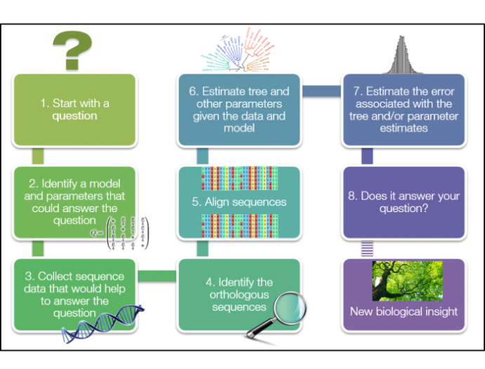
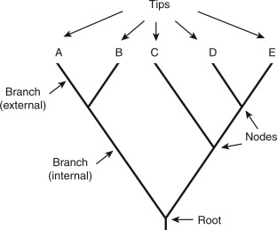
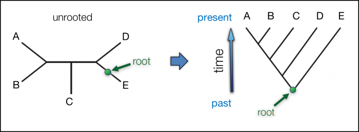
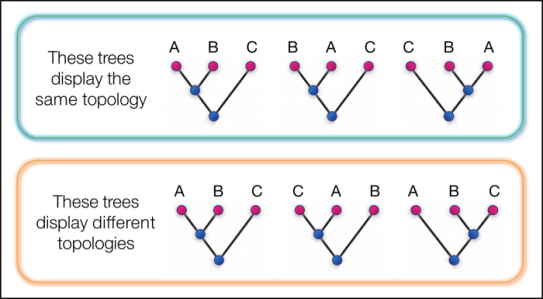
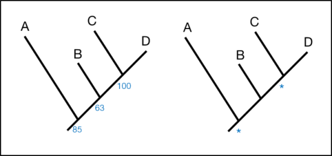

# Hands-on exercise 3.5: Phylogeny construction

#### Laura M. Carroll

#### 4/13/2025


# <span class="header-section-number">1</span> Introduction

**Goal:** Construct (i) distance based trees and (ii) (approximate) maximum likelihood (ML) phylogenies using whole bacterial genomes as input.

**Input:** Assembled genomes in fasta format (\*.fasta)

**Output:** Phylogenies in Newick format (\*.nwk, \*.tree)

**Programs Used:**

  - [mashtree](https://github.com/lskatz/mashtree): a tool for constructing distance-based trees using Mash distances
  - [Parsnp](https://harvest.readthedocs.io/en/latest/content/parsnp.html): a reference-based core SNP calling and phylogeny construction pipeline (uses [FastTree](https://journals.plos.org/plosone/article?id=10.1371/journal.pone.0009490) for approximate ML phylogeny construction)
  - [iTOL](https://itol.embl.de/itol.cgi): web tool for viewing and annotating phylogenies
  - [Gingr](https://harvest.readthedocs.io/en/latest/content/gingr.html) (optional): interactive visualization of alignments, trees, and variants produced by Parsnp


## <span class="header-section-number">1.1</span> Learning Outcomes

  - Construct a distance-based tree using Mash distances
  - Construct an approximate maximum likelihood phylogeny using a core-genome alignment approach
  - View, annotate, and interpret a phylogeny


# <span class="header-section-number">2</span> Background

When we have an alignment of nucleotide or amino acid sequences, we are able to infer a tree or phylogeny. There are numerous ways to do this, with the pros and cons of prominent ones described below. If you want more details, check out [this review\!](https://www.nature.com/articles/nrg3186)

**For a quick intro to concepts and terminology used in phylogenetics, see the [EMBL-EBI’s introduction to phylogenetics glossary](https://www.ebi.ac.uk/training/online/courses/introduction-to-phylogenetics/what-is-a-phylogeny/aspects-of-phylogenies/).**





Figure 1: Outline of major common stages in many phylogenetic analyses (EMBL-EBI)


### <span class="header-section-number">2.0.1</span> Some terminology

  - **phylogenetics** : the study of evolutionary relationships among biological entities (e.g., species, genes)

  - **phylogeny** : a diagram containing a hypothesis of relationships that reflects the evolutionary history of a group of organisms





Figure 2: Parts of a phylogeny (ScienceDirect)


  - **nodes** : parts of a phylogeny; points at the ends of branches which represent sequences or hypothetical sequences at various points in evolutionary history (includes tips and internal nodes, including the root)

  - **tips (taxa, leaves, external nodes)** : parts of a phylogeny; the individuals (e.g., sequences) that we sampled and used to construct our phylogeny, which occur on single terminal branches

  - **internal nodes** : parts of a phylogeny; occur at the points where more than one branch meet and represent the (usually inferred) ancestral sequences

  - **root** : part of a phylogeny; the most recent common ancestor of all taxa in a tree (note that most methods of phylogenetic reconstruction do not estimate the position of the root; as such, they produce “unrooted trees”)





Figure 3: Rooting a tree: before and after (note the branch lengths are not to scale; EMBL-EBI)


  - **branches** : parts of a phylogeny; show the path of transmission of genetic information from one generation to the next. Branch lengths indicate genetic change (the longer the branch, the more genetic change/divergence has occurred). Typically, the extent of genetic change is measured by estimating the average number of nucleotide or protein substitutions per site.


Figure 4: Representing branch lengths on a phylogeny using labels (left) and a scale bar (right; EMBL-EBI)


  - **topology** : aspect of a phylogeny; the branching structure of a tree, which indicates patterns of relatedness among taxa (trees with the same topology and root have the same biological interpretation)





Figure 5: Examples of trees with the same (top) and different (bottom) topologies (EMBL-EBI)


  - **bootstrapping** : within phylogenetics, an approach to estimate confidence in a phylogeny’s topology





Figure 6: Two typical representations of confidence on a phylogeny: bootstrap values of branch support, denoted by percentages (left); symbols denoting branches with bootstrap support \>80% (right; EMBL-EBI)


  - **frequentist statistics** : a type of statistical inference based in frequentist probability, which treats “probability” in equivalent terms to “frequency” and draws conclusions from sample-data by means of emphasizing the frequency or proportion of findings in the data

  - **Bayesian statistics** : a type of statistical inference based on the Bayesian interpretation of probability, where probability expresses a degree of belief in an event. The degree of belief may be based on prior knowledge about the event, such as the results of previous experiments, or on personal beliefs about the event (differs from the frequentist interpretation that views probability as the limit of the relative frequency of an event after many trials)

  - **Mash** : a method for rapidly computing distances (referred to here as “Mash distances”) between genomes


## <span class="header-section-number">2.1</span> Distance-Based versus Character-Based Tree Reonstruction

For **distance-based** methods, the pairwise distances between all sequences are calculated, and the distance matrix which results is used to build a tree (note that “tree” is used here, not phylogeny; many in the phylogenetics field do not consider trees produced via distance-based methods as true “phylogenies”). An example of this is neighbor joining, which uses a clustering algorithm to yield a tree.

For **character-based** methods (i.e., maximum parsimony, maximum likelihood, and Bayesian methods), each site (i.e., character in an alignment) is used to calculate a score for each tree:

  - For maximum parsimony, this score is the minimum number of changes.

  - For maximum likelihood, this score is the log-likelihood value.

  - For Bayesian methods, this score is the posterior probability.

Because it is not possible to search the space of all possible trees, heuristic algorithms are used (e.g., a starting tree is created using a fast algorithm, and the tree is rearranged to improve the score).


## <span class="header-section-number">2.2</span> Use of substitution models

Distance matrix, maximum likelihood, and Bayesian methods all utilize substitution models, which describe the rates at which any two nucleotides change. Examples of nucleotide substitution models include the JC69 model (assumes an equal rate of substitution between any 2 nucleotides), the K80 model (assumes different rates for transitions and transversions), and the GTR model (assumes different substitution rates for each pair of nucleotides, as well as unequal base frequencies)

Maximum parsimony, on the other hand, does not use an explicit substitution model.


## <span class="header-section-number">2.3</span> Distance Methods

Pros:

  - Computationally fast
  - Good for calculating starting trees

Cons:

  - Perform poorly on divergent sequences
  - Sensitive to alignment gaps


## <span class="header-section-number">2.4</span> Maximum Parsimony

Pros:

  - Simple and easy to understand
  - Relatively fast

Cons:

  - Lack of explicit assumptions
  - Does not account for multiple substitutions at the same site, which can result in long-branch attraction (can incorrectly group long branches together)
  - Statistically inconsistent


## <span class="header-section-number">2.5</span> Maximum Likelihood

Pros:

  - Explicit model assumption allows incorporation of evolutionary models in the likelihood
  - Faster and easier to use than Bayesian methods
  - Not Bayesian (represents an opposing statistical philosophy)

Cons:

  - More computationally demanding than distance and parsimony
  - Poor properties if model is not specified correctly
  - Not Bayesian (represents an opposing statistical philosophy)


## <span class="header-section-number">2.6</span> Bayesian Methods

Pros:

  - Explicit model assumption allows incorporation of evolutionary models in the likelihood
  - Easy to interpret posterior probabilities (i.e., the probability that a tree is correct, given your sequence alignment and your model)
  - Can incorporate prior information
  - Not Maximum Likelihood (represents an opposing statistical philosophy)

Cons:

  - Most computationally demanding (very slow\!)
  - Poor properties if model is not specified correctly
  - Prior specification may not be user-friendly
  - Not Maximum Likelihood (represents an opposing statistical philosophy)


# <span class="header-section-number">3</span> Activity 3.5

In this Activity, we will construct and compare two types of trees: (i) a distance-based tree, and (ii) an approximate maximum likelihood (ML) tree. In addition to our mystery *Salmonella* genome, we will use 19 additional, publicly available *Salmonella* genomes from NCBI…with the goal of evaluating the genomic/evolutionary relationships between our mystery genome and the public genomes, collected from different sources, all over the world\!

Table 1. 20 total genomes used in this Activity.

| Genome                               | Source                               | Location                             | Collection Year                      |
| ------------------------------------ | ------------------------------------ | ------------------------------------ | ------------------------------------ |
| mystery\_salmonella\_A.fna           | Human                                | Switzerland                          | 2017                                 |
| NC\_003197.2.fna                     | Not available (LT2 reference strain) | Not available (LT2 reference strain) | Not available (LT2 reference strain) |
| POL\_1969\_US\_SAL\_AB5364AA\_AS.fna | Poultry                              | Missouri, United States              | 1969                                 |
| CAM\_2017\_EG\_SAL\_CC9960AA\_AS.fna | Camelid                              | Egypt                                | 2017                                 |
| BOV\_2011\_LB\_SAL\_DB0456AA\_AS.fna | Beef food product                    | Lebanon                              | 2011                                 |
| ENV\_2019\_CL\_SAL\_DC0045AA\_AS.fna | Irrigation canal                     | Chile                                | 2019                                 |
| POL\_2021\_US\_SAL\_ED7792AA\_AS.fna | Chicken heart                        | Tennessee, United States             | 2021                                 |
| CAM\_2007\_US\_SAL\_FA2994AA\_AS.fna | Alpaca (feces)                       | Washington, United States            | 2007                                 |
| ENV\_1975\_DJ\_SAL\_IA6873AA\_AS.fna | River water                          | Djibouti                             | 1975                                 |
| POL\_1968\_TD\_SAL\_IA6915AA\_AS.fna | Poultry                              | Chad                                 | 1968                                 |
| DOG\_2009\_GB\_SAL\_OB4583AA\_AS.fna | Dog                                  | England                              | 2009                                 |
| FOO\_2009\_US\_SAL\_IC0842AA\_AS.fna | Bagged lettuce outbreak              | Washington, United States            | 2009                                 |
| AVI\_1946\_DK\_SAL\_JA6545AA\_AS.fna | Goose (feces)                        | Denmark                              | 1946                                 |
| AVI\_2016\_SE\_SAL\_PB5871AA\_AS.fna | Wild bird                            | Sweden                               | 2016                                 |
| BOV\_2015\_JP\_SAL\_PC6568AA\_AS.fna | Bovine                               | Japan                                | 2015                                 |
| FOO\_2013\_TH\_SAL\_RB4877AA\_AS.fna | Pork production environment          | Thailand                             | 2013                                 |
| FOO\_2019\_US\_SAL\_SB8577AA\_AS.fna | Pork chops                           | Minnesota, United States             | 2019                                 |
| HUM\_2022\_ZA\_SAL\_UC3893AA\_AS.fna | Human (feces)                        | South Africa                         | 2022                                 |
| HUM\_2000\_MX\_SAL\_VA4611AA\_AS.fna | Human                                | Mexico                               | 2000                                 |
| HUM\_2015\_PL\_SAL\_XA6389AA\_AS.fna | Human (feces)                        | Poland                               | 2015                                 |


## <span class="header-section-number">3.1</span> Construct a distance-based tree using mashtree

1.  Move to your `activity1` directory:


```bash
cd ~/activity1
```

If, for some reason, you accidentally deleted your `activity1` directory, have no fear\! Just (i) `cd ~` and (ii) type `mkdir activity1` to create a new one.

If we type `ls mystery_salmonella_A.fna`, we should see the mystery *Salmonella* genome we assembled in a previous activity:

```bash
ls mystery_salmonella_A.fna
```

If, for some reason, you accidentally deleted your `mystery_salmonella_A.fna` file, you can just copy the genome to your `activity1` directory with the following command:

```bash
wget http://beagle.henlab.org/public/course_introtobioinfo/mystery_salmonella_A.fna
```

2.  Let’s download our 19 additional, closely related, publicly available *Salmonella enterica* genomes. All 19 genomes have been archived in a `*.tar.gz` file named `salmonella_genomes.tar.gz`. To copy it from the server to your computer, run the following command:


```bash
wget http://beagle.henlab.org/public/course_introtobioinfo/salmonella_genomes.tar.gz
```

Once the file has been transferred, if we type `ls salmonella_genomes.tar.gz`, we should see the file `salmonella_genomes.tar.gz` in our current directory:

```bash
ls salmonella_genomes.tar.gz
```

3.  Let’s untar our file `salmonella_genomes.tar.gz` to get the individual genomes:


```bash
tar -xzf salmonella_genomes.tar.gz
```

If we type `ls`, we should see a directory named `salmonella_genomes` in our current directory:

```bash
ls
```

If we type `ls salmonella_genomes`, we can see that there are a bunch of fasta files in our new directory, `salmonella_genomes`:

```bash
ls salmonella_genomes
```

We can count the number of `*.fna` files using the following command:

```bash
ls -lh salmonella_genomes/*.fna | wc -l
```

There should be 19 `*.fna` files in our directory `salmonella_genomes`.

4.  Let’s copy our mystery *Salmonella* genome to our `salmonella_genomes` directory using `cp`:


```bash
cp mystery_salmonella_A.fna salmonella_genomes/
```

We can count the number of `*.fna` files using the following command:

```bash
ls -lh salmonella_genomes/*.fna | wc -l
```

There should now be 20 `*.fna` files in our directory `salmonella_genomes`: 19 publicly available genomes, plus our mystery genome\!

5.  Let’s construct a distance-based tree of our 20 genomes using [mashtree](https://github.com/lskatz/mashtree)\!

First, let’s load the mashtree module; note that there are some other modules we need to load before loading `Mashtree` (we can see this by running `module spider BWA/0.7.18`):

```bash
module purge > /dev/null 2>&1
ml GCC/13.2.0
ml Mashtree/1.4.6
```

To check if mashtree is loaded, let’s print the mashtree help screen:

```bash
mashtree --help
```

6.  Let’s use mashtree to construct our distance-based tree\! To do this, we’ll use the following command:


```bash
mashtree --numcpus 1 --genomesize 4700000 --mindepth 0 salmonella_genomes/*.fna > mashtree.nwk
```

With this command, we:

  - **Call `mashtree`**

  - **Tell `mashtree` to use 1 CPU (`--numcpus 1`)**

  - **Provide `mashtree` with a rough genome size estimate for our organism; for *Salmonella*, 4.7 Mb is a good estimate (`--genomesize 4700000`)**

  - **Tell `mashtree` to construct a more accurate tree with its minimum abundance finder; this step helps ignore very unique kmers that are more likely read errors (`--mindepth 0`)**

  - **Supply `mashtree` with the paths to all of our input genomes; in our case, we have all of our genomes in our directory, `salmonella_genomes`, and all of them end in `*.fna`…therefore, we can use a wildcard\! (`salmonella_genomes/*.fna`)**

  - **Tell `mashtree` to save our tree to an output file named `mashtree.nwk` (`> mashtree.nwk`)**


7.  Wait\! Once `mashtree` finishes, we can view it in iTOL (see the next section).


## <span class="header-section-number">3.2</span> View and annotate a phylogeny

1.  Feel free to use whatever phylogeny viewer you like\! If you don’t have a favorite, you can use [iTOL](https://itol.embl.de/)\! First, go to <https://itol.embl.de/>.

2.  Click “Upload”.

3.  Under “Tree file”, click “Choose File”, and select your tree, \`\`mashtree.nwk\`\`\`.

4.  Click “Upload”.

5.  Click the “Rectangular” button to change how the tree is displayed (not necessary, but it’s typically easier to read than the circular layout that iTOL uses by default).

6.  Click the “Advanced” tab -\> scroll down -\> click “Midpoint root” to root the tree at the midpoint. Note: Midpoint rooting a tree can produce a nice visualization; however, in reality, we should treat our tree as an unrooted tree.

7.  Feel free to play around with the display settings in iTOL\!


## <span class="header-section-number">3.3</span> Call core SNPs and construct an approximate maximum likelihood phylogeny using Parsnp and FastTree

[Parsnp](https://harvest.readthedocs.io/en/latest/content/parsnp.html) is a popular tool for rapidly identifying core SNPs in closely related bacterial genomes using a reference-based approach. Parsnp is fast, scalable (i.e., you can easily query dozens, hundreds, and even thousands of genomes), and very user friendly. It even comes with its own file manipulation and alignment/phylogeny viewing software, [HarvestTools](https://harvest.readthedocs.io/en/latest/content/harvest-tools.html) and [Gingr](https://harvest.readthedocs.io/en/latest/content/gingr.html), respectively, which make it easy to interact with your data.

1.  Move to your `activity1` directory, if you aren’t there already:


```bash
cd ~/activity1
```

2.  Let’s create a new directory for parsnp, named `parsnp`, which will contain our input files:


```bash
mkdir parsnp
```

3.  Parsnp uses assembled genomes as input, one of which acts as a reference genome; to make it more convenient for us to run Parsnp, let’s move our assembled genomes to our new `parsnp` directory:


```bash
mv salmonella_genomes/*.fna parsnp
```

If we type `ls parsnp`, we should see our 20 assembled genomes:

```bash
ls parsnp
```

4.  Now let’s change directories and move to our `parsnp` directory:


```bash
cd parsnp
```

If we type `pwd`, we should see that we are now in our `parsnp` directory:

```bash
pwd
```

If we type `ls`, we should see our 20 genomes:

```bash
ls
```

5.  We will use `NC_003197.2.fna`, the closed, LT2 chromosome, as our reference genome, and the other 19 genomes as our input genomes (Parsnp will include all of them in our final tree). To make it easier to run Parsnp, let’s create a new directory, `fna`, in our current directory, `parsnp`:


```bash
mkdir fna
```

6.  Now let’s move all of our genomes to `fna`:


```bash
mv *.fna fna/
```

If we type `ls`, we should see that now there are no genomes in our current working directory, only our `fna` directory:

```bash
ls
```

If we type `ls fna`, we should see that all 20 genomes are in our `fna`directory:

```bash
ls fna
```

7.  Let’s move our reference genome, `NC_003197.2.fna`, to our working directory, `parsnp`:


```bash
mv fna/NC_003197.2.fna .
```

Now if we type `ls`, we can see our reference genome `NC_003197.2.fna` and the `fna` directory in our current directory:

```bash
ls
```

If we type `ls fna`, we will see 19 genomes in our `fna` directory:

```bash
ls fna
```

8.  Now that everything is set up and ready to go, let’s run Parsnp\!

We’ll run Parsnp using [apptainer](https://apptainer.org/), plus a pre-built Parsnp container.

To do this, let’s download the Parsnp container using `apptainer pull`:

```bash
apptainer pull docker://quay.io/biocontainers/parsnp:2.1.3--h077b44d_0
```

If we type `ls`, we should see the Parsnp container in our current directory (`parsnp_2.1.3--h077b44d_0.sif`).

Once the Parsnp container has been downloaded, we can print its help screen by running the following:

```bash
apptainer run parsnp_2.1.3--h077b44d_0.sif parsnp --help
```

The first part of the command (`apptainer run parsnp_2.1.3--h077b44d_0.sif`) tells apptainer which container to run. The second part of the command (`parsnp --help`) is the actual command to run Parsnp (if we had used modules instead of `apptainer`, we would have just run `parsnp --help` to run the command).

9.  Let’s run the following to run Parsnp:


```bash
module purge > /dev/null 2>&1
apptainer run parsnp_2.1.3--h077b44d_0.sif parsnp -r NC_003197.2.fna -d fna -p 1 -x -c -o parsnp_out --use-fasttree
```

With this command, we are:

  - Calling `apptainer run`, and providing the path to the container we want to run (`apptainer run parsnp_2.1.3--h077b44d_0.sif`)
  - Calling Parsnp (`parsnp`)
  - Telling Parsnp that we want `NC_003197.2.fna` to be our reference genome (`-r NC_003197.2.fna`)
  - Telling Parsnp that we want to use the assemblies in `fna` as input (`-d fna`)
  - Telling Parsnp that we want to use one thread (`-p 1`)
  - Telling Parsnp that we want to filter recombination events, which can [bias phylogenetic reconstruction](https://academic.oup.com/nar/article/43/3/e15/2410982) (`-x`)
  - Telling Parsnp that we want to include all genomes in our input directory (`-c`)
  - Telling Parsnp to output our results in a directory named `parsnp_out` (`-o parsnp_out`)
  - Telling Parsnp to use `FastTree` to construct an approximate ML phylogeny (selected as our phylogeny construction algorithm because FastTree is very fast, and we’re impatient\! `--use-fasttree`)


10. Wait\! When Parsnp finishes running, type `ls` to check out the files in our output directory, `parsnp_out`:


```bash
ls parsnp_out
```

Notably, parsnp will produce a phylogenetic tree (`parsnp.tree`), constructed using FastTree, and a Gingr file (`parsnp.ggr`), which can be opened and viewed in Parsnp’s file viewer, Gingr\!

11. Feel free to view your output tree (`parsnp.tree`) in iTOL\! Alternatively, you can download and install [Gingr](https://harvest.readthedocs.io/en/latest/content/gingr.html) to open `parsnp.ggr` on your own computer and view an interactive phylogeny and alignment.

How do your results compare to the distance-based tree produced via mashtree?


# <span class="header-section-number">4</span> References

EMBL-EBI. Introduction to Phylogenetics. URL \[accessed 26 January 2024\]: <https://www.ebi.ac.uk/training/online/courses/introduction-to-phylogenetics/>.

Kapli, et al. 2020. Phylogenetic tree building in the genomic age. Nature Reviews Genetics. 21(7):428-444. doi: 10.1038/s41576-020-0233-0.

Katz, et al. 2019. Mashtree: a rapid comparison of whole genome sequence files. J Open Source Softw 4(44): 10.21105/joss.01762. doi: 10.21105/joss.01762.

Ondov, et al. 2016. Mash: fast genome and metagenome distance estimation using MinHash. Genome Biology 17(1):132. doi: 10.1186/s13059-016-0997-x.

Pavlopoulos, et al. 2010. A reference guide for tree analysis and visualization. BioData Mining 3(1):1. doi: 10.1186/1756-0381-3-1.

Price, et al. 2010. FastTree 2 – Approximately Maximum-Likelihood Trees for Large Alignments. PLoS One 5(3): e9490. doi: 10.1371/journal.pone.0009490.

Treangen, et al. 2014. [The Harvest suite for rapid core-genome alignment and visualization of thousands of intraspecific microbial genomes.](https://genomebiology.biomedcentral.com/articles/10.1186/s13059-014-0524-x) *Genome Biology* 15(11):524. DOI: <https://doi.org/10.1186/s13059-014-0524-x>.

Yang and Rannala. 2012. [Molecular phylogenetics: principles and practice.](https://www.nature.com/articles/nrg3186) *Nature Reviews Genetics* 13(5):303-14. DOI: 10.1038/nrg3186.

Zhou, Shen, Hittinger, and Rokas. 2018. [Evaluating Fast Maximum Likelihood-Based Phylogenetic Programs Using Empirical Phylogenomic Data Sets.](https://www.ncbi.nlm.nih.gov/pmc/articles/PMC5850867/) *Molecular Biology and Evolution* 35(2): 486–503. DOI: 10.1093/molbev/msx302.


