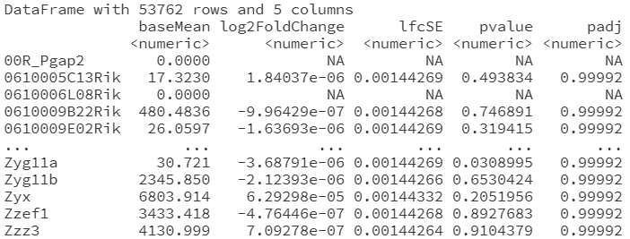
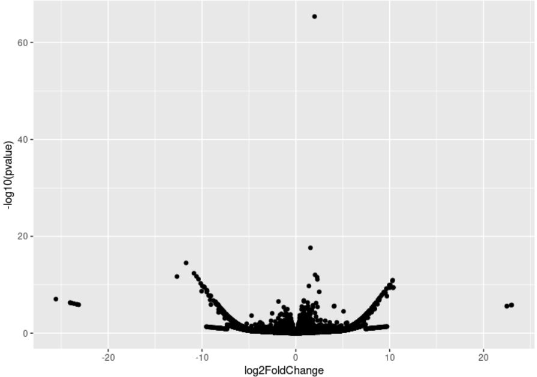

In this module we will finally perform an RNA-seq analysis, putting previous modules into action!

## From FASTQ to count matrix

**Learn first how to align raw sequencing data, and produce a count matrix:** The count matrix represents RNA molecule counts, and is obtained after aligning sequencing data, and comparing with the reference gene annotation. We will explain how to get this count matrix the common way, but also an incredibly fast shortcut to it using linear algebra (Canvas/Kaltura video: *4_5_alignment_for_rnaseq v2*).

- As mentioned, salmon is a pseudocount tool, going from FASTQ to count matrix directly. You can read more here: <https://combine-lab.github.io/salmon/about>
- [Salmon guide](https://combine-lab.github.io/salmon/getting_started/#indexing-txome)

**Get Salmon for pseudocounting:**

- if you use HPC2N, you can load it through:

    `ml load GCC/13.2.0 Salmon/1.10.3`

- If you run on your own computer, you can install it through [conda](https://anaconda.org/bioconda/salmon).

Check that it runs by simply typing `salmon` in the terminal. You should get a help page.

**Index a genome**

Building a genome the scale of the human genome can take hours. Thus, for this course, we have already prepared a ready-made index; or rather, we found ready-made indices at <http://refgenomes.databio.org>, luckily also for [human/salmon](http://refgenomes.databio.org/v3/genomes/splash/2230c535660fb4774114bfa966a62f823fdb6d21acf138d4).

You can use the following code to create a directory and download an index. Be sure to put it in a directory to avoid files all over your account!

```bash
mkdir salmon_human_index
cd salmon_human_index

wget http://awspds.refgenie.databio.org/refgenomes.databio.org/2230c535660fb4774114bfa966a62f823fdb6d21acf138d4/salmon_partial_sa_index__default/2230c535660fb4774114bfa966a62f823fdb6d21acf138d4.gtf
wget http://awspds.refgenie.databio.org/refgenomes.databio.org/2230c535660fb4774114bfa966a62f823fdb6d21acf138d4/salmon_partial_sa_index__default/complete_ref_lens.bin
wget http://awspds.refgenie.databio.org/refgenomes.databio.org/2230c535660fb4774114bfa966a62f823fdb6d21acf138d4/salmon_partial_sa_index__default/ctable.bin
wget http://awspds.refgenie.databio.org/refgenomes.databio.org/2230c535660fb4774114bfa966a62f823fdb6d21acf138d4/salmon_partial_sa_index__default/ctg_offsets.bin
wget http://awspds.refgenie.databio.org/refgenomes.databio.org/2230c535660fb4774114bfa966a62f823fdb6d21acf138d4/salmon_partial_sa_index__default/decoys.txt
wget http://awspds.refgenie.databio.org/refgenomes.databio.org/2230c535660fb4774114bfa966a62f823fdb6d21acf138d4/salmon_partial_sa_index__default/duplicate_clusters.tsv
wget http://awspds.refgenie.databio.org/refgenomes.databio.org/2230c535660fb4774114bfa966a62f823fdb6d21acf138d4/salmon_partial_sa_index__default/gentrome.fa
wget http://awspds.refgenie.databio.org/refgenomes.databio.org/2230c535660fb4774114bfa966a62f823fdb6d21acf138d4/salmon_partial_sa_index__default/info.json
wget http://awspds.refgenie.databio.org/refgenomes.databio.org/2230c535660fb4774114bfa966a62f823fdb6d21acf138d4/salmon_partial_sa_index__default/mphf.bin
wget http://awspds.refgenie.databio.org/refgenomes.databio.org/2230c535660fb4774114bfa966a62f823fdb6d21acf138d4/salmon_partial_sa_index__default/pos.bin
wget http://awspds.refgenie.databio.org/refgenomes.databio.org/2230c535660fb4774114bfa966a62f823fdb6d21acf138d4/salmon_partial_sa_index__default/pre_indexing.log
wget http://awspds.refgenie.databio.org/refgenomes.databio.org/2230c535660fb4774114bfa966a62f823fdb6d21acf138d4/salmon_partial_sa_index__default/rank.bin
wget http://awspds.refgenie.databio.org/refgenomes.databio.org/2230c535660fb4774114bfa966a62f823fdb6d21acf138d4/salmon_partial_sa_index__default/ref_indexing.log
wget http://awspds.refgenie.databio.org/refgenomes.databio.org/2230c535660fb4774114bfa966a62f823fdb6d21acf138d4/salmon_partial_sa_index__default/refAccumLengths.bin
wget http://awspds.refgenie.databio.org/refgenomes.databio.org/2230c535660fb4774114bfa966a62f823fdb6d21acf138d4/salmon_partial_sa_index__default/reflengths.bin
wget http://awspds.refgenie.databio.org/refgenomes.databio.org/2230c535660fb4774114bfa966a62f823fdb6d21acf138d4/salmon_partial_sa_index__default/refseq.bin
wget http://awspds.refgenie.databio.org/refgenomes.databio.org/2230c535660fb4774114bfa966a62f823fdb6d21acf138d4/salmon_partial_sa_index__default/seq.bin
wget http://awspds.refgenie.databio.org/refgenomes.databio.org/2230c535660fb4774114bfa966a62f823fdb6d21acf138d4/salmon_partial_sa_index__default/versionInfo.json
```

If you want to try building your own (optional), check the [Salmon guide](https://combine-lab.github.io/salmon/getting_started/#indexing-txome). It boils down to:

1. Downloading the human reference genome, and it has to be the cDNA for each gene (or CDS, coding sequence). To find suitable files, you would normally start digging [here](http://www.ensembl.org/Homo_sapiens/Info/Index), and at some point you will land [here](https://ftp.ensembl.org/pub/release-111/fasta/homo_sapiens/cds). Whatever you do, ensure to use the gene cDNA FASTA and not the chromosomal DNA! (BWA/STAR would want the latter instead.)
2. Running `salmon index -t ... -i ...`. Use multiple CPUs to speed up the process.

**Get FASTQ with RNA to quantify:**

Let's investigate some neuroblastoma! In a dataset, it has been treated with a drug. We will compare with untreated cells. The data is from a previous study: <https://www.ebi.ac.uk/biostudies/ArrayExpress/studies/E-MTAB-9315?query=E-MTAB-9315>

There is plenty of public data that you can reanalyze and make new findings. Also to get new ideas or help design experiments. This saves a lot of time in the lab!

You will find a link to ENA with raw FASTQ files. You need at least 2 treated and 2 untreated samples for the statistics — it is kept to a minimum to reduce compute time for this course; ideally you would want 3-5 replicates each.

To save you time, we have picked suitable files to download. Here are the commands:

```bash
wget -nc ftp://ftp.sra.ebi.ac.uk/vol1/run/ERR431/ERR4319001/RUN466-6-26081-CLBGA-IC50-Celasterol-RNAseq1BR_S3_L001_R1_001.fastq.gz
wget -nc ftp://ftp.sra.ebi.ac.uk/vol1/run/ERR431/ERR4319005/RUN466-20-26210-CLBGA-IC50-Celasterol-RNAseq5BR_S12_L001_R1_001.fastq.gz
wget -nc ftp://ftp.sra.ebi.ac.uk/vol1/run/ERR431/ERR4318985/RUN466-5-26079-CLBGA-DMSO-75-Celasterol-RNAseq1BR_S4_L001_R1_001.fastq.gz
wget -nc ftp://ftp.sra.ebi.ac.uk/vol1/run/ERR431/ERR4318989/RUN466-9-26102-CLBGA-DMSO-75-Celasterol-RNAseq2BR_S13_L001_R1_001.fastq.gz
```

- **Q1.1** Download the required raw files.

::: {.callout-tip collapse="true" appearance="minimal"}
## Hint
Run the four `wget` commands listed above in a directory where you want to keep the FASTQ files.
:::

::: {.callout-note collapse="true" appearance="minimal"}
## Solution
```bash
wget -nc ftp://ftp.sra.ebi.ac.uk/vol1/run/ERR431/ERR4319001/RUN466-6-26081-CLBGA-IC50-Celasterol-RNAseq1BR_S3_L001_R1_001.fastq.gz
wget -nc ftp://ftp.sra.ebi.ac.uk/vol1/run/ERR431/ERR4319005/RUN466-20-26210-CLBGA-IC50-Celasterol-RNAseq5BR_S12_L001_R1_001.fastq.gz
wget -nc ftp://ftp.sra.ebi.ac.uk/vol1/run/ERR431/ERR4318985/RUN466-5-26079-CLBGA-DMSO-75-Celasterol-RNAseq1BR_S4_L001_R1_001.fastq.gz
wget -nc ftp://ftp.sra.ebi.ac.uk/vol1/run/ERR431/ERR4318989/RUN466-9-26102-CLBGA-DMSO-75-Celasterol-RNAseq2BR_S13_L001_R1_001.fastq.gz
```
:::

**Quantify the number RNA molecules per gene:**

Using the index you downloaded, stored in directory `salmon_human_index`, you can estimate the number of RNA molecules for each gene using this command:

```bash
salmon quant -i salmon_human_index -l A \
    -r RUN466-20-26210-CLBGA-IC50-Celasterol-RNAseq5BR_S12_L001_R1_001.fastq.gz \
    -p 1 --validateMappings -o quants/IC50_5_quant
```

Here `-p 1` means to use one CPU. You can arrange to use multiple if you want. The output is specified using `-o`.

::: {.callout-note}
You can put `\` at the end of any bash command lines if you want to manually divide them up to increase readability. But be careful when copying above as there cannot be any newlines when you paste it in (bash will then think that you are giving it 3 separate commands, and fail).
:::

- **Q1.2**: Quantify each of the 4 FASTQ-files you downloaded. Give them suitable simple names. Note that the subdirectory `salmon_human_index` must be in the directory you are running the command in (or you need to adjust the command).

::: {.callout-tip collapse="true" appearance="minimal"}
## Hint
Run the same `salmon quant` command four times, once per FASTQ, changing both `-r` and `-o` for each sample. Pick short names like `IC50_1`, `IC50_5`, `DMSO_1`, `DMSO_2`.
:::

::: {.callout-note collapse="true" appearance="minimal"}
## Solution
```bash
salmon quant -i salmon_human_index -l A \
    -r RUN466-6-26081-CLBGA-IC50-Celasterol-RNAseq1BR_S3_L001_R1_001.fastq.gz \
    -p 1 --validateMappings -o quants/IC50_1_quant

salmon quant -i salmon_human_index -l A \
    -r RUN466-20-26210-CLBGA-IC50-Celasterol-RNAseq5BR_S12_L001_R1_001.fastq.gz \
    -p 1 --validateMappings -o quants/IC50_5_quant

salmon quant -i salmon_human_index -l A \
    -r RUN466-5-26079-CLBGA-DMSO-75-Celasterol-RNAseq1BR_S4_L001_R1_001.fastq.gz \
    -p 1 --validateMappings -o quants/DMSO_1_quant

salmon quant -i salmon_human_index -l A \
    -r RUN466-9-26102-CLBGA-DMSO-75-Celasterol-RNAseq2BR_S13_L001_R1_001.fastq.gz \
    -p 1 --validateMappings -o quants/DMSO_2_quant
```
:::

**Load the counts in R:**

As is common, data is not always stored in the simplest format. We have written some code here to enable you to read the counts for each library into one matrix in R. It assumes that you stored all outputs in the directory `~/glio/quants/`.

```r
## Read each separate salmon output of counts
all_counts <- list()
rootdir <- "~/glio/quants/"
for (f in list.files(rootdir)) {
  print(f)
  onedat <- read.csv(file.path(rootdir, f, "quant.sf"), sep = "\t")[, c("Name", "NumReads")]
  onedat$f <- f
  all_counts[[f]] <- onedat
}
## Put into one single count matrix
cnt <- reshape2::acast(do.call(rbind, all_counts), Name ~ f, value.var = "NumReads")
```

- **Q1.3:** You can already check which genes have the most amount of RNA. Which transcript has the most RNA?

::: {.callout-tip collapse="true" appearance="minimal"}
## Hint
You can, e.g., use the commands `order` and `sort` to get the list in a suitable order.
:::

::: {.callout-tip collapse="true" appearance="minimal"}
## Hint
Compute the row sums of the count matrix and order the rows by those sums in decreasing order.
:::

::: {.callout-note collapse="true" appearance="minimal"}
## Solution
```{r, eval=FALSE}
cnt[order(rowSums(cnt), decreasing = TRUE), ][1:10, ]
```
The top transcript is typically `ENST00000387347` (MT-RNR2 / mitochondrial 16S rRNA) — mitochondrial transcripts dominate in most bulk RNA-seq libraries.
:::

- **Q1.4: Optional**: Are there any genes you recognize? You can look up any geneID such as on Ensembl. Here is the page for the human gene [IL4](https://www.ensembl.org/Homo_sapiens/Gene/Summary?g=ENSG00000113520;r=5:132673986-132682678).

::: {.callout-tip collapse="true" appearance="minimal"}
## Hint
Paste an `ENST...` ID into the Ensembl search box. The very top hits are usually mitochondrial RNAs, ribosomal RNAs, or common housekeeping genes (GAPDH, ACTB, etc.).
:::

::: {.callout-note collapse="true" appearance="minimal"}
## Solution
The most abundant transcripts in bulk RNA-seq are usually mitochondrial (MT-RNR1, MT-RNR2, MT-CO1...) and housekeeping genes such as ACTB, GAPDH, and ribosomal protein genes (RPL/RPS family). These are highly expressed in essentially every human cell type.
:::

## Differential expression analysis

See this video, showing the overall workflow from counts to statistical test (Canvas/Kaltura: *4.3 deseq*).

- **Model matrices** are central to analysis of RNA-seq, microarray, proteomic and what-have-you data. **Once you grasp this concept, you can do most bioinformatics statistical analysis!**
- You will see that you can model a simple comparison between condition A and B (for two samples) as

    $$
    \begin{bmatrix} \text{counts}_A \\ \text{counts}_B \end{bmatrix}
    \sim \mathrm{Poisson}\!\left(
    \begin{bmatrix} 1 & 0 \\ 1 & 1 \end{bmatrix}
    \begin{bmatrix} \text{baseline} \\ \text{treatment} \end{bmatrix}
    \right)
    $$

    and then just compute $P(\text{baseline}_2 < q)$.

    - The **model matrix** is $\begin{bmatrix} 1 & 0 \\ 1 & 1 \end{bmatrix}$.
    - $P(\text{treatment} < q)$ is being evaluated to see if the expression is different from 0.
    - We call $\text{treatment}$ a **contrast**.

- Alternatively, equivalently,

    $$
    \begin{bmatrix} \text{counts}_A \\ \text{counts}_B \end{bmatrix}
    \sim \mathrm{Poisson}\!\left(
    \begin{bmatrix} 1 & 0 \\ 0 & 1 \end{bmatrix}
    \begin{bmatrix} \text{baseline}_1 \\ \text{baseline}_2 \end{bmatrix}
    \right)
    $$

    but the test becomes a bit more complicated instead: $P(\text{baseline}_2 - \text{baseline}_1 < q)$.

    - The **model matrix** is $\begin{bmatrix} 1 & 0 \\ 0 & 1 \end{bmatrix}$.
    - $P(\text{baseline}_2 - \text{baseline}_1 < q)$ is evaluated to see if it is different from 0.
    - $\text{baseline}_2 - \text{baseline}_1$ is the **contrast** in this case.

- The Poisson distribution we looked at only models the sequencing process. To also account for biological variation, we will instead use the negative binomial distribution, which turns out to be a natural extension. Optional reading at [Wikipedia](https://en.wikipedia.org/wiki/Negative_binomial_distribution).
- Optional reading on the origin of the negative binomial distribution, but even better is the [DESeq2 paper](https://genomebiology.biomedcentral.com/articles/10.1186/s13059-014-0550-8).

**Differential expression theory:**

- **Q2.1**: Using pen and paper, convince yourself that **log(fold change) = 0** means that there is no change.

::: {.callout-tip collapse="true" appearance="minimal"}
## Hint
What value of $x$ gives $\log(x) = 0$? And what does that value of the fold change $x = \text{new}/\text{old}$ mean?
:::

::: {.callout-note collapse="true" appearance="minimal"}
## Solution
$\log(x) = 0 \iff x = 1$. A fold change of $1 = \text{new}/\text{old}$ means $\text{new} = \text{old}$, i.e. no change in expression.
:::

- **Q2.2:** Using pen and paper, convince yourself that high **−log(p-value)** means smaller p-values, and thus higher significance.

::: {.callout-tip collapse="true" appearance="minimal"}
## Hint
$\log$ is monotonically increasing, so as $p$ decreases, $\log(p)$ decreases, and $-\log(p)$ increases.
:::

::: {.callout-note collapse="true" appearance="minimal"}
## Solution
For $p \in (0, 1]$, $\log(p) \le 0$, so $-\log(p) \ge 0$. As $p \to 0$, $-\log(p) \to \infty$. Thus a high $-\log_{10}(p)$ on the y-axis corresponds to a tiny p-value, i.e. a more significant result.
:::

**Set up the condition data frame:**

To run DESeq2 or any similar package, you need a data frame with information about the samples. The row names should correspond to sample names (i.e. column names in the count matrix). If you don't have a condition data frame, you can often create it from the names of the samples. This is a starting point:

```r
cond <- data.frame(
  row.names = colnames(cnt)
)
cond$treatment <- ...
```

You want to obtain a column called `treatment`, for each sample. In this case, DMSO and IC50 (or anything you prefer that is human-interpretable).

- **Q2.3:** Fill in the column.

::: {.callout-tip collapse="true" appearance="minimal"}
## Hint
The `stringr` R package has great functions for string manipulation. `str_split_fixed` and `str_split_i` are really useful here.
:::

::: {.callout-tip collapse="true" appearance="minimal"}
## Hint
The sample (column) names contain `DMSO` and `IC50` as one of the dash-separated tokens. Split on `-` and pick that token.
:::

::: {.callout-note collapse="true" appearance="minimal"}
## Solution
```{r, eval=FALSE}
library(stringr)
cond <- data.frame(row.names = colnames(cnt))
cond$treatment <- str_split_i(rownames(cond), "-", 5)
cond
```
:::

**Install DESeq2**

See here: <https://bioconductor.org/packages/release/bioc/html/DESeq2.html>

Remember to load it after installation!

**Run DESeq2 to fit statistical model:**

You are now ready to perform the statistical analysis! The following code, largely taken from the [vignette](https://bioconductor.org/packages/devel/bioc/vignettes/DESeq2/inst/doc/DESeq2.html) (recommended reading!), sets up a pairwise test.

```r
dds <- DESeqDataSetFromMatrix(
  countData = round(cnt),  # salmon output non-integer counts; round to integer to fix
  colData   = cond,
  design    = ~ treatment  # specifies model matrix
)
dds <- DESeq(dds)
res <- results(dds, c("treatment", "a", "b"))  # set appropriately
```

- **Q2.4**: Adjust to compare treated and untreated samples.

::: {.callout-tip collapse="true" appearance="minimal"}
## Hint
The contrast argument to `results()` is `c(factor_name, level_numerator, level_denominator)`. Here the factor is `treatment`, the levels are `IC50` (treated) and `DMSO` (control).
:::

::: {.callout-note collapse="true" appearance="minimal"}
## Solution
```{r, eval=FALSE}
dds <- DESeqDataSetFromMatrix(
  countData = round(cnt),
  colData   = cond,
  design    = ~ treatment
)
dds <- DESeq(dds)
res <- results(dds, c("treatment", "IC50", "DMSO"))
```
:::
- **Q2.5:** What does the model matrix look like? Does it make sense as compared to the video explanation? (hint: typical exam material!)

::: {.callout-tip collapse="true" appearance="minimal"}
## Hint
Try `model.matrix(~ treatment, data = cond)` in R and inspect the rows and columns.
:::

::: {.callout-tip collapse="true" appearance="minimal"}
## Hint
Compare what you see against the two model-matrix formulations in the video / above (the $\begin{bmatrix} 1 & 0 \\ 1 & 1 \end{bmatrix}$ vs. $\begin{bmatrix} 1 & 0 \\ 0 & 1 \end{bmatrix}$ examples). Which one is R using? What does each column represent (intercept vs. treatment effect)?
:::

::: {.callout-note collapse="true" appearance="minimal"}
## Solution
```{r, eval=FALSE}
model.matrix(~ treatment, data = cond)
```
With two treatment levels (DMSO and IC50) and the default treatment-coding, R picks the first level (alphabetically: DMSO) as the reference. You get a column of 1s (the intercept = DMSO baseline) plus one column that is 1 for IC50 samples and 0 for DMSO samples. This is the first formulation from the video,
$$
\begin{bmatrix} 1 & 0 \\ 1 & 0 \\ 1 & 1 \\ 1 & 1 \end{bmatrix},
$$
where the second column directly encodes the treatment effect (the contrast). The second formulation in the video uses two intercepts (one per group) and you compute the contrast as the difference of the two — equivalent, just parameterised differently.
:::

**Extract the differentially expressed genes and make a volcano plot:**

The output list of genes (unsorted) will look kind of like below.



- `log2FoldChange` is the log2(fold change) and what most are interested in.
- `padj` is multiple-hypothesis-testing-adjusted p-value.

- **Q2.6:** Adjusted p-value — this means adjusted for multiple hypothesis testing. What does this mean? This video explains: <https://www.youtube.com/watch?v=HLzS5wPqWR0>

::: {.callout-tip collapse="true" appearance="minimal"}
## Hint
If you test 20,000 genes at $p < 0.05$, how many false positives would you expect by chance alone?
:::

::: {.callout-note collapse="true" appearance="minimal"}
## Solution
Testing tens of thousands of genes simultaneously means many will appear significant by chance alone (at $p < 0.05$, about 5% of all tests). The adjusted p-value (DESeq2 uses Benjamini–Hochberg by default) controls the **false discovery rate (FDR)** — the expected proportion of false positives among the genes called significant. Use `padj` rather than raw `pvalue` when picking hits.
:::
- **Q2.7:** Make a volcano plot to aid interpretation. This plot is designed as follows:
    - x-axis: log2 fold change
    - y-axis: −log10 adjusted p-value

::: {.callout-tip collapse="true" appearance="minimal"}
## Hint
This is just using ggplot, nothing new! Convert the DESeq2 result to a data frame and use `geom_point`.
:::

::: {.callout-note collapse="true" appearance="minimal"}
## Solution
```{r, eval=FALSE}
library(ggplot2)
ggplot(as.data.frame(res), aes(log2FoldChange, -log10(padj))) +
  geom_point(alpha = 0.4) +
  theme_bw()
```
:::


- **Q2.8:** Which gene has the highest significance? Note that ENST* are human gene transcripts. A gene has multiple transcripts (isoforms). Use Ensembl to look up the name of the gene.

::: {.callout-tip collapse="true" appearance="minimal"}
## Hint
Order the result table by `padj` and look at the first row. Then paste the `ENST...` ID into the Ensembl search box.
:::

::: {.callout-note collapse="true" appearance="minimal"}
## Solution
```{r, eval=FALSE}
res_df <- as.data.frame(res)
res_df <- res_df[order(res_df$padj), ]
head(res_df, 5)
rownames(res_df)[1]  # top transcript ID, look this up on Ensembl
```
Take the top `ENST...` ID and search it at <https://www.ensembl.org>. The gene symbol shown there (e.g. HSPA1A, HMOX1 or similar stress-response gene) is the answer.
:::

Also note that the most significant gene has not changed much up or down in expression!

- **Q2.9 Optional:** Use ggrepel, <https://cran.r-project.org/web/packages/ggrepel/vignettes/ggrepel.html>, to highlight the names of the most differentially expressed genes. This is commonly done in articles, and a good package to know.

::: {.callout-tip collapse="true" appearance="minimal"}
## Hint
Add a `geom_text_repel` layer that only receives the top-N rows (e.g. smallest `padj`) so the plot does not get cluttered.
:::

::: {.callout-note collapse="true" appearance="minimal"}
## Solution
```{r, eval=FALSE}
library(ggplot2)
library(ggrepel)

res_df <- as.data.frame(res)
res_df$gene <- rownames(res_df)
top_n <- head(res_df[order(res_df$padj), ], 10)

ggplot(res_df, aes(log2FoldChange, -log10(padj))) +
  geom_point(alpha = 0.4) +
  geom_text_repel(data = top_n, aes(label = gene)) +
  theme_bw()
```
:::

## A more complex RNA-seq dataset

Sometimes you are lucky and counts have already been computed for you. Such is the case for this dataset where they have treated two cell lines with an anti-cancer drug: <https://www.ebi.ac.uk/biostudies/ArrayExpress/studies/E-MTAB-14822>

- **Q3.1 Optional:** What are the two cell lines? What cell types do they represent? They are commonly used in research!

::: {.callout-tip collapse="true" appearance="minimal"}
## Hint
Open the ArrayExpress page linked above and look in the sample/metadata section, or download `meta.csv` and read its columns.
:::

::: {.callout-note collapse="true" appearance="minimal"}
## Solution
The two cell lines are listed in the metadata on the ArrayExpress page (and inside `meta.csv`). They are well-known cancer cell lines — look up each name (e.g. on Cellosaurus, <https://www.cellosaurus.org>) to find the tissue / cell type of origin.
:::

**Download and load the data**

- **Q3.2** From the dataset link, download `meta.csv` (the condition data frame) and `readCounts.csv.gz`.

::: {.callout-tip collapse="true" appearance="minimal"}
## Hint
The files are listed in the "Files" section of the ArrayExpress page. Right-click and "Save link as", or `wget` the URL directly.
:::

::: {.callout-note collapse="true" appearance="minimal"}
## Solution
```bash
# right-click → save the two files from the ArrayExpress page, or
wget https://www.ebi.ac.uk/biostudies/files/E-MTAB-14822/meta.csv
wget https://www.ebi.ac.uk/biostudies/files/E-MTAB-14822/readCounts.csv.gz
```
No need to gunzip — `read.csv` reads `.gz` directly.
:::
- **Q3.3** Load the data into R. This can frequently be the hardest task as there is little agreement on the precise format of CSV/TSV files!
    - Note that this time you do not have to construct the condition matrix, but it is already provided. But ensure to set the row names to match the column names of the count matrix. Note that you have to break up the treatment column into time (6h, 24h) and treatment (no treatment, 5h of treatment, 10h of treatment).
    - When you load the count matrix, be careful that you might get the row names instead as column 1. DESeq will be unhappy. To fix this, either move the values to the rownames, or adjust the parameters to `read.csv` to avoid this (see the help for `read.csv`; e.g. `row.names` can be adjusted).

::: {.callout-tip collapse="true" appearance="minimal"}
## Hint
`read.csv("readCounts.csv.gz", row.names = 1)` will use the first column as row names. Check `head()` and `dim()` afterwards to confirm rows are genes and columns are samples.
:::

::: {.callout-tip collapse="true" appearance="minimal"}
## Hint
For the meta file, use `stringr::str_split_fixed` (or similar) on the original treatment column to break it into two new columns: `time` and `treatment_duration`.
:::

::: {.callout-note collapse="true" appearance="minimal"}
## Solution
```{r, eval=FALSE}
library(stringr)

cnt  <- read.csv("readCounts.csv.gz", row.names = 1)
cond <- read.csv("meta.csv")
rownames(cond) <- cond$sample   # use the sample-name column (whatever it is called)

# Ensure ordering matches the count matrix
cond <- cond[colnames(cnt), ]

# Split the treatment column into two new columns (adjust the separator/index
# to match the actual strings in meta.csv)
parts <- str_split_fixed(cond$treatment, "_", 2)
cond$treatment_duration   <- parts[, 1]
cond$time_since_treatment <- parts[, 2]
```
:::

**Perform DE analysis using DESeq2**

There is much more you can compare here, since you got both (1) cell type and (2) time since treatment. We will return to this dataset in Module 5 to perform unsupervised machine learning.

Note that there is metadata that you can ignore, such as the position of the sample on the multiwell plate where the sample was prepared.

You can build a multilinear equation describing the expression of genes as: `~ cell_type + treatment_duration + time_since_treatment`.

- **Q3.4** Does this model make sense? No model is perfect! Are there any assumptions built into the model? (this question has no single correct answer)

::: {.callout-tip collapse="true" appearance="minimal"}
## Hint
The formula `~ cell_type + treatment_duration + time_since_treatment` has no `:` or `*` terms. What does that mean about how the three factors are assumed to interact?
:::

::: {.callout-note collapse="true" appearance="minimal"}
## Solution
The `+` form assumes purely **additive** effects on $\log$ expression — each factor shifts expression independently of the others. In reality, the response to a drug may very well depend on the cell line (a cell-type × treatment **interaction**), which this model cannot capture. To allow that, you would add an interaction term such as `~ cell_type * treatment_duration`. The model also assumes the replicates are independent samples, that the negative-binomial mean-variance relationship holds, and that no important confounders (e.g. batch / plate position) are missing.
:::
- **Q3.5** What does the model matrix look like? Note as above that there are multiple model matrices that could be used for this problem. How would you have preferred to construct it?

::: {.callout-tip collapse="true" appearance="minimal"}
## Hint
Use `model.matrix(~ cell_type + treatment_duration + time_since_treatment, data = cond)` and inspect the columns: there is an intercept column, then one indicator column per non-reference level of each factor.
:::

::: {.callout-note collapse="true" appearance="minimal"}
## Solution
```{r, eval=FALSE}
mm <- model.matrix(~ cell_type + treatment_duration + time_since_treatment, data = cond)
head(mm)
```
The first column is the intercept (the reference cell line / no treatment / earliest time). Each remaining column is an indicator for one non-reference level. With $k$ levels in a factor you get $k-1$ columns (treatment contrasts). An alternative is the "no-intercept" parametrisation `~ 0 + cell_type + treatment_duration + time_since_treatment`, which gives one column per level — easier to read for some contrasts but you still need to choose contrasts carefully.
:::
- **Q3.6** Which genes are DE between the cell lines? Optional: If you checked what the cell lines are, do any genes make sense to you? (not trivial)

::: {.callout-tip collapse="true" appearance="minimal"}
## Hint
Run `resultsNames(dds)` after `DESeq(dds)` to see which coefficients are available. Pick the one corresponding to cell line and pass it via `name=`.
:::

::: {.callout-note collapse="true" appearance="minimal"}
## Solution
```{r, eval=FALSE}
dds <- DESeqDataSetFromMatrix(
  countData = round(cnt),
  colData   = cond,
  design    = ~ cell_type + treatment_duration + time_since_treatment
)
dds <- DESeq(dds)
resultsNames(dds)
res_cell <- results(dds, name = "cell_type_X_vs_Y")  # replace X and Y with the actual level names
head(res_cell[order(res_cell$padj), ])
```
Lineage-marker genes (e.g. tissue-specific transcription factors of the cell types you identified in Q3.1) often top the list.
:::
- **Q3.7** Which genes are DE due to the treatment? Optional: Do any genes make sense? (not trivial)

::: {.callout-tip collapse="true" appearance="minimal"}
## Hint
Same approach as Q3.6 but use the `treatment_duration_...` coefficient instead. Look at `resultsNames(dds)` to find the exact string.
:::

::: {.callout-note collapse="true" appearance="minimal"}
## Solution
```{r, eval=FALSE}
resultsNames(dds)
res_treat <- results(dds, name = "treatment_duration_treated_vs_untreated")  # replace with actual name
head(res_treat[order(res_treat$padj), ])
```
Drug-response genes (e.g. stress-response, apoptosis or cell-cycle genes depending on the drug's mechanism) tend to dominate the top of the list.
:::
